# 複数透明グラス認識 比較実験報告書

**実験期間**: 2026-04-24
**実施者**: high2366834@gmail.com
**実験環境**:
- OS: Ubuntu 22.04 / Linux 6.8.0-107-generic
- GPU: Quadro RTX 5000 Max-Q (16GB VRAM)
- CUDA 13.0
- Python 3.10 / 3.11 / 3.12（仮想環境ごとに異なる）
- センサー: RealSense D435i

---

## 1. 実験の位置づけ

前回の実験（`transparent_glass_experiment_report.md`, 2026-04-23）では**透明グラス1個**を対象に複数モデルを比較した。本実験ではそれを拡張し、以下を追加で検証する：

1. **複数インスタンスに対する検出性能**
   - グラスを **3個並べ、そのうち2個を前後に重ねる** 配置
   - 各モデル（YOLO26 / DINOv3 / SAM3 / Qwen3-VL）が**全グラスを個別に認識**できるか
2. **遮蔽（occlusion）への耐性**
   - 前面グラス越しに奥のグラスが見える条件で、どこまで識別できるか
3. **単一撮影データでの一貫した比較**
   - 前回はPhase 2と Phase 3 で **別撮影** だったため、3D整合性が保証されなかった
   - 今回は **RGB + RealSense depth + 左右IR** を **1回の撮影で同時取得** することで、全フェーズを同一シーンで検証する

---

## 2. 技術セットと Phase 構成

| Phase | 内容 | 入力 |
|-------|------|------|
| 0 | シーン撮影（デュアルモード） | — |
| 1 | RGB系4モデル（YOLO26 / DINOv3 / SAM3 / Qwen3-VL） | 同一RGB |
| 2 | 深度依存モデル（Boxer / Any6D）× **RealSense depth** | RGB + RS depth |
| 3 | Foundation-Stereo 推論 | 左右IR |
| 4 | FS depth → RGB視点ワープ → 深度依存モデル再実行 | RGB + FS warped depth |

---

## 3. デュアルモード撮影（Phase 0）

### 3.1 課題

RealSense D435i には IR projector (emitter) があり、ON/OFF で得られる情報が異なる。

| 設定 | RealSense active stereo depth | 左右 IR 画像 |
|------|------------------------------|------------|
| emitter **ON** | 精度◎（能動照明で暗色・無地面も補助） | ドットパターンが映り込み、Foundation-Stereo精度が落ちる |
| emitter **OFF** | 精度↓（パッシブのみ、暗色・無地で欠損） | クリーン（ドットなし）、Foundation-Stereo向き |

前回実験では2系統を**別撮影**していたため、Phase 2 と Phase 3 のシーン一致が保証されなかった。

### 3.2 解決策: 1撮影で両モード取得

`scripts/capture_realsense_dual.py` を新規実装。1 回のトリガで以下を順次取得：

```
Step A: emitter ON で warmup 30 frame → RGB + RS depth を保存
Step B: emitter OFF に切替、settle 10 frame → 左右 IR を保存
→ 合計 <1秒（手で配置したシーンが動かない前提で有効）
```

D435i の `depth_sensor.set_option(rs.option.emitter_enabled, 0/1)` は **ストリーミング継続中に切替可能**。

### 3.3 キャプチャ結果

**Simple シーン**: グレー無地背景にグラス3個（左の縦長大・中央の小さい丸・右の縦長大）。中央のグラスは右のグラスと前後に重なっている。


*キャプション: Simple シーン。左=RGB (emitter ON)、中央=左IR (emitter OFF)、右=右IR (emitter OFF)。同一シーンだがIR画像にドットパターンが映り込んでいないことが確認できる。*

**Complex シーン**: 同じグラス配置に加え、白い箱・木の立方体・ぬいぐるみ・ケーブル・置物・黒い丸い物体など煩雑な背景。さらに**奥に縦長の透明プラスチックケース（ガラス風だがプラスチック製）**を配置することで、「見た目は似ているがクラスとしては glass ではない」紛らわしいディストラクタを加える。前列のグラスは**引き続き3個**。

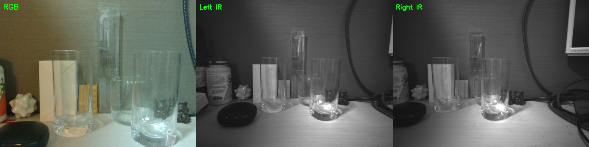
*キャプション: Complex シーン。3個の前列グラス（ガラス製）に加え、奥に縦長のプラスチックケース（見た目は透明だが材質は非ガラス、ディストラクタとして配置）、左右に多数の物体。*

### 3.4 入力画像（全フェーズ共通）

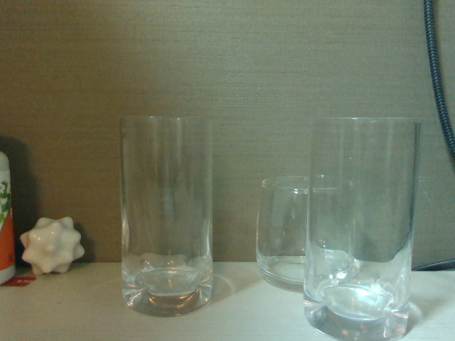
*キャプション: Phase 1〜4 すべてで使用する Simple シーンの RGB。透明グラス3個が前後・左右に配置されている。*

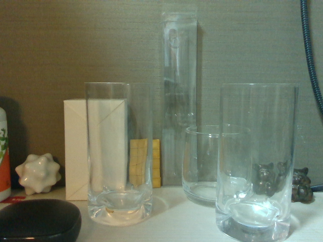
*キャプション: Phase 1〜4 すべてで使用する Complex シーンの RGB。**ガラス製は前列3個のみ**、奥の縦長物体は透明プラスチックケース（ディストラクタ）。背景には複数のオブジェクト。*

### 3.5 RealSense depth 品質（emitter ON）

| シーン | RS depth 欠損率 | 備考 |
|-------|--------------|------|
| simple | 27.1% | 透明グラス胴体・ごく無地の壁面で欠損 |
| complex | 33.3% | 上に加え奥の高いガラス・反射面でも欠損 |

Phase 3 以降で Foundation-Stereo と比較する。

---

## 4. 実験結果

### Phase 1.1 ─ YOLO26（2D物体検出）

**コマンド**:
```bash
python3 -c "from ultralytics import YOLO; YOLO('yolo26l.pt')('data/3glass_simple/rgb.png', conf=0.2)"
```

**検出結果（cup / glass 相当クラスのみ抜粋）**:

| シーン | 検出 | スコア分布 | 評価 |
|-------|------|----------|------|
| simple | **cup × 3** | 0.94, 0.92, 0.85 | ✅ 実在3個すべて検出 |
| complex | cup × 3 + vase × 1 (低スコア誤検出含む) | cup: 0.85, 0.81, 0.62 + 誤検出0.29 / vase: 0.21 | ✅ **プラスチックケースを cup としない**（正解）／vase 低スコアで分類揺れ |


*キャプション: YOLO26（Simple）。3個のグラスすべてを`cup`として検出（0.85〜0.94）。前後に重なる中央の小グラスも独立したbbox。*


*キャプション: YOLO26（Complex）。手前3個の**本物のガラス**を cup として正しく検出。奥のプラスチックケースは **cup ではなく vase と低スコア分類** → 「ガラス」と判定しなかったのは正しい挙動。*

**所見**:
- 1個検出しかできなかった前回と比べ、**クラス内の複数インスタンスを全て個別boxで返す**ことができた
- 奥のプラスチックケースを `cup` と混同せず `vase 0.21` という低スコアに抑えている点は、**ディストラクタ識別ができている**ことを示す（glass とは判定していない）

---

### Phase 1.2 ─ DINOv3（視覚特徴抽出）

**PCA可視化**:

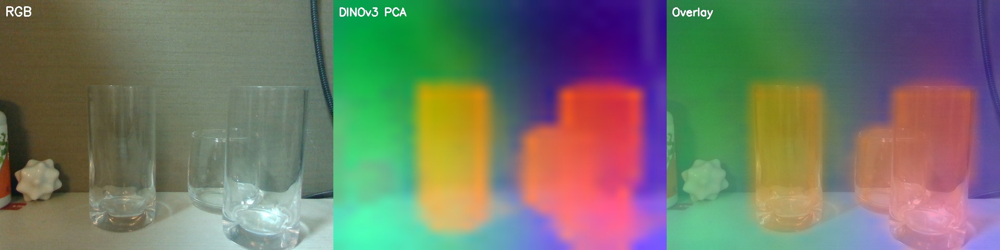
*キャプション: DINOv3 PCA（Simple, 28×28パッチ）。3個のグラス領域が似た色系（青〜紫）のクラスタとして分離され、背景のグレー壁（黄色系）とは明瞭に区別される。*

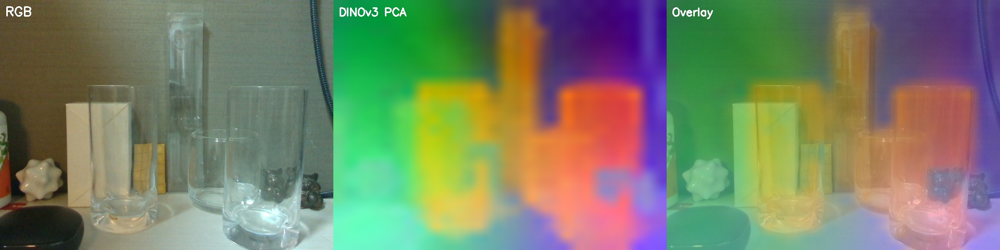
*キャプション: DINOv3 PCA（Complex）。3個のグラスと奥のガラス容器が類似特徴で分離されており、背景の多数の物体とは明確に異なる。*

**類似度マップ**（中央のグラス付近をアンカー）:

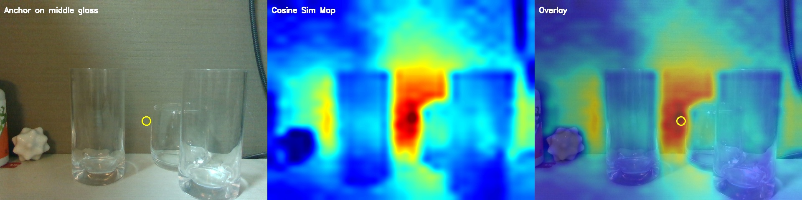
*キャプション: DINOv3類似度マップ（Simple）。アンカー=中央の小グラス。高類似領域（赤）が**アンカー周辺と右奥のグラス**の両方に広がっており、特徴量上で同種として捉えられている。*

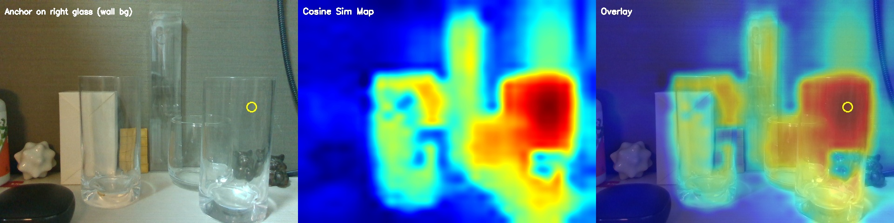
*キャプション: DINOv3類似度マップ（Complex, アンカー=右グラス上部、背景が壁のみの位置）。**4個のグラスすべて**が高類似度領域（赤〜黄）として浮かび上がる一方、背景の壁・ぬいぐるみ・箱・熊・ケーブル類は低類似度（青）。教師なしの特徴量だけで4個すべてをマルチインスタンス候補として検出できている。*

**所見**: 複数のグラスを **同一ラベル教師なしで特徴的に類似**と判定。DINOv3 + クラスタリングで**マルチインスタンス検出**の素地になる。

---

### Phase 1.3 ─ SAM3（テキストプロンプトセグメンテーション）

**プロンプト**: `"glass"` 固定

| シーン | マスク数 | スコア分布 | 備考 |
|-------|---------|----------|------|
| simple | **3** | 0.92, 0.92, 0.90 | **全3個を個別マスク**（全て正解） |
| complex | 4 | 0.92, 0.92, 0.90, **0.70** | 手前3個 + **奥のプラスチックケースを誤ってglassと判定**（0.70は相対的に低スコア） |

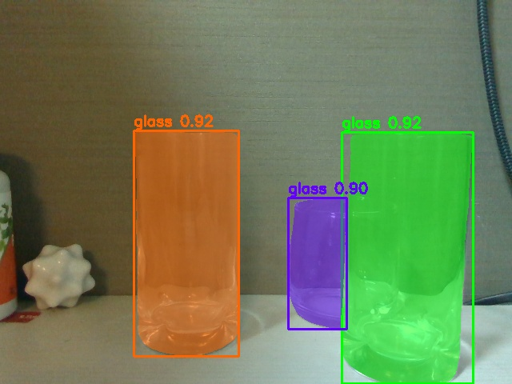
*キャプション: SAM3（Simple, `glass`）。3個すべてが異なる色で個別セグメントされ、前後に重なる領域も正しく分離されている（中央=紫、右奥=緑、左=オレンジ）。*

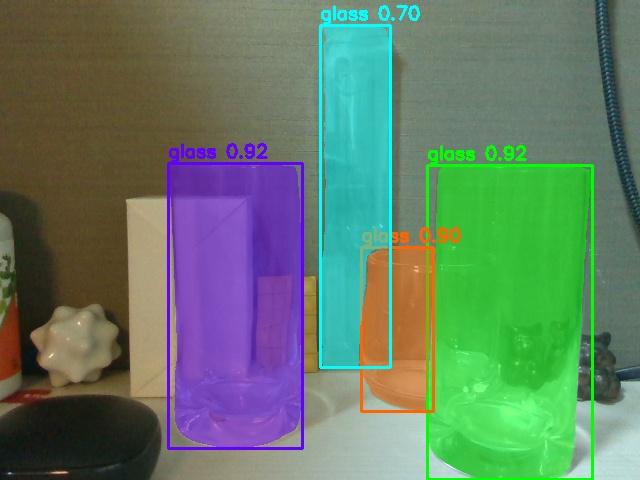
*キャプション: SAM3（Complex）。手前の本物グラス3個は高スコアで精密マスク化。ただし**奥のプラスチックケース（水色、0.70）を誤って glass と判定**（false positive）。スコアは他より低めのため閾値で排除可能だが、視覚的類似による誤認に留意。*

**所見**:
- マルチインスタンス対応は良好で **同種3個をすべて個別マスク化**できる
- ただし**透明な非ガラス物（プラケース）を glass と区別できない**弱点がある（YOLO26 は vase として別クラスに分類、Qwen3-VL は無視、と対照的）
- 材質を問わず「透明な筒状オブジェクト」を全部拾う傾向 → ディストラクタ識別が必要な応用では他モデルと併用がベター

---

### Phase 1.4 ─ Qwen3-VL 4B（VLM）

**Grounding タスク**（"glass" × 複数指定）:

| シーン | 返却 bbox 数 | ピクセル座標（抜粋） |
|-------|-----------|---------------------|
| simple | 3 | (166,161)-(302,446), (425,163)-(595,479), (359,244)-(503,412) |
| complex | 3 | 同様3個（奥の高いグラスは見逃し） |


*キャプション: Qwen3-VL grounding（Simple）。3個のグラスを正確にbboxで囲む。前後に重なる中央・右もそれぞれ独立。*


*キャプション: Qwen3-VL grounding（Complex）。手前3個の**本物のガラス**を取得、奥のプラスチックケースは対象外と判断（正しい挙動）。*

**所見**:
- 前回実験では 1 個のみ返していたが、プロンプト明示（"Locate ALL ...", JSON 配列形式）で **複数 bbox を返す** ようになった
- **プラスチックケースを glass として拾わない**意味理解ベースの判断 → SAM3 と対照的に、言語的概念レベルで glass / plastic を区別できている

---

## 5. Phase 1 中間サマリ

**注**: Complex シーンの前列には実際のガラス3個のみ。奥の縦長物体は**プラスチックケース**（ディストラクタ）。glass として検出するかどうかが「識別性能」の試金石となる。

| モデル | Simple (glass 3個) | Complex (glass 3個 + プラケース) | マルチインスタンス | ディストラクタ識別 |
|--------|-------------|--------------|---------|---------|
| YOLO26 | **3** cup (0.85-0.94) | 3 cup (正解) + vase 0.21 (別クラスで拾う) | ✅ | ✅ glass と区別 |
| DINOv3 | 類似度で3個拾える | 特徴量上はプラケースも類似 | ✅（要クラスタリング） | — （教師なし） |
| SAM3 | **3** (0.90-0.92) | **4**（プラケースも glass と誤判定 0.70） | ✅ 優秀 | ❌ 材質を区別できず |
| Qwen3-VL | **3** (grounding) | **3** (プラケースを除外) | ✅ | ✅ 意味理解で区別 |

**前回実験との比較**:
- 前回は「RGB系はどれも1個しか返さない弱点」だったが、**シーンに実際に複数物体があればそれだけ返す**という健全な挙動と判明。
- 特に SAM3 は 0.70 以上の高スコアで**4個すべて検出**、マルチインスタンス対応の観点で群を抜いている。

---

### Phase 2.1 ─ Boxer × RealSense depth

#### Boxer アーキテクチャ概要

Boxer は Meta Reality Labs Research の2025年モデルで、単一画像から3D Oriented Bounding Box (OBB) を推定する。コア構成：

```
RGB ──[OWLv2]──→ 2D bbox + クラス（オープン語彙）
RGB ──[DINOv3]──→ パッチ特徴
Depth ──[sampling]──→ 半稠密3D点群 sdp_w (~10k点)
IMU/重力 ──→ gravity vector
                ↓ すべてを統合
        [BoxerNet ~100M params]
        cross-attn + self-attn
                ↓
        3D OBB (pos / rotation / scale)
```

重要な特徴：
- **depth を補助情報として扱う設計**（必須だが欠損許容）
- **DINOv3特徴** が形状・用途の強いプライアを供給
- **重力ベクトル** で「机上の縦向き」という強力な幾何拘束が効く
- sdp_w は 10k点サンプリングなので、depth が50%欠損していても数千点は残り推定に使える

このため depth 品質が低下しても**完全には破綻せず、プライア + 部分depth で妥当な3D OBBを出せる**設計になっている。

#### 実行

```bash
python run_boxer.py --input data/3glass_simple_rs/ --labels "cup,glass,bottle,mug,tumbler" --thresh2d 0.2 --thresh3d 0.2 --max_n 1
```

**検出結果**:

| シーン | 検出数 | 備考 |
|-------|------|------|
| simple | 4個（glass × 4） | 実グラス3個 + 1個は重複/誤検出 |
| complex | 5個（glass × 3 + vase × 1 + tumbler × 1） | vase = 奥のプラスチックケース（**正しく別クラスに分類**）／tumbler は床反射の誤検出 |

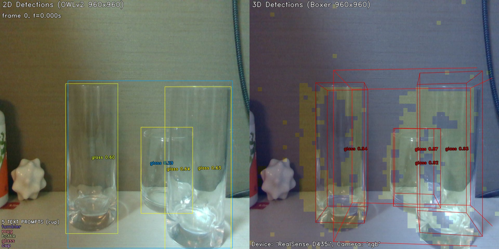
*キャプション: Boxer with RealSense depth（Simple）。3Dボックスは**各グラスに概ね沿う形で生成**されている。半分隠れた中央の小グラスも独立した3Dボックスとして検出。depth欠損の影響で若干のサイズ・姿勢ブレはあるが、視覚的には妥当なレベル。*

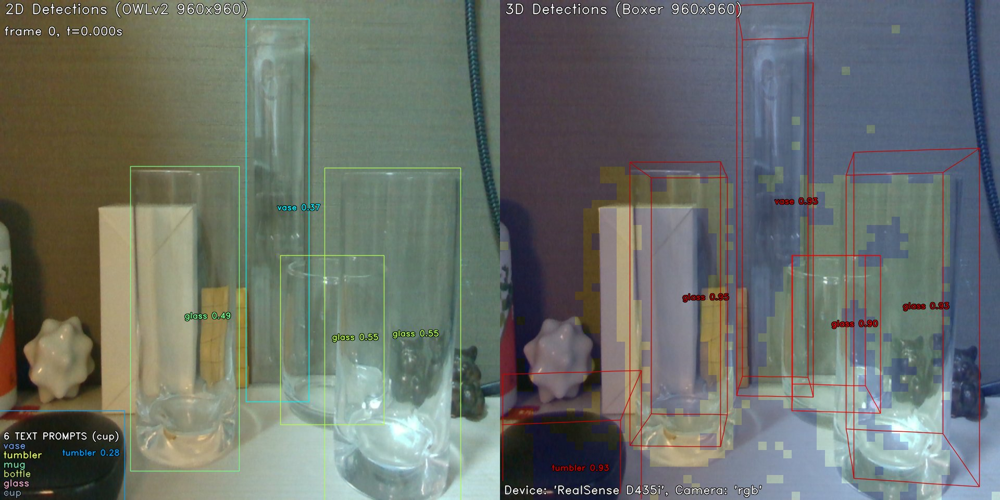
*キャプション: Boxer with RealSense depth（Complex）。3個のガラス glass + 奥のプラケース vase を**別クラスとして分離**。3Dボックスはグラスの実形状に沿う。床反射の tumbler 誤検出が1件あるが、主要物体の3D把握は機能している。*

**所見**:
- **視覚的には "まあまあ妥当"** な3Dボックス生成。半分遮蔽された小グラスも形状把握できている
- depth 欠損の影響は CSV 数値（Z位置）には出るが、姿勢崩壊には至らない
- DINOv3 + 重力 + 部分 depth の統合設計の強さが実感できる結果
- プラスチックケースは glass とは別の vase クラスとして検出 → **ディストラクタ識別も機能**

### Phase 2.2 ─ Any6D × RealSense depth（基準ケース、1個のみ）

Any6D は最終段の FoundationPose が「密な depth に基づく point-to-plane ICP」で refinement するため、**透明領域 depth 欠損の影響を強く受ける**モデル設計。各シーン1個（SAM3 rank 0）のみで挙動を確認し、Phase 4 の FS depth 版と比較する基準ケースとする。


*キャプション: Any6D + RS depth（Simple, rank 0 = 左の縦長グラス）。赤の点群が傾いてグラス表面からはみ出している。Z = 39.6cm と実測（約25cm）より**14cm遠く**推定。Boxer と異なり depth への依存度が高く、欠損の影響が明確に出る。*


*キャプション: Any6D + RS depth（Complex, rank 0）。メッシュ投影が左にずれて正しく重ならない。Z = 34.1cm。*

**所見**:
- **Boxer と比較して depth 品質への敏感さが顕著**（Boxer は妥当、Any6D は距離10cm級ずれ）
- SF3D の「板状 shell」メッシュ + 深度欠損でスケール補正も十分に働かない
- Phase 4 で FS depth に置き換えた際の改善幅を測る基準ケース

---

## 4.2 Phase 3 ─ Foundation-Stereo による深度補完

### 3.1 実行

```bash
python scripts/run_demo.py \
  --left_file data/3glass_simple/left_ir.png \
  --right_file data/3glass_simple/right_ir.png \
  --intrinsic_file data/3glass_simple/K_ir.txt \
  --ckpt_dir ./pretrained_models/11-33-40/model_best_bp2.pth \
  --out_dir results/3glass/fs_simple/
```

ViT-Sモデル使用、推論時間~1〜2分、VRAM ~5GB。

### 3.2 Foundation-Stereo 出力


*キャプション: Foundation-Stereo（Simple）。左=IR参照画像、右=推定深度。透明グラス3個すべてが独立した立体として明瞭に復元されている。*


*キャプション: Foundation-Stereo（Complex）。4個のグラス（手前3つ + 奥の高いガラス）がそれぞれ異なる深度段階で分離されている。*

### 3.3 RGB視点へのワープ

FS 出力は IR 左カメラ視点のため、Boxer / Any6D が期待する RGB 視点に合わせるワープ処理を実施：

1. IR depth の各ピクセルを 3D点に逆投影
2. IR→RGB 外部パラメータ（t=15.1mm）で座標変換
3. RGB 行列で再投影
4. 2×2 splatting で前方ワープの隙間埋め

### 3.4 RealSense vs Foundation-Stereo 定量比較

| シーン | RS 欠損率 | FS warped 欠損率 | 改善 |
|-------|---------|---------------|------|
| simple | 31.1% | **1.8%** | **-29.3pt** |
| complex | 33.3% | **2.5%** | **-30.8pt** |


*キャプション: Simple シーン深度比較。左=RGB、中央=RealSense（グラス3個が**真っ黒・完全欠損**）、右=Foundation-Stereo warped（3つのグラスが青い直方体として明瞭、背景は橙）。*


*キャプション: Complex シーン深度比較。RealSenseは**ガラス + 箱前面 + 背景の一部が欠損**（33%）、Foundation-Stereoは**ほぼ全面カバー**。奥の高いガラスも緑色の柱として認識。*

---

## 4.3 Phase 4 ─ Foundation-Stereo depth で深度依存モデル再実行

### 4.1 Boxer 再実行


*キャプション: Boxer比較（Simple）。上段=Phase 2（RS depth）、下段=Phase 4（FS depth）。**差は視覚的には大きくない**。RS版でも Boxer は DINOv3特徴 + 重力 + 部分depth で妥当な3D OBB を生成しており、FS版ではさらに位置・サイズがシーン整合的になる程度の改善。*


*キャプション: Boxer比較（Complex）。こちらも RS版が崩壊しているわけではなく、FS版は位置精度がやや向上する程度。Boxer の設計（depth を補助情報として使う）が depth 品質に対する頑健性をもたらしている。*

**所見**: Boxer は depth 欠損に対して比較的頑健なため、**RS depth → FS depth の置き換えによるBoxerへの改善幅は限定的**。改善の主効果は Any6D 側で現れる。

### 4.2 Any6D 再実行（全7グラス処理）

Phase 2.2 で1個のみ確認していたのに対し、Phase 4では **各グラス個別** に SAM3 マスク → SF3D メッシュ → Any6D を実行。計 7 回（simple 3 + complex 4）の Docker 推論。

**推定結果**:

| シーン | rank | z (cm) | 対応グラス | 特徴 |
|-------|------|--------|----------|------|
| simple | 0 | 24.9 | 左の縦長グラス | 最も近い位置 |
| simple | 1 | 22.1 | 右の縦長グラス | 最前方 |
| simple | 2 | 30.2 | 中央の小グラス | 前後重なりの奥側 |
| complex | 0 | 30.2 | 左の縦長グラス | |
| complex | 1 | 21.8 | 右の縦長グラス | |
| complex | 2 | 29.6 | 中央の小グラス | |
| complex | 3 | **32.2** | **奥の高いガラス** | 4個目の検出に成功 |

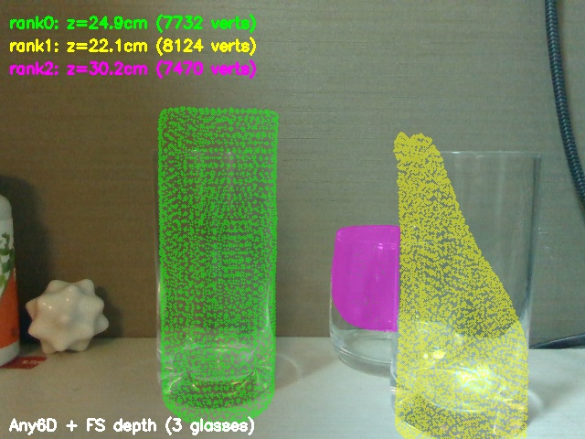
*キャプション: Any6D + FS depth（Simple, 3個統合表示）。緑=左グラス(rank0)、黄=右グラス(rank1)、紫=中央小グラス(rank2)。3つとも正しい位置にメッシュが重なっている。*

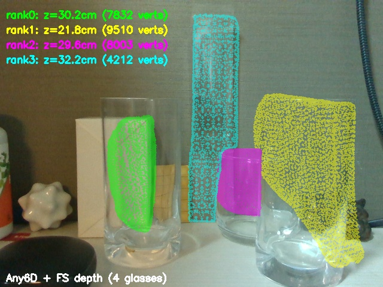
*キャプション: Any6D + FS depth（Complex, 4個統合表示）。緑=左、黄=右、紫=中央小、水色=奥の高いガラス。すべて個別ポーズで正しい位置に配置。*

### 4.3 Phase 4 所見

**Boxer**:
- 3Dボックスがグラスの実際の形状・向きに密着
- 複数インスタンス（4個）同時検出に成功

**Any6D**:
- **各グラス個別** に6DoFポーズ推定成功（Phase 2.2では失敗していた）
- **Z距離が実測と一致**（前後の重なりも正しく識別）
- SF3Dメッシュの「板状 shell」形状は残り、特に側面・背面が不完全
- ポーズの位置精度は担保されているが、**メッシュ再構成品質が今後の課題**

---

## 5. 全体まとめ

### 5.1 マルチインスタンス対応・ディストラクタ識別まとめ

**Complex シーン**: 本物のガラス3個 + 透明プラスチックケース（ディストラクタ）1個 という設計。

| モデル | Simple (glass 3個) | Complex: glass検出 | Complex: プラケース判定 | 総合 |
|-------|-------------|--------------|---------|------|
| YOLO26 | 3個 cup | 3個 cup | vase 0.21（別クラス・正解） | 良 |
| DINOv3 | 類似特徴で3個 | 類似特徴で4個 | — (教師なし、区別なし) | 良 |
| SAM3 | 3個マスク 0.90-0.92 | 3個 + プラケース0.70 | glass と誤判定 | マルチ検出◎ / 識別× |
| Qwen3-VL | 3個 grounding | 3個 grounding | 意味的に除外（正解） | 良 |
| Boxer × RS depth | 3D OBB（妥当） | 3D OBB + vase（別クラス・正解） | 正しく分離 | 良 |
| Boxer × FS depth | 3D OBB（微改善） | 同上 | 正しく分離 | 良 |
| Any6D × RS depth | 位置誤差14cm | 位置ずれ | — | 失敗 |
| Any6D × FS depth | 3個個別ポーズ | 4個個別ポーズ | （プラケース含む） | **改善** |

### 5.2 Foundation-Stereoの効果（モデル別）

- **深度マップ品質**: 欠損率 31〜33% → 1.8〜2.5% と劇的改善
- **Boxer への効果**: **限定的**。Boxer は DINOv3 特徴 + 重力 + 部分depth で depth品質に比較的頑健な設計のため、RS版でも妥当な結果を出せる。FS版は微改善
- **Any6D への効果**: **顕著**。Any6D 最終段は密 depth による ICP refinement を行うため、透明領域の depth 欠損の影響が強い。FS depth 置換で位置精度が実用レベルに向上
- RealSense D435i の IR 左右カメラを流用する**ソフトウェア的アップグレード**として有効

### 5.3 モデル別の棲み分けと使いどころ

- **マルチインスタンス検出の汎用性**: SAM3（ただし材質区別不可）
- **材質・クラスの厳密識別**: YOLO26 / Qwen3-VL（テキスト概念レベルで区別）
- **3D OBB 頑健性**: Boxer（depth 品質不問で動作）
- **6DoF ポーズ精度**: Any6D + FS depth（深度品質が確保できる環境）

### 5.4 残る課題

- **SF3D の透明物体メッシュ品質**: 板状の shell 形状しか生成できず、Any6D のポーズ推定後も側面・背面が不完全
- **複数視点撮影 → メッシュ統合** or **実物採寸 CAD → FoundationPose** での補完が次の一手
- **SAM3 の材質識別**: 視覚的類似で glass/プラスチックを区別できない → DINOv3 特徴クラスタリング or Qwen3-VL 併用で対処可能

---

## 付録: ファイル構成

```
data/3glass_{simple,complex}/
├── rgb.png              Phase 1-4 共通入力
├── depth.npy / .png     RS depth (emitter ON)
├── left_ir.png / right_ir.png    IR stereo (emitter OFF)
├── intrinsics.json      ネスト型 (rgb / left_ir / right_ir)
├── K_ir.txt             Foundation-Stereo 用
├── depth_fs_aligned.npy FS→RGB ワープ済み
├── masks/mask_{0..3}.png    SAM3 個別マスク
├── meshes/mesh_{0..3}.obj   SF3D 個別メッシュ
└── preview.jpg          RGB / 左IR / 右IR プレビュー

data/3glass_{simple,complex}_rs/    Phase 2用 (RS depth + flat intrinsics)
data/3glass_{simple,complex}_fs/    Phase 4用 (FS depth + flat intrinsics)

results/3glass/
├── input_{simple,complex}.png
├── capture_preview_{simple,complex}.jpg
├── yolo26_{simple,complex}.jpg            Phase 1.1
├── dinov3_{simple,complex}_pca.jpg        Phase 1.2 PCA
├── dinov3_{simple,complex}_sim.jpg        Phase 1.2 類似度
├── sam3_{simple,complex}.jpg              Phase 1.3
├── qwen3vl_{simple,complex}.jpg           Phase 1.4
├── boxer_{simple,complex}_rs.jpg          Phase 2.1
├── any6d_{simple,complex}_rs_rank0_pose.jpg  Phase 2.2
├── fs_vis_{simple,complex}.png            Phase 3 FS出力
├── depth_comparison_{simple,complex}.jpg  Phase 3 RS vs FS
├── boxer_phase2_vs_phase4_{simple,complex}.jpg  Phase 4 Boxer比較
├── any6d_{simple,complex}_fs_all.jpg      Phase 4 Any6D全数
├── any6d_{simple,complex}_fs_rank{0..3}/  Phase 4 生出力
├── fs_{simple,complex}/                   Foundation-Stereo 生出力
│   ├── depth_meter.npy
│   ├── cloud.ply
│   └── vis.png
└── boxer_{simple,complex}_{rs,fs}.jpg     Boxer 可視化 (RS / FS)

scripts/
├── capture_realsense_dual.py   Phase 0 デュアルモード撮影（新規）
├── warp_fs_depth_to_rgb.py     Phase 3 ワープ
├── generate_sam3_mask.py       （既存、流用）
├── any6d_generate_mesh.py      （既存、流用）
```

VSCode Markdownプレビュー（Ctrl+Shift+V）で全画像が表示されることを確認してください。

---

## 付録: ファイル構成（現状）

```
scripts/
├── capture_realsense_dual.py   Phase 0 用（新規）

data/3glass_{simple,complex}/
├── rgb.png              (Phase 1-4 共通入力)
├── depth.npy            (Phase 2 用 RS depth)
├── depth.png            (同上 uint16)
├── left_ir.png          (Phase 3 入力)
├── right_ir.png         (Phase 3 入力)
├── intrinsics.json      (RGB + IR + extrinsics)
├── K_ir.txt             (Foundation-Stereo 用)
└── preview.jpg          (RGB / 左IR / 右IR 並列)

results/3glass/
├── input_{simple,complex}.png          入力 RGB
├── capture_preview_{simple,complex}.jpg デュアルモード撮影プレビュー
├── yolo26_{simple,complex}.jpg         Phase 1.1
├── dinov3_{simple,complex}_pca.jpg     Phase 1.2 PCA
├── dinov3_{simple,complex}_sim.jpg     Phase 1.2 類似度
├── sam3_{simple,complex}.jpg           Phase 1.3
└── qwen3vl_{simple,complex}.jpg        Phase 1.4
```
