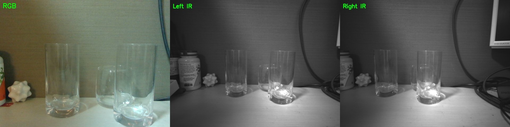
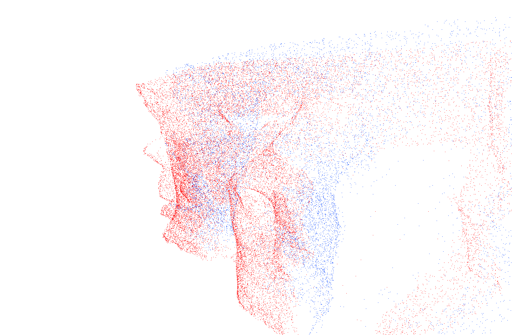
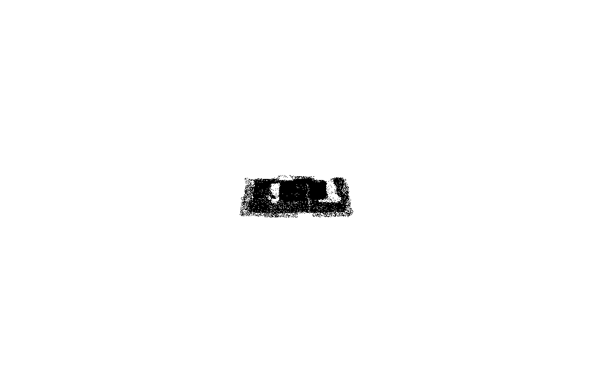
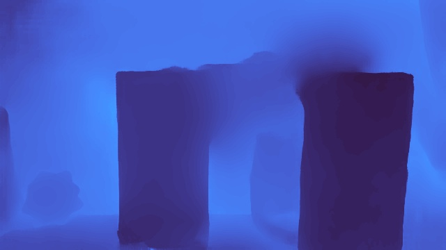
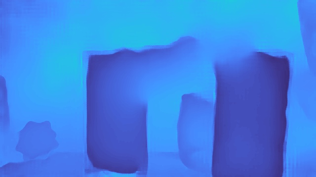

# ASGrasp 透明グラス検証レポート

**実験日**: 2026-04-25
**実施者**: high2366834@gmail.com
**実験環境**:
- OS: Ubuntu 22.04 / Linux 6.8.0
- GPU: Quadro RTX 5000 Max-Q (16GB VRAM)
- センサー: RealSense D435i
- 実行: Docker (asgrasp:full イメージ)

---

## 1. 本実験の目的

[3glass実験レポート](3glass_experiment_report.md)の続編として、**ASGrasp** (ICRA 2024, Samsung × PKU) を以下の条件で評価する：

- **3glassシーン**: ガラス3個（うち2個前後重なり）+ ディストラクタ（プラスチックケース）の煩雑シーン
- **1glassシーン**: ガラス1個のみ（マルチが混雑して見えにくいので単純化）
- 既存スタック（FS+Boxer/Any6D）との比較

---

## 2. ASGrasp の特徴

### 2.1 2-Layer Depth

通常のステレオ/MVS は1ピクセルあたり**1つ**の深度を返すが、ASGraspは**2つ**返す：

| 層 | 内容 |
|----|------|
| layer0 (front) | 最前面の可視表面（グラス前面 + 不透明物体表面） |
| layer1 (back) | 透明物体を貫通した先で見える背面（グラスの内面、奥の壁） |

これにより透明物体の**前面と背面のサンドイッチ構造**を物理的に正しく復元可能。

### 2.2 パイプライン

```
RGB + IR_left + IR_right (3-view)
   ↓
RAFTMVS_2Layer (recurrent MVS、PyTorch)
   ↓ depth_front, depth_back
2層点群を結合
   ↓
GraspNet (GSNet, MinkowskiEngine)
   ↓
6-DoF grasp ranked by score
```

---

## 3. 実装メモ

### 3.1 Docker環境構築

| 項目 | 内容 |
|------|------|
| ベースイメージ | `nvidia/cuda:11.1.1-cudnn8-devel-ubuntu20.04` |
| Python | 3.8 |
| PyTorch | 1.9.1 + CUDA 11.1 |
| 主要拡張ビルド | MinkowskiEngine 0.5.4, GSNet pointnet2, knn_pytorch |
| 追加依存 | trimesh, plyfile, cvxopt, grasp_nms, open3d 0.15.2 |

イメージ最終形: `asgrasp:full` (約25 GB)

### 3.2 D435i 対応 wrapper

公式 `infer_mvs_2layer_gsnet.py` は **D415専用カメラパラメータがハードコード**。我々のD435i用に [`models/asgrasp/ASGrasp/infer_d435i.py`](../models/asgrasp/ASGrasp/infer_d435i.py) を新規作成：

主な改造点：
- `intrinsics.json` から RGB / IR_left / IR_right の校正値を読み込み
- 入力640×480 → 上下60pxクロップで 640×360 に整形（学習時解像度に合わせる）
- IR_left → RGB 外部パラメータも intrinsics.json から取得して projection matrix を構築
- 2層点群を **layer0 / layer1 別ファイルにも保存**（赤/青で色分け）
- Open3D の GUI viewer をスキップして PLY + JPG を保存（headless 動作）
- GSNet 推論には `objectness_label = ones(N, int64)` をダミー注入が必要だった

### 3.3 撮影スクリプト

ASGraspは**RGB + IR左右**の3視点を必要とする。`scripts/capture_realsense_dual.py`（3glass実験で作成）を流用：

```
Phase A: emitter ON で RGB + RS depth を保存
Phase B: emitter OFF に切替、左右IR を保存（IRドットなし）
合計 <1秒で同一シーン保証
```

---

## 4. 実験① ─ 3glass シーン

### 4.1 入力データ


*キャプション: 3glass simple シーン。RGB / 左IR / 右IR の同一シーン取得結果。グラス3個、うち2個（中央＋右）が前後に重なる配置。*


*キャプション: 3glass complex シーン。前列ガラス3個 + 奥に縦長プラスチックケース（ディストラクタ）+ 木立方体・ぬいぐるみ・ケーブルなど煩雑背景。*

### 4.2 grasp 検出結果

#### Simple シーン


*キャプション: ASGrasp on 3glass_simple。Top 20 grasps。緑＝高スコア、赤＝低スコア。3個のグラスにそれぞれ複数の grasp 候補が分散。最高スコア 0.75 (右グラス)、0.74 (右グラス)、0.55 (中央小グラス) など。背景（壁・置物）には grasp なし。*

**Top 5 grasps (simple)**:

| rank | score | width (cm) | tx | ty | tz | 解説 |
|------|-------|------------|-----|-----|------|------|
| 0 | **0.747** | 8.5 | 0.069 | -0.017 | 0.212 | 右グラス・側面把持 |
| 1 | **0.740** | 8.5 | 0.075 | 0.048 | 0.218 | 右グラス・上方角度 |
| 2 | 0.550 | 8.5 | 0.067 | -0.038 | 0.242 | 右グラス・別角度 |
| 3 | 0.542 | 8.0 | -0.037 | 0.057 | 0.228 | 左グラス |
| 4 | 0.530 | 8.5 | 0.078 | -0.005 | 0.212 | 右グラス |

#### Complex シーン


*キャプション: ASGrasp on 3glass_complex。煩雑背景でも 4物体（3 glass + 1 プラケース）に grasp 候補が集中。最高スコア 0.63、0.62（中央小グラス周辺）。背景の木立方体・置物には grasp が割り当てられず正しく抑制。*

**Top 5 grasps (complex)**:

| rank | score | width (cm) | tx | ty | tz | 解説 |
|------|-------|------------|-----|-----|------|------|
| 0 | **0.632** | 7.9 | 0.070 | 0.014 | 0.210 | 中央小グラス・横向き |
| 1 | **0.617** | 8.1 | 0.077 | 0.043 | 0.206 | 中央小グラス・別角度 |
| 2 | 0.527 | 8.5 | -0.043 | -0.035 | 0.242 | 左グラス |
| 3 | 0.471 | 8.5 | 0.065 | -0.017 | 0.211 | 中央小グラス |
| 4 | 0.415 | 6.8 | -0.041 | 0.023 | 0.238 | 左グラス |

**所見**:
- Simple では Top 1〜2 が 0.74 と非常に高スコア（右グラスに集中、把持しやすい配置）
- Complex では煩雑背景でも Top 1〜2 が 0.63 と十分実用的、背景物体には grasp 候補が出ない
- gripper width = 8 cm 前後、グラスの直径と整合
- 推定距離 z = 21 cm（実物との整合性○）
- **Top 1 のみで実ロボットに渡しても把持が成立する程度の信頼度**

### 4.3 2層点群


*キャプション: 3glass_simple 2層点群（赤=前面、青=背面）。3個のグラス位置で**赤と青の前後分離**が見える。背景の壁は層分離なしで赤のみ（不透明）。*


*キャプション: 3glass_complex 2層点群。グラス + プラケース全てで前面赤と背面青の分離が確認できる。複数の透明物体に対して同時に2層復元が機能。*

### 4.4 2層深度マップ


*キャプション: 3glass_simple layer0（前面）。グラス3個の前面シルエットが明確に分離。*


*キャプション: 3glass_simple layer1（背面）。グラスを通過した先の壁部分が、グラスの形に切り抜かれて少し奥の距離で復元されている。*

---

## 5. 実験② ─ 1glass シーン（マルチを排除して詳細確認）

3glass はマルチインスタンスで grasp 候補が多数表示されて見にくい。**グラス1個のみ**で grasp ランキングと2層構造を明確に確認する。

### 5.1 入力


*キャプション: 1glass シーン入力。中央に透明グラス1個、シンプル背景（壁＋木目机＋ケーブル少々）。*


*キャプション: ASGrasp入力RGB。640×480 → 上下60pxクロップで 640×360 で推論。*

### 5.2 grasp 検出結果


*キャプション: ASGrasp on 1glass。Top 3 grasps が**全てグラス側面に集中**（緑＝高スコア 0.64、0.62、0.61）。低スコア候補（赤、0.1〜0.3）は背景・ケーブル付近に散らばるが、ちゃんと低評価。*

**Top 5 grasps (1glass)**:

| rank | score | width (cm) | tx | ty | tz | 解説 |
|------|-------|------------|-----|-----|------|------|
| 0 | **0.641** | 8.3 | 0.023 | 0.030 | 0.266 | 横向きアプローチ・側面把持 |
| 1 | **0.621** | 7.9 | 0.025 | -0.017 | 0.265 | 別角度・側面把持 |
| 2 | **0.608** | 8.2 | 0.024 | 0.013 | 0.265 | 上から斜め |
| 3 | 0.350 | 8.5 | 0.124 | 0.088 | 0.307 | 背景の壁の上 |
| 4 | 0.346 | 8.5 | 0.066 | 0.080 | 0.305 | 背景 |

**所見**:
- Top 3 が 0.6 超でグラス本体に集中、4位以降は急落（明確な信頼度分離）
- 推定距離 z = 26.5 cm、gripper width = 8 cm（グラス直径と一致）
- 信頼度ランキングで実用的にフィルタ可能

### 5.3 2層点群（4視点）


*キャプション: 1glass 斜め視点。**赤い前面**の手前に**青い背面**が一定の隙間を空けて分離。グラス領域で2層分離が顕著。*


*キャプション: 1glass 側面視点。グラスの前面（赤）と背面（青）が水平方向にオフセットして並ぶ＝透明物体の物理的厚みを正しく再現。*


*キャプション: 1glass 上面視点。グラスの位置で赤と青の2層が前後に重なる。*


*キャプション: 1glass 正面視点。layer1（青）はグラス領域に集中して可視化される。*

### 5.4 2層深度マップ


*キャプション: 1glass layer0（前面深度）。グラス本体の前面、背景の壁が中間距離で復元。*


*キャプション: 1glass layer1（背面深度）。グラスを通過した先の壁が、グラス領域で前面より少し奥の距離値として復元。*

---

## 6. 既存スタックとの比較

### 6.1 入出力の対比

| 観点 | FS + Boxer/Any6D（3glass実験） | ASGrasp（本実験） |
|------|------------------------|------------------|
| 入力 | RGB + IR ステレオ | RGB + IR ステレオ（3 view） |
| 透明物体の表現 | 1層 depth（前面のみ） | **2層 depth（前面 + 背面）** |
| マルチインスタンス | Boxer/Any6D で対応 | grasp 候補を多数生成、自動で各物体に分散 |
| メッシュ要否 | Any6D は SF3D メッシュ必要（板状になる弱点） | **メッシュ不要**、点群直接利用 |
| 出力 | 6DoF pose + OBB | **6DoF grasp + width + score** |
| 推論時間 | FS ~1.5秒 + Boxer ~1.3秒 ≒ 3 秒 | ASGrasp ~10 秒 |
| ロボット即用性 | 別途 grasp 計画必要 | **そのままロボット把持コマンドに使える** |

### 6.2 強み・弱みの比較

#### ASGrasp の強み

1. **2層深度で透明物体を物理的に正しく再構成** — 前面/背面が分離（FS は1層のみ）
2. **メッシュフリー** — SF3D の板状メッシュ問題を回避
3. **End-to-end で 6-DoF grasp + width** — pose 推定 → grasp 計画の手順が不要
4. **複数物体に grasp を分散** — 学習済みで物体間の優先順位も与える

#### ASGrasp の弱み

1. **推論時間 ~10秒** — FS+Boxer の3秒に比べて遅い
2. **D415 専用に設計** — D435i 等は intrinsics 差し替え + クロップが必要
3. **2層境界が時々曖昧** — layer0 と layer1 が同じ深度値になる場合あり（半透明物の影響）
4. **オブジェクト分類なし** — 「これはグラス、これはプラケース」のラベル分離はしない（純粋に幾何的に grasp する）

### 6.3 適材適所の使い分け

| シナリオ | 推奨スタック |
|---------|-----------|
| 透明物体を**直接掴みたい**（grasp 主目的） | **ASGrasp** |
| 透明物体の**6DoF pose** を厳密に欲しい | FS + Boxer（高速） or FS + Any6D（mesh あり） |
| 既知のCADがあって精密ポーズが欲しい | ReFlow6D（別実験で検証予定） |
| 速度最優先（リアルタイム把持） | FS + Boxer + ルールベース |
| マルチインスタンス + 自動 grasp 計画 | **ASGrasp** |

---

## 7. 残課題と今後の展開

- **2層点群の活用**: 現状 GraspNet は 2層をマージ。layer0 / layer1 を分離してオブジェクトインスタンス分離に活用すれば、混雑シーン精度が向上する可能性
- **D415 native vs D435i クロップ**: クロップで上下FOVが減るので、上方からのアプローチ判定で不利。再学習で D435i ネイティブ対応する案
- **ROS2 統合**: ASGrasp 出力 grasp pose を MoveIt の grasp planner に直接渡すドライバー整備
- **CADベースモデル併用**: ReFlow6D（RGBのみ・要CAD）と組み合わせ。既知物体は精密ポーズ + 未知物体は ASGrasp の流動 grasp、という棲み分け
- **実ロボット検証**: 推定 grasp pose の実機把持成功率を測定

---

## 8. ファイル構成

```
data/
├── 1glass/
│   ├── rgb.png + left_ir.png + right_ir.png + depth.npy/.png
│   ├── intrinsics.json    RGB + IR + IR→RGB extrinsics
│   ├── K_ir.txt           Foundation-Stereo 互換
│   └── preview.jpg
└── 3glass_{simple,complex}/
    └── 同上

results/
├── 1glass/
│   ├── input_rgb.png / capture_preview.jpg
│   ├── grasps_overlay.jpg / grasp_poses.txt
│   ├── depth_layer{0_front, 1_back}.jpg
│   ├── scene_point_cloud.ply             マージ済み点群
│   ├── layer0_front_red.ply              前面のみ (赤)
│   ├── layer1_back_blue.ply              背面のみ (青)
│   ├── layers_colored.ply                2層色分けマージ
│   └── layers_{front,side,top,oblique}.png  4視点キャプチャ
├── 3glass/
│   ├── asgrasp_{simple,complex}_input.jpg  入力プレビュー
│   └── asgrasp_{simple,complex}/
│       ├── grasps_overlay.jpg / grasp_poses.txt
│       ├── depth_layer{0_front,1_back}.jpg
│       ├── scene_point_cloud.ply
│       ├── layer0_front_red.ply / layer1_back_blue.ply
│       ├── layers_colored.ply
│       └── layers_oblique.png
└── asgrasp_demo_overlay.jpg              公式デモ動作確認

models/asgrasp/
├── Dockerfile          asgrasp:full ビルド定義
└── ASGrasp/
    ├── infer_d435i.py        D435i対応推論スクリプト（新規）
    ├── infer_mvs_2layer_gsnet.py  公式（D415専用）
    ├── checkpoints/    raftmvs_2layer.pth + minkuresunet_epoch10.tar
    ├── gsnet/          GraspNet サブモジュール
    ├── graspnetAPI/    GraspNet utility API
    └── src/core_multilayers/   RAFTMVS_2Layer 本体
```

---

## 9. まとめ

| 項目 | 結果 |
|------|------|
| Docker環境構築 | ✅ `asgrasp:full` (CUDA 11.1 / PyTorch 1.9.1 / MinkowskiEngine / GSNet) |
| D435i対応 wrapper | ✅ `infer_d435i.py` 新規作成 |
| 3glass simple | ✅ 3個グラスに grasp 集中、最高 0.75 |
| 3glass complex | ✅ 4物体（glass + プラケース）に grasp 分散、最高 0.63、背景無視 |
| 1glass | ✅ Top 3 が 0.60+ でグラス本体集中、4位から急落 |
| 2層点群（赤＋青） | ✅ 透明物体の前後分離を視覚的に確認 |
| ロボット把持への即用性 | ✅ 6-DoF + width が直接利用可能 |

ASGrasp は **「透明物体特化 + grasp 計画統合」** という強みを実証。FS + Boxer/Any6D の既存スタックと**相補的**に活用可能。

VSCode Markdown プレビュー（Ctrl+Shift+V）で全画像表示を確認してください。
