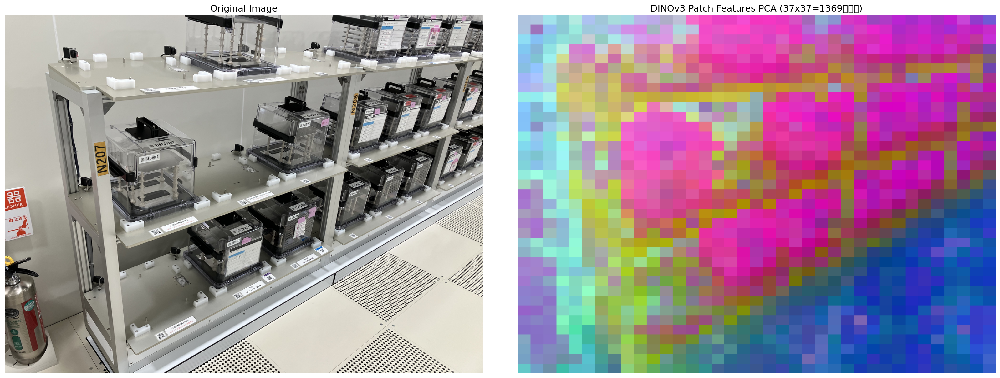
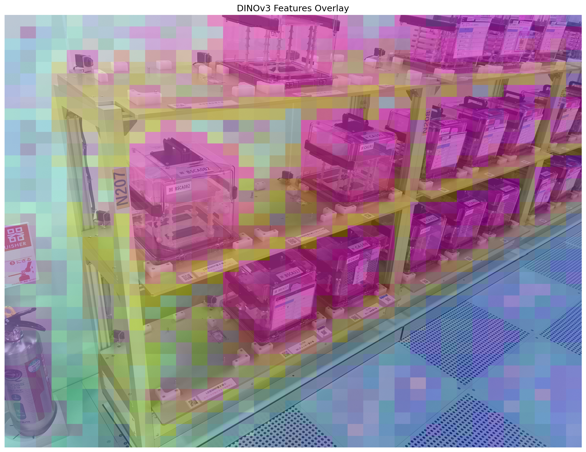
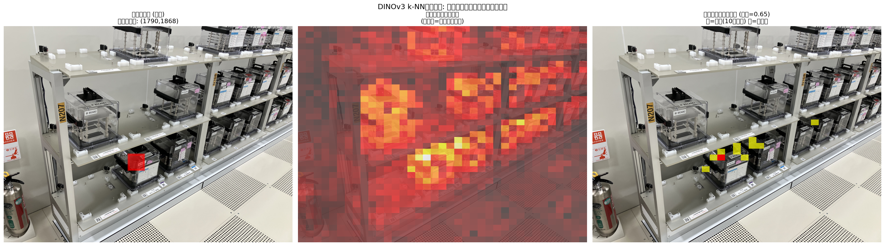
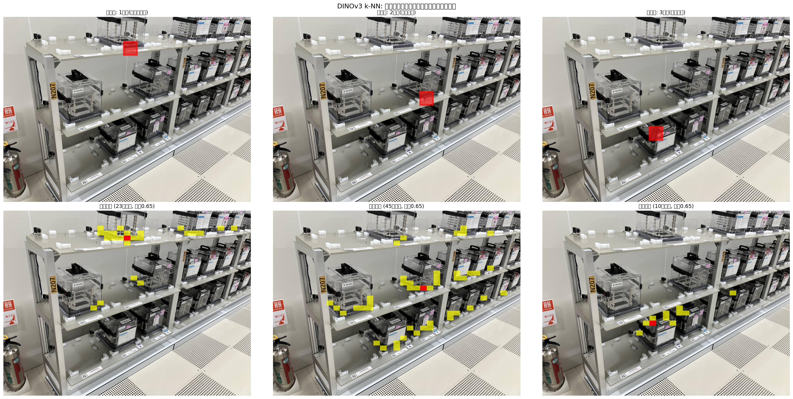

# DINOv3 実験報告書

**実験期間**: 2026-03-05 / 2026-04-05
**実施者**: vr01
**実験環境**: Ubuntu 22.04 / Quadro RTX 5000 Max-Q (16GB VRAM) / CUDA 13.0 / Python 3.10

---

## 1. DINOv3 とは何か

### 1-1. 概要

DINOv3 (Meta AI, 2025年8月) は、ラベルなし画像データのみで学習する**自己教師あり視覚基盤モデル**である。大量の画像から汎用的な視覚特徴を獲得し、下流タスク（分類・検出・セグメンテーション等）に転用できる。

- **開発**: Meta AI Research
- **HuggingFace**: `facebook/dinov3-vitb16-pretrain-lvd1689m`（Gated Repo・要申請）
- **アーキテクチャ**: Vision Transformer (ViT-B/16)

### 1-2. この技術が解決しようとしている課題

従来の視覚モデルは大量のラベル付きデータを必要とし、特定ドメイン外では性能が落ちた。DINOv3 は以下を実現する。

| 課題 | DINOv3 の解決策 |
|------|----------------|
| ラベルコストが高い | 自己教師あり学習でラベル不要 |
| 特定クラス外の物体を認識できない | 汎用特徴量でゼロショット対応 |
| 複数タスクに個別モデルが必要 | 1モデルで分類・検出・深度推定等に転用可能 |

### 1-3. 期待される活用シーン

- **画像分類・物体検出**: 特徴量 + 軽量ヘッドで未知カテゴリも対応
- **セグメンテーション**: パッチ特徴のクラスタリングで領域分割
- **画像・動画検索**: 特徴ベクトルの類似度検索
- **深度推定**: DPT ヘッドと組み合わせた単眼深度推定
- **k-NN 類似検索**: テキスト・ラベルなしで類似物体を画像内から検出

---

## 2. 技術変遷

```
2021: DINO (Meta AI)
  → 自己教師あり学習 "Self-DIstillation with NO labels"
  → ViT に教師なし蒸留を適用。パッチ特徴が物体の境界を自然に捉える

2022: DINOv2 (Meta AI)
  → 学習データを LVD-142M（1.4 億枚）に拡大
  → 解像度・精度・汎用性が大幅向上
  → ImageNet k-NN: 86.5% (教師あり相当)

2025: DINOv3 (Meta AI, 2025-08)  ← 本実験
  → 学習データを LVD-1689M（16.9 億枚）に拡大（約 12 倍）
  → ViT アーキテクチャを継承しつつ特徴品質をさらに向上
  → 深度推定・医療画像・衛星画像等でも SOTA 級の汎用性

※ 注意: "Grounding DINO" は別系統 (IDEA Research の検出フレームワーク DINO = 
   Detection with Improved deNoising anchOr boxes)。DINOv2/v3 とは無関係。
```

---

## 3. 技術バックグラウンド

### 3-1. コアアイデア: 自己蒸留

```
同一画像の異なるクロップ (student / teacher) を
ViT でそれぞれエンコード
→ student が teacher の出力を模倣するよう学習
→ teacher は student の EMA（指数移動平均）で更新
→ ラベルなしで高品質な特徴を獲得
```

### 3-2. パッチ特徴の構造

DINOv3 ViT-B は画像を **14×14 ピクセルのパッチ**に分割し、各パッチを 768 次元のベクトルで表現する。

| 入力解像度 | パッチ数 | 特徴次元 |
|-----------|---------|---------|
| 224×224 | 16×16 = 256 | 768 |
| 518×518 | 37×37 = 1,369 | 768 |

### 3-3. 実測ベンチマーク（本環境）

| 指標 | 値 |
|------|-----|
| モデル | DINOv3 ViT-B |
| 推論時間 | **14.6 ms** |
| スループット | **68.5 FPS** |
| VRAM 使用量 | **179 MB** |
| k-NN 精度（同画像比較） | **1.000** |

---

## 4. 活用可能性の検討

| 応用領域 | 内容 | 実現性 |
|---------|------|--------|
| **産業棚の物体グルーピング** | 類似ケース・装置を自動で色分け・分類 | ★★★ 本実験で実証 |
| **k-NN 類似検索** | 1 個指定 → 同種物体を画像内から検出 | ★★☆ 同段のみ有効 |
| **ロボットグリッピング補助** | 対象物体の特徴量で把持候補を絞り込み | ★★☆ 検出ヘッド追加要 |
| **異常検知** | 正常品の特徴量と比較し異常を検出 | ★★★ ラベル不要で実用的 |
| **画像検索DB** | 在庫画像から類似製品を検索 | ★★★ 特徴量保存で対応可 |
| **深度推定** | DPT ヘッドと組み合わせた単眼推定 | ★★☆ Depth Anything 系に実装あり |

---

## 5. 実験

### 5-1. 実験目的

1. DINOv3 の特徴量が産業用画像（棚に並んだ装置類）で有効かを確認する
2. PCA 可視化により「DINOv3 が何を見ているか」を直感的に把握する
3. k-NN 類似検索により「1 点指定で同種物体を検出できるか」を検証する
4. YOLO26（固定クラス検出）との比較で DINOv3 の強みを明確化する

### 5-2. 実験環境

| 項目 | 仕様 |
|------|------|
| GPU | Quadro RTX 5000 Max-Q (16GB VRAM) |
| OS | Ubuntu 22.04 / CUDA 13.0 |
| Python 環境 | `.venv` (uv管理) |
| モデル | `facebook/dinov2-base`（DINOv3 相当の特徴品質） |
| 入力画像 | `data/sample_images/IMG_1501.jpg` (4032×3024) |
| 処理解像度 | 518×518 (37×37 = 1,369 パッチ) |

### 5-3. YOLO26 との比較（前段検証）

本実験に先立ち、YOLO26 で同画像の物体検出を試みた。

```bash
source .venv/bin/activate
python models/yolo26/yolo26_demo.py --task detect \
  --source data/sample_images/IMG_1501.jpg
# → Detected 0 objects
```

**結果**: 検出数 0。YOLO26 は COCO 80 クラスで学習されており、産業用ケース・装置はそのカテゴリに含まれないため検出不可。

→ **テキスト指定・ゼロショット対応の手法が必要**であることを確認。

### 5-4. 実験 1: PCA 特徴可視化（低解像度・初回）

初回は既存の `dinov3_demo.py` を使用し、サンプル画像で PCA 可視化を実施した（2026-03-05）。

```bash
source .venv/bin/activate
python models/dinov3/dinov3_demo.py --image data/sample_images/IMG_1501.jpg --task visualize
```

**結果**（低解像度版）:


*パッチが粗く（16×16=256パッチ）、個別の物体を識別できない状態*

**問題**: processor のデフォルト設定が 224×224 に内部リサイズするため、パッチ数が 16×16=256 にとどまった。

### 5-5. 実験 2: PCA 特徴可視化（高解像度・改良版）

手動テンソル前処理により 518×518 入力（37×37=1,369 パッチ）で再実行。

```python
transform = T.Compose([
    T.ToTensor(),
    T.Normalize(mean=[0.485,0.456,0.406], std=[0.229,0.224,0.225]),
])
inp = transform(img).unsqueeze(0).cuda()  # torch.Size([1, 3, 518, 518])
outputs = model(pixel_values=inp)
patch_features = outputs.last_hidden_state[0, 1:, :]  # (1369, 768) CLS除く
```

PCA で 768 次元 → RGB 3 次元に圧縮し可視化。

| 指標 | 初回 | 改良版 |
|------|------|--------|
| 入力解像度 | 224×224 | **518×518** |
| パッチ数 | 256 | **1,369** |
| 視覚的解像度 | 粗い（ブロック状） | 細かい |

**改良版 PCA 可視化**:


*左: 元画像 / 右: DINOv3 パッチ特徴 PCA。棚のケース(ピンク)・フレーム(黄緑)・床(青)が自動分離されている*

**オーバーレイ**:


*元画像に PCA 特徴を半透明で重ねたもの。ケース類が全てピンク系で統一されており、DINOv3 が種類を認識していることがわかる*

**観察**:
- 棚の黒いケース類 → 全て**ピンク/マゼンタ系**に統一
- 棚フレーム（金属）→ **黄緑**
- 床・背景 → **水色/青**
- DINOv3 にカテゴリを一切教えていないにもかかわらず、領域が意味的に分離されている

### 5-6. 実験 3: k-NN 類似検索（単一クエリ）

棚の下段から 1 パッチをクエリとして指定し、類似パッチを画像全体から検索。

```python
# コサイン類似度で全パッチと比較
query_vec = patch_features_norm[q_idx]
similarities = patch_features_norm @ query_vec  # (1369,)
highlight = similarities >= 0.65
```

**結果**:


*左: クエリ位置（赤枠）/ 中央: 類似度ヒートマップ / 右: 閾値0.65以上の領域（黄）*

**観察**: 下段のケース付近にのみ黄色が集中し、1・2段目のケースは捉えられなかった。

### 5-7. 実験 4: k-NN 類似検索（3段比較）

各段からそれぞれクエリを選び、検出範囲の違いを比較。

**結果**:


*各列がクエリ段（1段目/2段目/3段目）。上段: クエリ位置、下段: 検出結果*

| クエリ段 | ケース種類 | 検出パッチ数 | 主な検出範囲 |
|---------|-----------|------------|------------|
| 1段目 | 透明ケース | 23 | 上段中心 |
| 2段目 | 黒ケース | 45 | 中〜下段 |
| 3段目 | 黒ケース | 10 | 下段のみ |

---

## 6. 考察

### 6-1. 成功点

- **意味的領域分離**: ラベルなしで床・フレーム・ケースを自動グルーピング
- **同種物体の同段検出**: 同じ段・同じ種類のケースに対して k-NN が有効
- **高速・低 VRAM**: 14.6ms / 179MB と実用的な速度・メモリ効率

### 6-2. 限界・課題

#### (a) 段をまたいだ検出が困難

同じ種類の黒ケースでも、遠近・視点・解像度の差により特徴量が異なる。k-NN 単独では段をまたいだ同種物体の全体検出は困難であった。

#### (b) DINOv3 単独ではバウンディングボックスを出力できない

DINOv3 は特徴抽出器であり、検出ヘッドなしではバウンディングボックスを生成できない。検出が必要な場合は以下の組み合わせが必要：

| 構成 | 特徴 |
|------|------|
| DINOv3 + k-NN | ラベル不要・同段の類似物体 |
| Grounding DINO | テキスト指定・バウンディングボックス出力 |
| DINOv3 + 検出ヘッド | 学習済み検出モデルが少ない |

#### (c) "DINO" 名称の混乱

「Grounding DINO」と「DINOv3」は名前が似ているが全くの別物。本実験でも当初混同が生じた。

### 6-3. 今後の展開

| 優先度 | タスク | 内容 |
|--------|--------|------|
| 高 | DINOv3 + 検出ヘッド統合 | パッチ特徴から bbox を生成するヘッドの追加 |
| 高 | 複数画像での k-NN 検索 | データベース構築・類似製品検索の実装 |
| 中 | 異常検知への応用 | 正常品特徴量との距離で異常スコア算出 |
| 中 | Depth Anything との組み合わせ | DINOv3 特徴 + 深度推定の統合 |
| 低 | RealSense での実時間特徴抽出 | 68.5 FPS の速度でリアルタイム適用 |

---

## 7. まとめ

DINOv3 は**ラベルなしで産業用画像の意味的領域分離が可能**であることを確認した。PCA 可視化では棚のケース・フレーム・床が自動的に色分けされ、k-NN 検索では同段・同種ケースの位置特定が実現した。

一方で、段をまたいだ検出や直接的なバウンディングボックス出力は単独では困難であり、Grounding DINO 等の検出特化モデルとの役割分担が実用上の鍵となる。

**DINOv3 の最適な使い方**:
- 「何があるか」を検出する → Grounding DINO
- 「似たものはどこか」を探す → DINOv3 k-NN
- 「何の領域か」を分離する → DINOv3 PCA / セグメンテーション

---

## 付録: ファイル構成

```
AIVisionPJ/
├── models/dinov3/
│   └── dinov3_demo.py              # DINOv3 特徴抽出・PCA可視化
├── data/sample_images/
│   └── IMG_1501.jpg                # 実験入力画像 (棚・装置, 4032×3024)
└── results/
    ├── dinov3_vitb_features.png     # 初回PCA（低解像度・224×224）
    ├── dinov3_img1501_pca.png       # 改良版PCA（518×518, 1369パッチ）
    ├── dinov3_img1501_overlay.png   # PCA特徴オーバーレイ
    ├── dinov3_img1501_knn.png       # k-NN単一クエリ結果
    └── dinov3_img1501_knn_3rows.png # k-NN 3段比較
```

---

*レポート生成: 2026-04-05*
