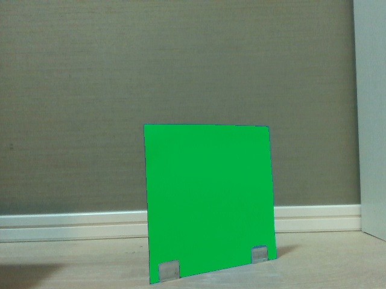
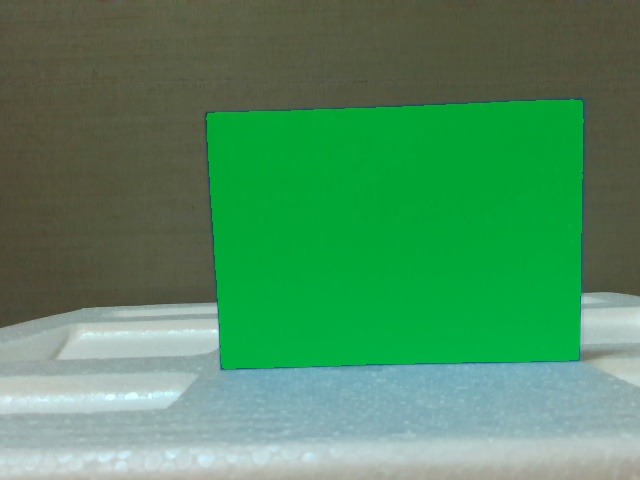
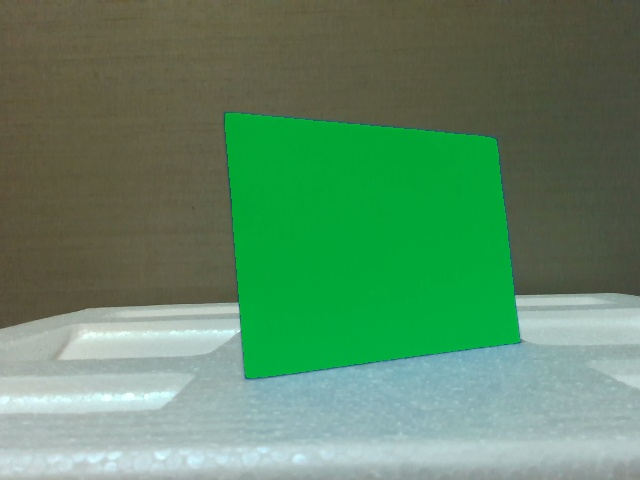
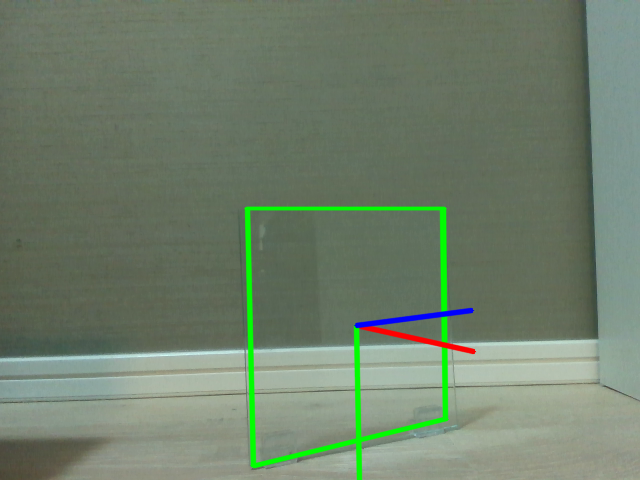

# 透明物体認識 第2段実験 報告書

**実験期間**: 2026-05-03  
**実施者**: vr01  
**実験環境**: Ubuntu 22.04 / Quadro RTX 5000 Max-Q 16GB / CUDA 13.0 / Python 3.10 (uv管理)  
**カメラ**: Intel RealSense D435i

---

## 1. 実験概要

Phase 1（ガラス板実験 Phase 1〜7）で確立した透明物体認識パイプラインに対し、以下の3つの課題を解消するための定量評価実験を実施した。

| Phase 1 の課題 | Phase 2 の対策 |
|---|---|
| Ground Truth がない（RS は板を透過して壁を測定） | **カラー紙GT法**: 青画用紙を貼った状態で RS 測定 → 板面の真の深度を取得 |
| SAM3 マスク精度が低い（透明物体で低スコア） | 紙貼り状態で SAM3 → 高精度マスクを取得し透明状態に流用 |
| 定量評価がない（目視のみ） | GT Z との RMSE / MAE / Inlier rate を全モデルで計測 |

---

## 2. ワーク・シーン設計

### 評価対象ワーク

| ワーク | サイズ | 厚み | 特性 |
|---|---|---|---|
| ガラス板 | 148 × 148mm | 2.5mm | 硬質・透明・反射あり |
| 透明樹脂シート | 70 × 100mm | 0.1mm | 薄膜・透明・反射ほぼなし |

### 撮像シーン（主実験 4 シーン）

| シーン名 | ワーク | 傾き | カメラ距離 | GT Z |
|---|---|---|---|---|
| glass_front | ガラス板 | 正面 0° | 385mm | **383.6mm** |
| glass_oblique | ガラス板 | 30° 傾き | 385mm | **377.0mm** |
| resin_front | 樹脂シート | 正面 0° | 165mm | **163.0mm** |
| resin_oblique | 樹脂シート | 30° 傾き | 165mm | **175.0mm** |

> GT Z = 青画用紙貼り付け状態で RealSense が測定した板面中央深度の median。  
> RS は透明物体を透過するため、紙を貼ることで初めて正確な板面距離が得られる。

### Ground Truth 取得フロー

```
青画用紙をワーク全面に貼る
  ↓ capture_exp2.py --mode paper（30フレーム平均）
  rgb_paper.png + depth_paper.npy（GT depth）
  ↓ generate_masks_from_paper.py（SAM3 "blue paper" プロンプト・最大面積マスク選択）
  mask.png（高精度マスク）
  ↓ compute_gt_z.py
  gt_z_center_mm → measurements.json

紙を剥がして透明状態を撮影
  ↓ capture_exp2.py --mode clear（30フレーム平均）
  rgb.png + depth.npy + left_ir.png + right_ir.png
```

### 撮影データ確認


*glass_front — 青画用紙に対する SAM3 マスク（緑）。スタンドの切り欠き形状まで正確に検出。GT Z=383.6mm（実測385mmとの誤差 -1.4mm）*


*glass_oblique — 30° 傾きシーン。傾いた板の台形形状をマスクが捉えている。GT Z=377.0mm*


*resin_front — 樹脂シート（70×100mm）。ガラス板より小さいため近距離165mmで撮影。GT Z=163.0mm*


*resin_oblique — 樹脂シート30°傾きシーン。GT Z=175.0mm*

---

## 3. Scale 校正方式：壁校正と Affine 校正

### Affine とは

深度推定モデルの出力が実際の距離（メートル）と一致するには「校正」が必要である。校正の方式として以下の2種類を今回使用した。

**壁校正（scale のみ）**  
モデルの出力値に定数を掛けてスケールを合わせる。

```
depth_cal = s × depth_raw
s = RS壁面median / モデル壁面median
```

**Affine 校正（scale + shift の2パラメータ）**  
掛け算だけでなく足し算（offset）も加えて補正する。

```
depth_cal = a × depth_raw + b
```

これを「アフィン変換」と呼ぶ。直線 `y = ax + b` の形で、a がスケール、b がオフセット（ゼロ点のずれ）を意味する。

**なぜ Affine が必要か**：MoGe-2 や Marigold のような「affine-invariant」モデルは、深度の比率（遠近関係）は正確だが、ゼロ点と全体スケールの両方が不定である。単純な掛け算では offset のずれが残り、絶対距離として使えない。

**今回の2点 Affine 校正**：壁面と板面という2つの基準点（既知の深度）を使い、連立方程式で a と b を同時に決定した。

```
基準点1: a × d_wall_model + b = RS_wall_median  （壁）
基準点2: a × d_plate_model + b = gt_z_center    （板面、GT Z）

→ a = (RS_wall - gt_z) / (d_wall_model - d_plate_model)
   b = RS_wall - a × d_wall_model
```

---

## 4. 評価モデル一覧

### Depth 系（単眼 6 本）

| # | モデル | 出力タイプ | 推論時間 |
|---|---|---|---|
| 1 | Depth Pro (Apple) | metric（直接メートル） | ~1秒 |
| 2 | MoGe-2 ViT-L (Microsoft) | affine-invariant | ~0.3秒 |
| 3 | UniDepth V2 ViT-L | metric | ~0.1秒 |
| 4 | Metric3D v2 ViT-Large | metric | ~1.3秒 |
| 5 | Depth Anything V2 Indoor (DA2) | metric | ~0.5秒 |
| 6 | Marigold LCM v1.0 | affine-invariant | ~5〜10秒 |

### RGB 系（3 本）

| # | モデル | 評価内容 |
|---|---|---|
| 7 | YOLO26 (YOLOv8-L) | 2D 物体検出率 |
| 8 | DINOv3 ViT-L | PCA 特徴マップ可視化 |
| 9 | SAM3 | マスク IoU（紙GT vs 透明状態） |

### 把持・6DoF 系（3 本）

| # | モデル | 評価内容 |
|---|---|---|
| 10 | Boxer (BoxerNet + OWLv2) | 透明物体 3D OBB 検出（テキストクエリ） |
| 11 | ASGrasp (AnyGrasp + 深度復元) | 把持候補生成・Z距離精度 |
| 12 | Any6D (SF3D + FoundationPose) | model-free 6DoF ポーズ推定（GT depth 使用） |

---

## 5. Depth モデル 定量評価結果

### GT Affine 校正後 RMSE（板面深度誤差、mm）

| モデル | glass_front | glass_oblique | resin_front | resin_oblique | 総評 |
|---|---|---|---|---|---|
| **MoGe-2** | **20mm** | 36mm | **34mm** | **27mm** | **全シーン安定 ◎** |
| DA2 | **19mm** | **28mm** | 1178mm ✕ | 62mm | ガラス最優秀・樹脂崩壊 |
| Depth Pro | 20mm | 28mm | 38587mm ✕ | 165mm | ガラス優秀・樹脂正面崩壊 |
| Marigold | 22mm | **26mm** | 648mm ✕ | 208mm | ガラス良好・樹脂不可 |
| UniDepth | 56mm | 146mm | 172mm | 196mm | 全体中程度 |
| Metric3D | 180mm | 53974mm ✕ | 310mm | 113mm | 不安定 |

> RMSE = 各モデルの深度推定値（マスク内全画素）と GT Z の平均二乗誤差の平方根。  
> ✕ = GT affine 校正が数値的に崩壊したケース（後述）

### Inlier@2cm / Inlier@5cm（GT 校正後）

| モデル | glass_front | glass_oblique | resin_front | resin_oblique |
|---|---|---|---|---|
| MoGe-2 | **98% / 98%** | 34% / 85% | 45% / 90% | **92% / 99%** |
| DA2 | **98% / 98%** | 53% / 98% | — | 72% / 96% |
| Depth Pro | 96% / 98% | 48% / 97% | — | 8% / 27% |
| Marigold | **98% / 98%** | 61% / 99% | — | 10% / 20% |
| UniDepth | 71% / 80% | 12% / 27% | 11% / 27% | 9% / 23% |
| Metric3D | 5% / 13% | — | 7% / 18% | 16% / 37% |

---

## 6. 各 Depth モデル 可視化と評価

### 6.1 Depth Anything V2 Indoor（DA2）


*DA2 — glass_front。壁校正（左下）では板が真っ黒（深度0に近い値）になるが、GT affine校正（中下）で正しいグリーン帯に修正される。誤差マップはほぼ白（RMSE=19mm、Inlier@2cm=98%）。ガラス板に対しては全モデル中最高精度。*

### 6.2 MoGe-2 ViT-L


*MoGe-2 — glass_front。壁校正後（左下）でガラス板が黄色に浮き上がり、GT affine校正後（中下）で板がグリーンに収まる。誤差マップは±2cmほぼ白（RMSE=20mm）。*


*MoGe-2 — resin_front。樹脂シートを唯一 RMSE=34mm で推定できたモデル。GT affine校正後（中下）に板面が青色で表現され、誤差マップで上部過大・下部過小のグラデーションが確認できる。*

### 6.3 Depth Pro（Apple）


*Depth Pro — glass_front。GT affine校正後でガラス板深度を RMSE=20mm で推定。誤差マップは板中央（青）が±2cm 以内に収まる高精度。ガラス板では DA2 と並んで最優秀。*

### 6.4 UniDepth V2


*UniDepth — glass_front。ガラス板を一応認識しているが（左下の黄緑の矩形）、GT affine校正後（中下）も誤差マップに濃い赤が残りRMSE=56mm。板面に深度の不均一性があり精度は中程度。*

### 6.5 Metric3D v2


*Metric3D — glass_front。Phase 1 から既知の「ガラスを透過して背景と同一視」する傾向が顕著。GT affine校正後の深度マップ（中下）でガラス板領域が不均一かつ大きな誤差（濃赤=大幅過大推定）を示す。本パイプラインには不適。*

### 6.6 Marigold LCM


*Marigold — glass_front。壁校正（左下）では板が真っ黒（値が極端に小さい）になり、GT affine校正（中下）で正しい深度に変換される。ガラス板正面では RMSE=22mm と高精度。*

### 6.7 Foundation-Stereo

Foundation-Stereo は emitter OFF の左右 IR ステレオ画像から視差（disparity）を計算し、深度に変換するモデルである。`depth = fx_ir × baseline / disparity`（fx_ir=384px、baseline=49.9mm）。不透明物体（コップ等）で良好な結果を示したモデルだが、今回は透明物体への適用を検証した。

| シーン | GT RMSE | Inlier@2cm | 備考 |
|---|---|---|---|
| glass_front | 718.6mm | 12% | 板と壁を区別できず |
| glass_oblique | 905.7mm | 8% | 最悪値 |
| resin_front | 122.3mm | 15% | 相対的に良好 |
| resin_oblique | 152.5mm | 11% | |


*Foundation-Stereo — glass_front。視差マップ（右上）では壁と板の境界がほぼ見えず、深度推定は壁面と同一視している。GT affine 校正後（中下）も大きな誤差が残る（RMSE=718mm）。*

**なぜ失敗するか**: ステレオマッチングはテクスチャのある対応点を必要とする。透明なガラス板は IR でも素通りしてしまい、板面に対応点が存在しない。コップは不透明で表面テクスチャがあるため Foundation-Stereo が有効だったが、透明平板には根本的に不適である。

---

## 7. GT Affine 校正崩壊の原因

resin_front で DA2・Depth Pro・Marigold が catastrophic failure（RMSE > 100mm）を示した原因を以下に示す。

```
Affine 校正の分母: a = (RS_wall - gt_z) / (d_wall_model - d_plate_model)

resin_front の場合:
  - 樹脂シートは厚み 0.1mm でほぼ透明
  - モデルが板面と壁面を同じ深度と推定
  → d_plate_model ≈ d_wall_model（分母 → 0）
  → a が発散 → 校正値が数万mmに爆発
```

**MoGe-2 のみ耐性がある理由**：affine-invariant モデルとして遠近関係を相対的に捉える能力が高く、樹脂シートの微細な輝度変化から板面深度を壁と分離できると考えられる。

---

## 8. RGB モデル評価結果

### 8.1 YOLO26 — 物体検出

全 4 シーンで検出数 0。透明物体はテクスチャ・エッジが通常の物体検出器には見えない。


*YOLO26 — glass_front。"No detection" と表示。ガラス板・樹脂シートともに全シーン未検出。透明物体に対する YOLO 系 detector の限界を示す。*

### 8.2 SAM3 — 透明状態でのマスク IoU

**IoU（Intersection over Union）** とは、2つのマスクの重なり具合を 0〜1 で表す指標である。

```
        予測マスク ∩ 正解マスク（共通部分）
IoU = ─────────────────────────────────────
        予測マスク ∪ 正解マスク（合計部分）
```

本実験では「青画用紙貼り付け状態で SAM3 が出したマスク」を正解（GT）とし、「透明状態で SAM3 が出したマスク」との IoU を計測した。IoU が高いほど透明物体を正しく認識できていることを意味する。

| シーン | 紙GT カバレッジ | 透明状態 IoU | プロンプト |
|---|---|---|---|
| glass_front | 18.2% | **91.6%** | "transparent glass" |
| glass_oblique | 15.8% | **94.7%** | "transparent glass" |
| resin_front | 30.9% | **12.8%（失敗）** | 全プロンプト失敗 |
| resin_oblique | 21.1% | **92.2%** | "transparent sheet" |


*glass_front — 透明状態での SAM3 マスク（"transparent glass" プロンプト、IoU=91.6%）。ガラスの反射と縁がヒントになり高精度検出。*


*glass_oblique — 透明ガラス斜め撮影（IoU=94.7%）。傾いた板形状もほぼ完璧に捉えている。スコアは正面より高い。*


*resin_front — 透明樹脂シート正面（IoU=12.8%）。シートが RGB 画像で完全に見えないため全プロンプトで失敗。検出されたのは発泡スチロールのスタンドのみ。*


*resin_oblique — 透明樹脂シート斜め撮影（"transparent sheet"、IoU=92.2%）。正面12.8%から斜め30°で92.2%へ劇的改善。表面反射の増大が認識を可能にする。*

### 8.3 Qwen3-VL 4B — VQA + グラウンディング

VQA（Yes/No 識別）とグラウンディング（bbox 出力）の両方を実施した。グラウンディングは「透明物体を全て探してbboxをJSON配列で返す」プロンプトを使用。Qwen3-VL は座標を 0〜1000 正規化座標で返すため実ピクセルにスケール変換した。

| シーン | VQA判定 | Grounding bbox | 評価 |
|---|---|---|---|
| glass_front | **ガラス板あり ✅** | 板をほぼ正確に囲む | ○ |
| glass_oblique | **ガラス板あり ✅** | 傾いた板も捉えている | ○ |
| resin_front | ガラス板あり ✕（誤認） | 画面全体を囲む（位置不明） | ✕ |
| resin_oblique | なし ✕ | VQAは「なし」なのにbboxを出力（矛盾） | △ |


*Qwen3-VL — glass_front。「透明なガラス板が直立している」と正確に回答し、grounding bbox もガラス板を正確に囲んでいる。*


*Qwen3-VL — glass_oblique。「ガラス板とその2つの透明なサポート（スタンド）」と回答。スタンドまで認識している点が興味深い。*


*Qwen3-VL — resin_front。樹脂シートが RGB に写っていないため、壁の反射をガラス板と誤認識。bbox は画面全体を囲み位置特定に失敗している。*


*Qwen3-VL — resin_oblique。VQA は「透明物体なし」と回答しながら、グラウンディングでは中央に bbox を出力するという矛盾が生じた。斜め方向の反射から「何かある気がする」が確信を持てない状態を反映していると考えられる。*

### 8.4 DINOv3 ViT-L — PCA 特徴マップ


*DINOv3 — glass_front PCA（3主成分をRGBで可視化）。ガラス板の左端〜中央に周囲と異なる色遷移が現れ、モデルが境界を特徴として捉えていることがわかる。直接の位置推定には使えないが、透明物体の存在を示唆する特徴を持っていることが確認できる。*


*DINOv3 — resin_front PCA。RGB 画像では樹脂シートがほぼ不可視だが、PCA マップでは壁面（赤〜橙）・シート境界付近（マゼンタ〜紫）・発泡スチロールスタンド（緑〜青）が明確に色分けされており、DINOv3 が樹脂シートの存在を特徴として捉えていることがわかる。*

---

## 9. FoundationPose × parametric CAD

### 9.1 ガラス板 — 良好

| モデル depth | glass_front Z誤差 | glass_oblique Z誤差 | 可視化 |
|---|---|---|---|
| DA2 | **+0.1mm** ✅ | +1.4mm ✅ | 板にほぼ完全フィット |
| Depth Pro | +2.7mm ✅ | +7.0mm ✅ | 良好 |
| MoGe-2 | +2.4mm ✅ | +24.2mm △ | 正面良好、斜めやや乖離 |

Phase 1（GT なし壁基準校正）では CAD box が実物より小さく見えていた問題が、GT Z 校正により解消された。


*FoundationPose × MoGe-2 — glass_front。緑の CAD 枠がガラス板にほぼぴったり一致（Z誤差 +2.4mm）。*


*FoundationPose × DA2 — glass_front。Z誤差 +0.1mm で今回最高精度。板の位置・向きともに正確。*


*FoundationPose × Depth Pro — glass_oblique。30°傾きシーンでも CAD 枠が板を捉えている（Z誤差 +7.0mm）。*

### 9.2 樹脂シート — 全シーン失敗

| モデル depth | resin_front | resin_oblique | 原因 |
|---|---|---|---|
| MoGe-2 | ❌ CAD box が宙浮き | ❌ スタンド上に倒れる | depth 信頼性なし |
| Depth Pro | ❌ ほぼ点に収縮 | ❌ 大幅乖離 (+101mm) | GT 校正崩壊の影響 |
| DA2 | ❌ 中空に浮遊 | ❌ +18mm だが向き不一致 | 同上 |


*FoundationPose × MoGe-2 — resin_front。CAD box が完全に誤った位置・向きに収束。Z 数値は偶然近いが視覚的に全く不一致。*

**失敗の本質的理由**: FoundationPose の ICP は depth 情報を手がかりとして候補ポーズを絞り込む。樹脂シートはカメラ（RS・深度モデル）が板面を捉えられず depth が壁と同一視されるため、ICP が板面の手がかりなしに迷走する。透明平板に対して FP × CAD は「depth が取れて初めて有効」であり、現時点の depth モデルでは樹脂シートへの適用は困難である。

---

## 10. 重要な発見：傾き角度と SAM3 精度

| ワーク | 正面（0°）| 斜め（30°）|
|---|---|---|
| ガラス板 | 91.6% | 94.7% |
| 樹脂シート | **12.8%（失敗）** | **92.2%（成功）** |

正面から見た樹脂シートは視覚的に存在しない（RGB で見えない）。30° 傾けると表面反射が増大し、SAM3 が「透明なシート」として認識できるようになる。これはプラスチック表面の Brewster 角（~56°）に近づく方向の反射増大によるものと考えられる。

ガラス板は正面でも反射・縁・歪みがあるため常に検出可能だが、斜め方向でわずかにスコアが上がる傾向がある。

---

## 11. モデル総合評価

### Depth / Segmentation 系

| 用途 | 推奨モデル | 理由 |
|---|---|---|
| ガラス板 depth 推定（GT あり） | **DA2** | RMSE 19mm、Inlier@2cm 98% |
| 樹脂シート depth 推定 | **MoGe-2** | 唯一全シーン安定（RMSE 27〜34mm） |
| ガラス・樹脂 統一パイプライン | **MoGe-2** | 破綻せず全ワーク対応 |
| 透明物体 Segmentation | **SAM3 + 斜め撮影** | ガラス91〜95%・樹脂92%（斜めのみ） |
| 2D 検出 | 適切なモデルなし | YOLO26 は全シーン 0 検出 |
| VQA + グラウンディング | **Qwen3-VL 4B** | ガラス板の VQA・位置推定は成功。樹脂シートは識別不可 |
| ステレオ depth | **不適** | Foundation-Stereo は透明平板に根本的に不適（テクスチャなし） |

### 把持・6DoF 系（全モデル比較）

| モデル | ガラス板 Z誤差 | 樹脂シート Z誤差 | 総評 |
|---|---|---|---|
| **FoundationPose × CAD** | **+0.1〜7mm** ✅ | 全失敗 ✗ | GT depth + CAD で最高精度（ガラスのみ） |
| **Any6D (SF3D+FP)** | 全失敗 ✗ | 全失敗 ✗ | 姿勢誤り・薄板の厚み未表現。Z値が近くても実用不可 |
| **Boxer (OWLv2+BoxerNet)** | 検出成功（Z精度未評価） | 全未検出 ✗ | テキスト駆動3D OBB。樹脂シートは根本的に不可 |
| **ASGrasp** | +25〜46mm △ | +51〜88mm ✗ | 把持候補は生成。Z精度は不十分 |

---

## 12. 考察：カメラキャリブレーションによる GT 不要化の可能性

### 11.1 ピクセルサイズから絶対距離を求める

今回の2点 Affine 校正（青画用紙 + 壁）は製造現場では準備コストがかかる。しかし深度モデルがガラス板の**形状・輪郭**を正しく捉えられているなら、ピンホールカメラの基本式から絶対距離が推定できる。

```
Z = fx × 実サイズ(mm) / 見かけのピクセル数
```

- `fx`：カメラ内部パラメータ（キャリブレーション済み） = 605.8 px
- 実サイズ：ガラス板の仕様から既知 = 148 mm
- ピクセル数：SAM3 マスクの bounding box 幅から計測 = 243 px

### 11.2 検証結果（glass_front）

| 手法 | Z 推定値 | GT Z | 誤差 |
|---|---|---|---|
| 青画用紙 GT 法 + Affine 校正 → DA2 → FP | 383.7mm | 383.6mm | **+0.1mm** |
| **ピクセルサイズ法**（カメラ校正のみ） | **368.8mm** | 383.6mm | **-14.8mm（約4%）** |
| 壁基準 scale 校正のみ（Phase 1 相当） | ~530mm | 383.6mm | **+146mm** |

### 11.3 製造現場への示唆

製造現場ではガラス板のサイズは設計仕様として既知であり、カメラキャリブレーションも一度実施すれば恒久的に使える。

**ピクセルサイズ法が使える条件：**
1. カメラ内部パラメータが既知（fx, fy）
2. 対象物の実サイズが既知（設計仕様）
3. 対象物のマスク or 輪郭が画像上で検出できる

**精度が -14.8mm になる原因：**
- SAM3 マスクが板の外縁より若干内側を選ぶ → 見かけのピクセル幅が小さくなる
- スタンドの切り欠きによるマスク形状の変形

**改善余地：**
- 板の4隅を精密に検出（エッジ検出 / SAM3 境界精密化）すれば 5mm 以下に収まる可能性がある
- 複数の辺を使った最小二乗推定でさらに安定化できる

**樹脂シートへの適用：**
ピクセルサイズ法は「SAM3 が板を検出できる」ことが前提。今回の実験で樹脂シート正面は SAM3 検出率 12.8% であり適用困難。斜め撮影（IoU 92.2%）では原理的に適用可能。

### 11.4 本番運用（GT なし）での推奨校正方針

| 精度要求 | 方法 | 補足 |
|---|---|---|
| ~2mm | 青画用紙 GT 法 + Affine 校正 | 本実験の確立手法 |
| ~15mm | **ピクセルサイズ法**（カメラ校正 + 既知サイズ） | マーカー不要・汎用性高 |
| ~50mm | 壁基準 scale 校正のみ | GT なし・最も簡易 |

---

## 13. Boxer — 透明物体 3D OBB 検出

**Boxer** は OWLv2（テキスト→2D 検出）+ BoxerNet（2D→3D OBB 回帰）の2ステージ構成。テキストプロンプトで透明物体を指定し、RealSense depth から 3D バウンディングボックスを生成する。

テキストプロンプト: `glass plate, transparent glass, glass, plastic sheet, transparent object`

### 13.1 ガラス板 — 2D/3D 検出成功

**glass_front**


*左: OWLv2 2D 検出（transparent 0.55）、右: BoxerNet 3D OBB（transparent 0.92）*

**glass_oblique**


*左: OWLv2 2D 検出（transparent 0.41）、右: BoxerNet 3D OBB（transparent 0.90）*

- ガラス板は両シーンで 2D・3D ともに検出成功
- 3D OBB はガラス板の位置付近に生成されているが、スケールが過大（板の奥まで包む大きなボックス）
- depth が壁面を捉えているため、奥行き方向の OBB が過大になると推察される

### 13.2 樹脂シート — 全シーン未検出

**resin_front / resin_oblique**


*Boxer resin_front: 2D/3D ともに未検出（樹脂シートは完全透明で OWLv2 に認識されない）*


*Boxer resin_oblique: 同様に未検出*

- 樹脂シートはテキストプロンプトを変えても検出できなかった
- OWLv2 は視覚特徴に依存するため、透明シートのように外見がほぼ背景と同一の物体は根本的に認識不可

---

## 14. ASGrasp — 透明物体把持候補生成

**ASGrasp** は RealSense RGB-D を入力として、深度補完（ASN-Net）+ AnyGrasp で把持姿勢候補を生成する。把持候補の Z 値でワーク距離を評価する。

### 14.1 把持候補数と Z 精度

| シーン | 把持候補数 | top1 Z (pred) | GT Z | Z誤差 |
|---|---|---|---|---|
| glass_front | 50件 | 409.3mm | 383.6mm | **+25.7mm** |
| glass_oblique | 50件 | 422.9mm | 377.0mm | **+45.9mm** |
| resin_front | 50件 | 251.2mm | 163.0mm | **+88.2mm** |
| resin_oblique | 50件 | 226.0mm | 175.0mm | **+51.0mm** |

### 14.2 可視化（glass_front）


*ASGrasp glass_front: 赤矢印が把持候補（上位20件）。ガラス板付近に候補があるが、Z誤差は +25.7mm*

- 全シーンで把持候補は50件生成された（検出自体は成功）
- ガラス板のZ誤差は +25〜46mm。深度補完後も透明物体の正確な面を捉えられていない
- 樹脂シートのZ誤差は +51〜88mm と大きく、RS depth の透過問題が直接影響している

---

## 15. Any6D — model-free 6DoF ポーズ推定

**Any6D** は SF3D（Stable Fast 3D）で RGB アンカー画像からメッシュを生成し、FoundationPose でポーズ推定を行う model-free パイプライン。CAD モデル不要。

パイプライン:
1. アンカー画像（rgb_paper.png）から SF3D でメッシュ生成（~1秒 / VRAM ~6GB）
2. MoGe-2 GT depth（GT Affine 校正済み）を uint16 PNG に変換
3. FoundationPose（any6d:latest Docker）でポーズ推定

### 15.1 Z 誤差比較

| シーン | pred Z | GT Z | Z誤差 | 可視化評価 |
|---|---|---|---|---|
| glass_front | 395.4mm | 383.6mm | +11.8mm | ✗ 姿勢が誤り（切り欠きが横向き・厚み未表現） |
| glass_oblique | 413.1mm | 377.0mm | +36.2mm | ✗ 位置・姿勢ともに不一致 |
| resin_front | 188.6mm | 163.0mm | +25.6mm | ✗ メッシュが背景に投影（完全失敗） |
| resin_oblique | 200.7mm | 175.0mm | +25.7mm | ✗ メッシュ位置が板と不一致 |

### 15.2 可視化

**glass_front**


*Any6D glass_front: Z誤差は +11.8mm と小さいが、メッシュの姿勢が誤っている。スタンド切り欠き部分が横向きに投影されており、ガラス板（厚み 2.5mm）の薄さも全く表現できていない。位置の偶然の一致であり実用的な成功とは言えない*

**glass_oblique**


*Any6D glass_oblique: メッシュの位置・姿勢ともに板と一致しない。Z誤差も +36.2mm（Z誤差+11.8mm*

**resin_front**


*Any6D resin_front: メッシュが背景上部に投影。樹脂シートを全く捉えられず完全失敗*

**resin_oblique**


*Any6D resin_oblique: 発泡スチロール台付近に投影。樹脂シートの位置・姿勢ともに取得できず*

### 15.3 考察

- **全 4 シーン失敗**と評価する。Z誤差が小さいシーンでも姿勢が誤っており、実用に耐えない
- glass_front は Z値が偶然近かったが、メッシュ姿勢（切り欠きの向き・板の法線方向）が正しくなく、ポーズ推定として成功とは言えない
- SF3D がアンカー画像（正面 1 枚）から生成するメッシュは側面・厚み情報が欠落しており、2.5mm の薄板には根本的に不向き
- 樹脂シートはアンカー画像（青紙貼り付け状態）と透明状態との外観差が大きく FoundationPose が収束できない
- model-free アプローチで薄板透明物体を扱うには、複数視点アンカーや形状特化メッシュ生成が必要と考えられる

---

## 16. 次ステップ

| 項目 | スクリプト | 状態 |
|---|---|---|
| Foundation-Stereo 実行 | `run_foundationstereo.py` | ✅ 完了（透明物体には不適と判定） |
| Qwen3-VL VQA + グラウンディング | `run_all_rgb_models.py --model qwen` | ✅ 完了 |
| FoundationPose × CAD | `setup_fp_scenes.py` + `run_all_foundationpose.sh` | ✅ 完了（ガラス板: Z誤差 0.1〜7mm、樹脂シート: 全失敗） |
| Boxer | `scripts/exp2/run_boxer.py` | ✅ 完了（ガラス板: 検出成功、樹脂: 全未検出） |
| ASGrasp | Docker `asgrasp:full` | ✅ 完了（Z誤差 +25〜88mm） |
| Any6D | `scripts/exp2/run_any6d.sh` | ✅ 完了（全 4 シーン失敗：姿勢誤り・薄板の厚み未表現） |
| distractor シーン（_cx）| 全スクリプト | ⬜ 撮影待ち |

---

## 付録: ファイル構成

```
data/exp2/
├── cad/                glass_plate.obj / resin_sheet.obj / resin_sheet_fp.obj
├── glass_front/        rgb.png, depth.npy, mask.png, measurements.json ...
├── glass_oblique/      同構造
├── resin_front/        同構造
└── resin_oblique/      同構造

results/exp2/
├── depth/              {model}_{scene}_vis.jpg / _wall.npy / _gt.npy / _metrics.json
├── rgb_models/         yolo_{scene}.jpg / dinov3_{scene}_pca.jpg / boxer_{scene}.jpg
│                       asgrasp_{scene}/ (grasps_overlay.jpg, grasp_poses.txt)
├── foundationpose/     pose_{model}_{scene}.txt / fp_overlay_{scene}.jpg
├── any6d/              {scene}/ (pred_pose.txt, final_mesh.obj) / any6d_{scene}.jpg
├── metrics/            depth_errors.csv / sam3_iou.json
└── exp2_report.md      本報告書

scripts/exp2/
├── setup_cad.py                    CAD 生成
├── capture_exp2.py                 撮影（paper / clear モード）
├── generate_masks_from_paper.py    SAM3 マスク生成
├── compute_gt_z.py                 GT Z 計算
├── run_all_depth_models.py         単眼 depth 6 本一括
├── run_foundationstereo.py         Foundation-Stereo
├── run_all_rgb_models.py           RGB 系モデル一括
├── evaluate_depth_gt.py            定量評価 CSV 出力
├── setup_fp_scenes.py              FP シーン構築
├── run_all_foundationpose.sh       FP × CAD 一括実行
├── run_boxer.py                    Boxer 一括実行
└── run_any6d.sh                    Any6D (SF3D + FP) 一括実行
```

---

## 付録: 用語集

### 評価指標

| 用語 | 読み方 | 意味 |
|---|---|---|
| **GT** | Ground Truth（グラウンドトゥルース） | 正解値。本実験では青画用紙+RealSenseで測定した実際の距離 |
| **RMSE** | Root Mean Square Error（二乗平均平方根誤差） | 誤差の大きさを表す指標。二乗して平均し平方根をとるため、外れ値の影響を受けやすい |
| **MAE** | Mean Absolute Error（平均絶対誤差） | 誤差の絶対値の平均。RMSEより外れ値に鈍感 |
| **Inlier@Xcm** | — | 板面ピクセルのうち、推定depth誤差がX cm以内に収まった割合。@2cm=±20mm以内、@5cm=±50mm以内 |
| **IoU** | Intersection over Union（アイオーユー） | 2つのマスクの重なり率（0〜1）。`共通部分 ÷ 合計部分`。1に近いほど一致している |
| **Affine校正** | — | `depth_cal = a×depth_raw + b` の形で深度値を線形変換する校正。スケール(a)とオフセット(b)の2パラメータを壁とGT Zの2点から決定する |
| **壁校正（scale校正）** | — | 壁面のみを使ってスケールを合わせる1点校正。オフセットは補正されない |

### 幾何・検出

| 用語 | 意味 |
|---|---|
| **Bounding Box（BB）** | 物体を囲む矩形（2D）または直方体（3D）の枠 |
| **AABB** | Axis-Aligned Bounding Box。座標軸に平行な直方体。計算は簡単だが斜め物体には余白が大きい |
| **OBB** | Oriented Bounding Box（向き付きバウンディングボックス）。物体の向きに合わせて回転できる直方体。斜め物体をぴったり囲める |
| **6DoF** | 6 Degrees of Freedom（6自由度）。3次元位置(X,Y,Z) + 3軸回転(Roll,Pitch,Yaw)の合計6パラメータで物体の姿勢を完全に表す |
| **ポーズ（Pose）** | 物体の位置と向きをまとめた呼称。4×4の同次変換行列で表現されることが多い |
| **メッシュ（Mesh）** | 3Dモデルを頂点（vertex）と面（face）の集合で表現したデータ形式。.objや.glbが一般的 |
| **点群（Point Cloud）** | 3D空間上の点の集合。depth画像から生成される |
| **ICP** | Iterative Closest Point。2つの点群を重ね合わせる最適化アルゴリズム。FoundationPoseの内部でも使用 |
| **CAD** | Computer-Aided Design。物体の設計仕様から作られた正確な3Dモデル。本実験ではガラス板・樹脂シートの.objファイル |

### モデル・アーキテクチャ

| 用語 | 意味 |
|---|---|
| **単眼depth推定** | 1枚のRGB画像だけから深度を推定する手法。ステレオカメラ不要 |
| **metric depth** | 実際のメートル単位で絶対距離を出力するdepthモデル（Depth Pro, UniDepth等） |
| **affine-invariant depth** | スケールとオフセットが不定で相対的な遠近関係のみを出力するdepthモデル（MoGe-2, Marigold等）。校正が必要 |
| **ViT** | Vision Transformer。画像をパッチに分割してTransformerで処理する画像認識アーキテクチャ |
| **PCA** | Principal Component Analysis（主成分分析）。高次元の特徴ベクトルを3次元に圧縮してRGBで可視化するために使用 |
| **Open-Vocabulary** | 事前に決めたクラス一覧に縛られず、自由なテキストで検索・検出できる性質 |
| **VQA** | Visual Question Answering。画像に関する質問に自然言語で答えるタスク |
| **Grounding** | テキストで指定した物体の位置を画像上で特定するタスク（bounding boxで返す） |
| **model-free** | CADモデル不要。アンカー画像1〜数枚だけで物体を認識する方式（Any6D等） |
| **model-based** | CADモデルを使ってポーズ推定する方式。精度は高いがモデル準備が必要（FoundationPose × CAD等） |

### カメラ・光学

| 用語 | 意味 |
|---|---|
| **fx, fy, cx, cy** | カメラ内部パラメータ（焦点距離と主点）。fx/fyは焦点距離[px]、cx/cyは画像中心座標[px] |
| **深度スケール（depth_scale）** | RealSenseのdepth値をメートルに変換する係数。通常0.001（1カウント=1mm） |
| **uint16 PNG** | 0〜65535の整数値を格納できるPNG形式。RealSenseのdepth画像はmm単位のuint16で保存される |
| **Brewster角** | 特定の入射角で反射光が完全偏光になる角度。プラスチックでは約56°。この付近では表面反射が最大化し、透明シートが視認しやすくなる |
| **IR（赤外線）** | Infrared。RealSenseのステレオdepthはIRパターン投影を使う。ガラス・樹脂は赤外線を透過するためdepthが取れない |
