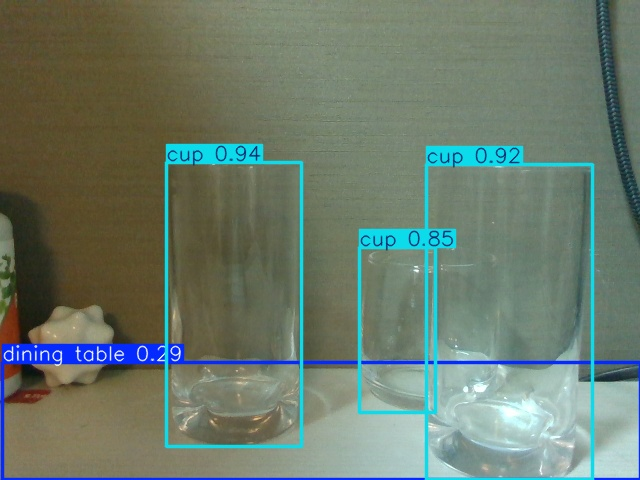
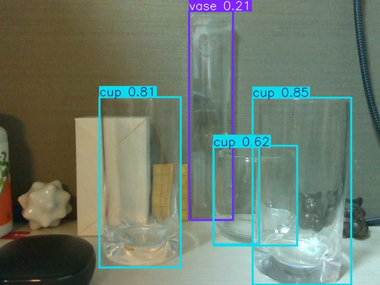
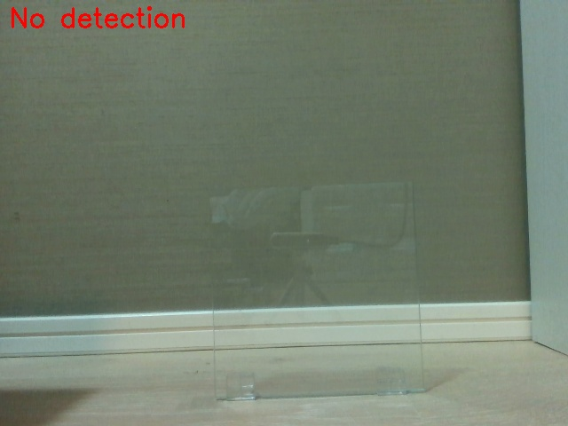
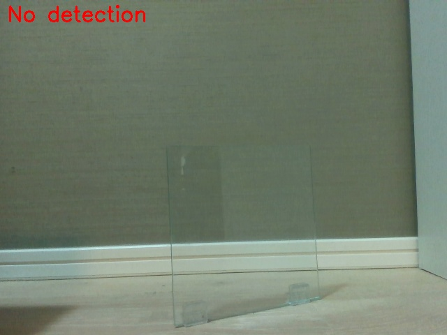
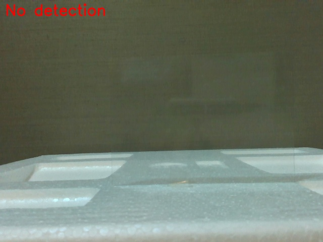
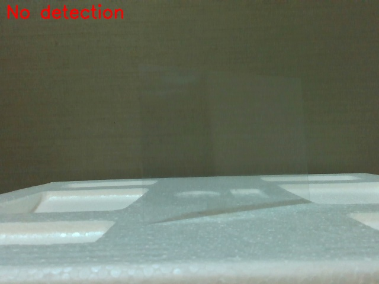
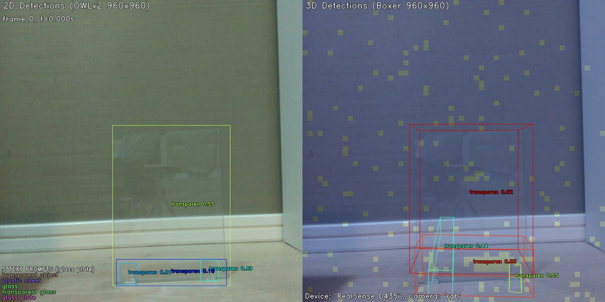
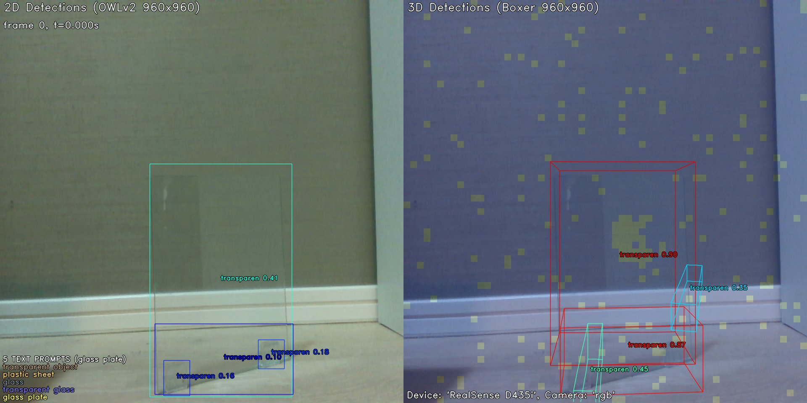
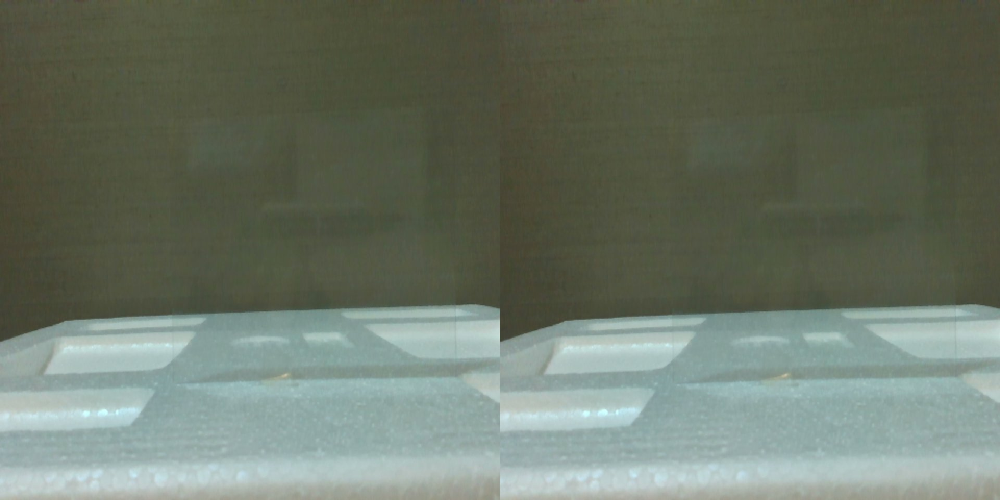
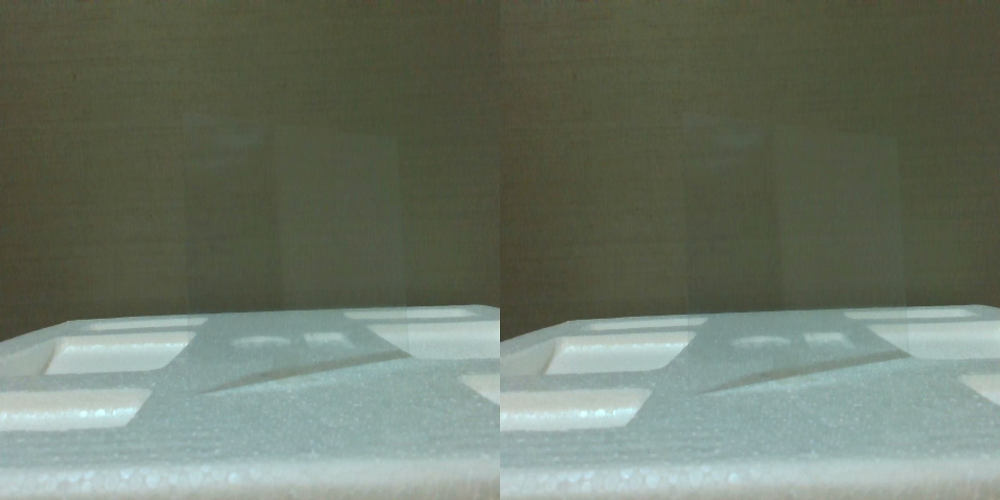

# 2D物体検出 技術調査・実験報告
## YOLO26 / OWLv2

**文書番号**: PDX-RB20260504-002  
**作成日**: 2026-05-04  
**作成者**: 室屋  
**関連文書**: [概観レポート](00_overview.md)

---

## 1. この技術が解決する課題

製造ラインでのロボットピッキングや品質検査において、カメラ映像の中から
「どこに何があるか」を自動で見つけることが求められる。
2D物体検出は、画像上で物体を矩形（バウンディングボックス）で囲み、
クラス名（ラベル）と確信度スコアを出力する最も基本的な認識タスクである。

```
入力: RGB画像
出力: [(ラベル, スコア, [x1,y1,x2,y2]), ...]
         例: ("cup", 0.94, [160, 45, 315, 420])
```

現代の2D検出器は不透明物体に対して非常に高い精度を誇る一方、
透明物体（ガラス・樹脂シート等）への適用は根本的な困難を抱えている。
本調査では2つのアプローチを評価した。

---

## 2. 評価した技術

| モデル | アプローチ | クラス指定方法 | 開発元 |
|---|---|---|---|
| **YOLO26**（yolo26l） | 固定クラス検出 | 80クラス固定（COCO） | Ultralytics（2026年1月） |
| **OWLv2** | テキスト指定検出 | 任意テキストで指定可 | Google |

> OWLv2 は Boxer パイプラインの第1段として使用した。
> 本報告では2D検出の観点から評価し、Boxer 全体の評価は [07_grasp_3d.md](07_grasp_3d.md) を参照。

---

## 3. 技術の仕組み

### 3.1 YOLO（You Only Look Once）

YOLOは「画像を1度だけ見て物体を検出する」という設計思想に由来する。
2015年の初版から継続的に改良されており、下表にその変遷を示す。

| バージョン | 年 | 主な改良点 |
|---|---|---|
| v1 | 2015 | "1回見るだけ" の概念確立。速いが精度は低め |
| v2〜v3 | 2016〜2018 | アンカーボックス・多スケール対応で精度向上 |
| v4〜v7 | 2020〜2022 | バックボーン強化・Loss改善。実用精度に到達 |
| **v8** | 2022 | アンカーフリー化。現在も広く使われる主流版 |
| v9〜v10 | 2024 | 構造効率化・リアルタイム性能向上 |
| **v11** | 2024 | Ultralytics最新世代。マルチタスク統合 |
| **YOLO26** | 2026年1月 | v11後継。パラメータ26.3M、COCO80クラス対応 ← 本実験 |

**本実験でYOLO26を選んだ理由:**
- 本プロジェクト導入時点（2026年3月）の Ultralytics 最新安定版
- v8〜v11の設計を受け継ぎつつ軽量化（26.3M パラメータ）
- 実測73.5 FPS（n モデル）という実用的な速度
- 透明物体専用ではないが、一般物体検出ベースラインとして最適

**動作の仕組み:**
```
画像をグリッドに分割
   ↓
各グリッドセルで「物体がいるか」「どんな物体か」を同時予測
   ↓
確信度の高い矩形だけ残す（NMS: 非最大値抑制）
   ↓
クラスラベル + バウンディングボックス を出力
```

**COCO 80クラスにおけるガラス系クラス:**

| クラスID | クラス名 | 主な対象形状 |
|---|---|---|
| 40 | wine glass | ワイングラス（脚付き容器） |
| 41 | **cup** | コップ・グラス（円筒容器） ← ガラスコップはここ |
| 39 | bottle | ボトル |
| 75 | vase | 花瓶 |

> ガラス**板**（フラットなシート）や樹脂シートに対応するクラスはCOCO80に存在しない。

### 3.2 OWLv2（Open-Vocabulary Object Localization v2）

OWLv2はGoogleが2023年に発表した**オープンボキャブラリー検出器**である。
CLIPの言語×画像対照学習を物体検出に応用し、任意のテキストで物体を指定できる。

```
テキスト "transparent glass plate"
         ↓
  CLIPの言語エンコーダで特徴ベクトル化
         ↓
  画像各領域の特徴との類似度を計算
         ↓
  閾値以上の領域をバウンディングボックスで返す
```

**本実験でのテキストプロンプト:**
`"glass plate"`, `"transparent glass"`, `"glass"`, `"plastic sheet"`, `"transparent object"`

### 3.3 比較検討: GroundingDINO

OWLv2 と同じオープンボキャブラリー検出の有力候補として **GroundingDINO**（IDEA Research, 2023）がある。DINO の自己教師あり特徴とテキストグラウンディングを組み合わせたモデルで、OWLv2 より高い検出精度を報告する論文もある。本実験では時間的制約から評価できていないが、今後の比較対象として有望である。

| 比較項目 | YOLO26 | OWLv2 | GroundingDINO |
|---|---|---|---|
| クラス指定 | 80クラス固定 | テキスト自由 | テキスト自由 |
| 速度 | **高速**（~38ms） | 中程度 | 中程度 |
| 未検証クラス対応 | 不可 | 可 | 可（精度高め） |
| 本実験での評価 | ✅ 実施 | ✅ 実施 | ⬜ 未実施（今後） |

---

## 4. 実験

### 4.1 実験シーン

本報告では2種類の実験シーンを評価する。

| 実験 | 対象 | シーン | 目的 |
|---|---|---|---|
| **実験A** | 透明グラスコップ（3個） | Simple / Complex | YOLO26の透明容器検出能力の確認 |
| **実験B** | ガラス板・樹脂シート | 正面 / 斜め各2シーン | 平板透明ワークへの適用評価 |

### 4.2 実験A — 透明グラスコップ3個（2026-04-24）

#### シーン設定

| シーン | 内容 |
|---|---|
| **Simple** | グレー背景 + 透明グラス3個（左大・中小・右大）。中央は右と前後に重なる |
| **Complex** | 同じグラス配置 + 複数の背景物体 + 奥に透明プラスチックケース（ディストラクタ） |

**YOLO26 — Simple シーン**


*YOLO26 — Simple シーン。3個すべての透明グラスを `cup` クラスとして高スコアで検出（0.85〜0.94）。
前後に重なる中央の小グラスも独立したbboxで正しく認識している。*

**YOLO26 — Complex シーン**


*YOLO26 — Complex シーン。手前の本物ガラス3個を `cup` として正しく検出。
奥の透明プラスチックケース（ディストラクタ）は `cup` ではなく `vase` と低スコアで分類しており、
「ガラス製容器」と「非ガラス透明物体」の区別が一定程度できている。*

| シーン | 検出数 | クラス | スコア範囲 | 評価 |
|---|---|---|---|---|
| Simple | 3 | cup | 0.85〜0.94 | ✅ 全グラス検出成功 |
| Complex | 3（本物） + 1（vase） | cup / vase | cup:0.80〜0.90 | ✅ ガラスを正しく特定 |

**考察**: YOLO26 は `cup` クラスが COCO に存在するため、透明グラスコップを高精度で検出できた。
この結果はモデルの能力が十分であることを示しており、実験Bでの失敗はクラス定義の問題であって
モデル自体の限界ではない。

### 4.3 実験B — ガラス板・樹脂シート（2026-05-03）

#### YOLO26 結果

**全4シーンで検出数ゼロ。**

| シーン | 検出数 | 推論時間 |
|---|---|---|
| glass_front | 0 | 731ms（初回ロード含む） |
| glass_oblique | 0 | 38ms |
| resin_front | 0 | 38ms |
| resin_oblique | 0 | 38ms |


*YOLO26 — glass_front。赤文字 "No detection"。ガラス板は画面中央に写っているが
COCO80 に「平板ガラス」クラスが存在しないため検出不能。*


*YOLO26 — glass_oblique。斜め撮影でも未検出。*


*YOLO26 — resin_front。樹脂シートは正面で視覚的にほぼ不可視。
クラス未定義 × 視覚特徴なし の2重の問題により未検出。*


*YOLO26 — resin_oblique。斜め撮影でも未検出。*

**実験Aと実験Bの比較からわかること:**

```
透明グラスコップ（実験A）: ✅ 検出成功（cup クラスが COCO にある）
ガラス板・樹脂シート（実験B）: ✗ 未検出（対応クラスが COCO にない）

→ YOLO26 は「クラスとして定義された透明物体」は検出できる
→ 「新規の透明ワーク形状」には追加学習が必要
```

#### OWLv2 結果（実験B）

| シーン | 2D検出数 | 最高スコアラベル | スコア |
|---|---|---|---|
| glass_front | 4件 | transparent object | 0.55 |
| glass_oblique | 4件 | transparent object | 0.41 |
| resin_front | 0件 | — | — |
| resin_oblique | 0件 | — | — |


*OWLv2（Boxer経由） — glass_front。左: 2D検出（スコア0.55でガラス板領域を検出）。
検出枠はガラス板よりやや大きく、スタンドも含んでいる。
右: BoxerNetによる3D OBB（詳細は [07_grasp_3d.md](07_grasp_3d.md) 参照）。
右パネル背景の**黄色い正方形ドット**は RealSense の**IRエミッタが投射する構造化光パターン**。
深度計算のためエミッタON時にシーンへ投射される赤外線ドットが画像に写り込んでいる。エミッタOFF時には消える。*


*OWLv2 — glass_oblique。スコア0.41で検出。正面よりスコアが低下している。
右パネル背景の黄色いドットは glass_front 同様、RealSense IRエミッタの構造化光パターン。*


*OWLv2 — resin_front。未検出。樹脂シートは正面で完全に不可視のため
テキストプロンプトに対応する視覚的手がかりがない。*


*OWLv2 — resin_oblique。斜め撮影でも未検出。*

---

## 5. 透明ワーク認識への適用可能性

| 評価項目 | YOLO26 | OWLv2 |
|---|---|---|
| 透明グラスコップ検出 | ✅（cup クラスあり、0.85〜0.94） | 未評価 |
| ガラス板（正面）検出 | ✗（クラスなし） | △（0.55、枠が粗い） |
| ガラス板（斜め）検出 | ✗ | △（0.41） |
| 樹脂シート（正面）検出 | ✗ | ✗ |
| 樹脂シート（斜め）検出 | ✗ | ✗ |
| 既知クラス精度 | **高い**（0.85〜0.94） | 中程度（0.41〜0.55） |
| リアルタイム処理 | ✅（38ms / 73.5 FPS） | △（~200ms） |
| 追加学習なし | ✅ | ✅ |

---

## 6. 考察

### 6.1 YOLO26 の正確な評価

YOLO26 は「透明物体が検出できないモデル」ではなく、
「学習済みクラス外の物体は検出できないモデル」である。
今回の評価対象（ガラス板・樹脂シート）は COCO80 クラスに存在しないため失敗したが、
透明グラスコップ（cup）は高精度で検出できた。

**製造現場での活用可能性:**
ガラス板については、数百枚の画像を収集してファインチューニングすれば検出改善の余地がある。
ただし「透明物体のバウンディングボックスに一貫したラベルを付ける」作業自体が困難で、
学習データの品質が課題となる。

**樹脂シートについては、学習データを追加しても改善は難しい可能性が高い。**
正面撮影では物体が背景と完全に融合して視覚的な手がかりがほぼゼロであり、
これはクラス未定義という問題ではなく「物理的に見えない」という根本的な制約に起因する。
学習ベースの手法は「存在するが見つけにくい特徴」を強化することはできるが、
「特徴が存在しない」ケースに対しては本質的な解決策にならない。

### 6.2 OWLv2 の限界と可能性

テキスト指定でクラスの問題を回避できる点は有用だが、
視覚特徴がない（背景と同化している）場合は原理的に検出困難である。

**OWLv2 の改善の方向性:**
- ChArUco 背景マーカーで背景との差分を明確化する実験を予定中
- ガラスの縁・反射を強調する照明条件での評価
- GroundingDINO との比較検証

### 6.3 透明物体検出の根本的な課題

```
通常の物体検出の前提:
  「物体は固有の外見（色・テクスチャ）を持つ」

透明物体の問題:
  「外見が背景に依存して変化する」
  → 同じガラス板でも背景が変わると外見が変わる
  → 学習データをいくら増やしても汎化が難しい
```

この根本課題を解決するアプローチとして、
物体の外見ではなく「エッジ・屈折・反射」といった物理的特性を手がかりにする
研究（ClearGrasp, Trans4Trans 等）が進んでいるが、製造現場への展開はまだ限定的である。

---

## 7. まとめ

| 項目 | 内容 |
|---|---|
| YOLO26（グラスコップ） | 全グラス検出成功（0.85〜0.94）。COCOクラスに該当する透明容器は高精度で対応可 |
| YOLO26（ガラス板） | 全シーン未検出。クラス未定義が主因。学習データ追加による改善の余地あり |
| YOLO26（樹脂シート） | 全シーン未検出。正面では物体が物理的にほぼ不可視であり、追加学習でも改善困難と見込まれる |
| OWLv2（ガラス板） | スコア0.41〜0.55で粗い検出成功。テキスト指定でクラス問題は回避 |
| OWLv2（樹脂シート） | 全シーン未検出。視覚特徴の欠如が根本原因 |
| 今後の検討 | GroundingDINO との比較 / ChArUco 背景での認識改善実験 |

---

*次のレポート: [02_segmentation.md](02_segmentation.md) — SAM3 / DINOv3 によるセグメンテーション*

---

## 参考文献・リンク

| モデル | 論文 | GitHub / Web |
|---|---|---|
| YOLO26（Ultralytics） | — | [ultralytics/ultralytics](https://github.com/ultralytics/ultralytics) / [ultralytics.com](https://ultralytics.com) |
| OWLv2 | [arxiv 2306.09683](https://arxiv.org/abs/2306.09683) | [HuggingFace google/owlv2](https://huggingface.co/google/owlv2-base-patch16-ensemble) |
| GroundingDINO（未実施・参考） | [arxiv 2303.05499](https://arxiv.org/abs/2303.05499) | [IDEA-Research/GroundingDINO](https://github.com/IDEA-Research/GroundingDINO) |
