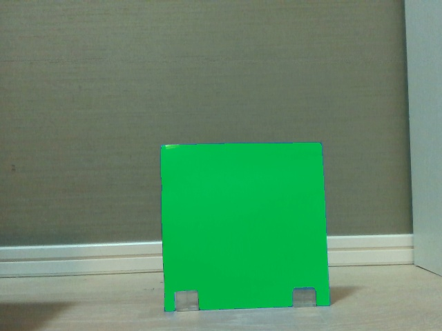
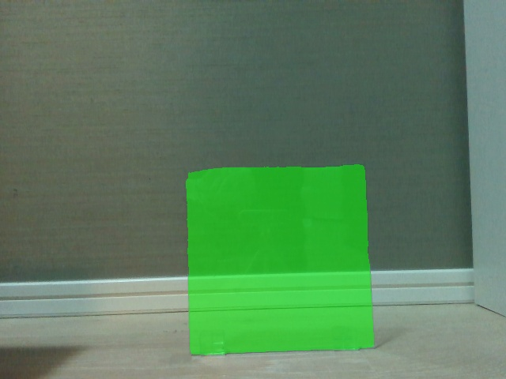
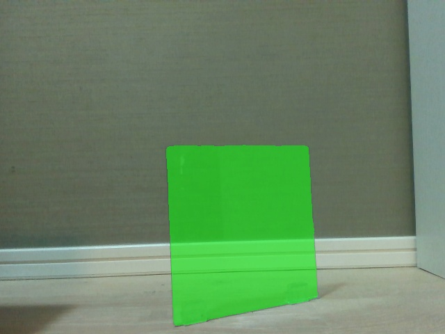
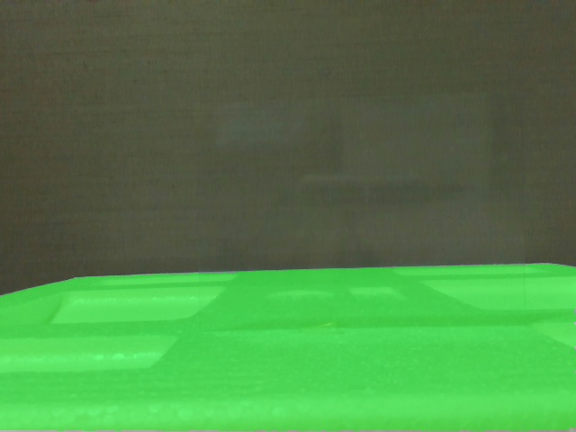
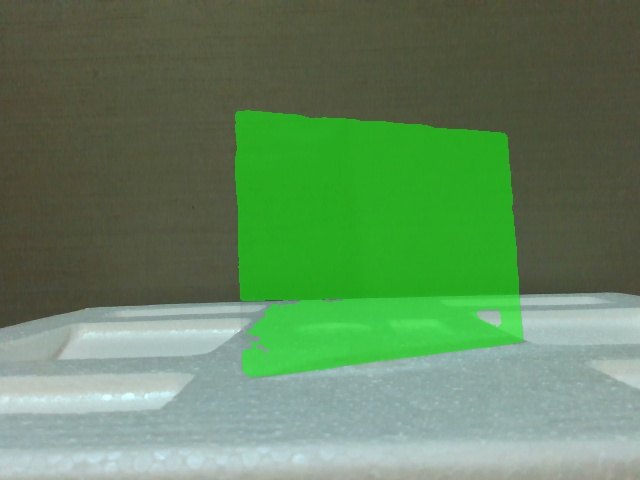
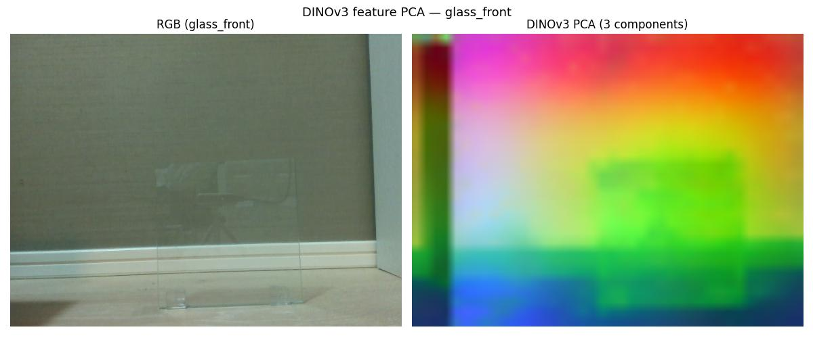
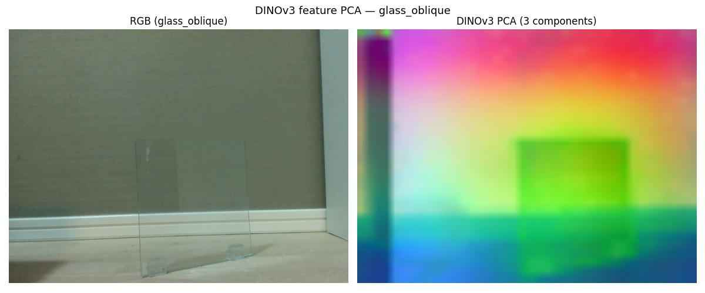
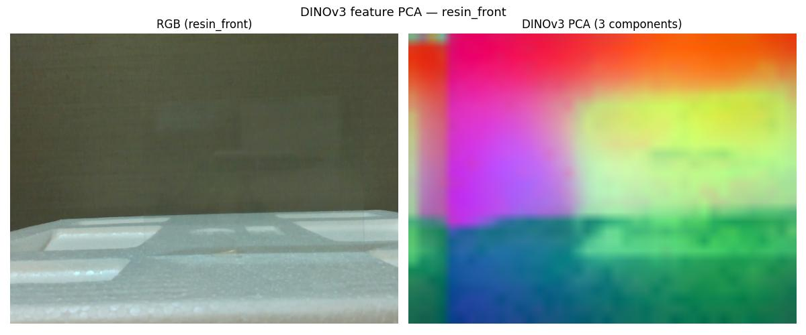
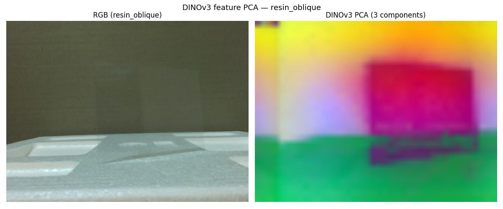

# セグメンテーション・特徴抽出 技術調査・実験報告
## SAM3（Segment Anything v3）/ DINOv3 ViT-L

**文書番号**: PDX-RB20260504-003  
**作成日**: 2026-05-04  
**作成者**: 室屋  
**関連文書**: [概観レポート](00_overview.md) / [前レポート: 2D検出](01_detection_2d.md)

---

## 1. この技術が解決する課題

2D物体検出（前レポート参照）は物体を矩形で囲むのに対し、
**セグメンテーション**は物体の輪郭に沿ったピクセル単位のマスクを生成する。

```
2D検出:    [x1,y1,x2,y2] の矩形
セグメント: ピクセル単位のマスク画像（物体の形に沿う）
```

透明物体認識においてセグメントマスクは2つの用途で重要である。

1. **深度推定の補助**: マスク内領域の深度統計を板面の代表値として使う
2. **ポーズ推定の入力**: FoundationPose / Any6D 等は「物体がどこにあるか」をマスクで受け取る

本報告では以下の2モデルを評価する。

| モデル | タスク | 特徴 |
|---|---|---|
| **SAM3**（Segment Anything v3） | テキスト/点プロンプト → マスク | 直接「切り出す」 |
| **DINOv3** ViT-L | 特徴マップ可視化（PCA） | 物体の「見え方」を可視化する |

---

## 2. 技術の仕組み

### 2.1 SAM3（Segment Anything Model v3）

Meta AIが2024年に発表した汎用セグメンテーションモデル。
テキストプロンプト・点・矩形などを「ヒント」として受け取り、
画像上の任意の物体を切り出すマスクを生成する。

**動作の仕組み:**

```
入力: RGB画像 + プロンプト（"transparent glass" 等）
         ↓
  ① 画像エンコーダ（ViT-H）で画像全体を特徴ベクトル化
  ② テキストエンコーダでプロンプトを特徴ベクトル化
  ③ 両者を照合して「最もプロンプトに合う領域」を特定
  ④ マスクデコーダでピクセル単位のマスクを生成
         ↓
出力: バイナリマスク画像（物体=白, 背景=黒）+ 確信度スコア
```

**SAMシリーズの変遷:**

| バージョン | 年 | 主な改良点 |
|---|---|---|
| SAM v1 | 2023 | "Segment Anything" の概念確立。点・矩形プロンプト対応 |
| SAM v2 | 2024 | 動画セグメンテーション対応。精度・速度向上 |
| **SAM v3** | 2024〜 | テキストプロンプト対応強化。マルチオブジェクト同時検出 ← 本実験 |

**マスク選択の工夫（本実験）:**
SAM3 は同一プロンプトに対して複数のマスク候補を返す。
スコアが最高のマスクを選ぶと、ガラス越しに見える背景を選んでしまう場合がある。

```
対策: 「最大面積マスク」を選択
  → 板全体を覆う大きなマスクが物体マスクとして適切
  → スコア最高のマスクが小さな背景領域を指すケースを回避
```

### 2.2 DINOv3 ViT-L

Meta AIが開発した自己教師あり視覚基盤モデル。
ラベルなしの大量画像から「物体の本質的な特徴」を学習する。

**動作の仕組み:**

```
入力: RGB画像
         ↓
  画像を14×14ピクセルのパッチに分割
         ↓
  Vision Transformer (ViT) で各パッチの特徴ベクトルを計算
  （1024次元 / ViT-L）
         ↓
出力: 各パッチの特徴ベクトル群（特徴マップ）

可視化: PCA（主成分分析）で1024次元 → 3次元に圧縮 → RGBで色付け
```

DINOv3 はセグメンテーション結果は出力しないが、
特徴マップの「色分け」を見ることで、モデルが画像のどこを
「同じもの」「異なるもの」と認識しているかを把握できる。

**DINOシリーズの変遷:**

| バージョン | 年 | 主な特徴 |
|---|---|---|
| DINO v1 | 2021 | ViTの自己教師あり学習。セグメント能力の発現を確認 |
| DINOv2 | 2023 | 大規模データ・蒸留学習で精度大幅向上。下流タスク汎用性◎ |
| **DINOv3** | 2024 | さらなる大規模化・マルチモーダル拡張 ← 本実験 |

---

## 3. 実験A — 透明グラスコップ3個（2026-04-24）

### 3.1 SAM3 — グラスコップ

**プロンプト**: `"glass"`（固定）

**Simple シーン**


*SAM3 — Simple シーン。3個すべての透明グラスを個別のマスクとして正確に分離
（左=オレンジ、中央=紫、右奥=緑）。前後に重なる中央の小グラスも独立して認識。
確信度スコア 0.90〜0.92。*

**Complex シーン**


*SAM3 — Complex シーン。手前の本物グラス3個は高スコアで精密にマスク化。
ただし奥の**透明プラスチックケース**（ガラスではなくディストラクタとして配置）も
`glass` として判定（スコア 0.70）。視覚的に透明であれば材質を問わず検出してしまう。*

| シーン | 検出マスク数 | スコア | 評価 |
|---|---|---|---|
| Simple | 3（全グラス） | 0.90〜0.92 | ✅ 完全検出 |
| Complex | 3（本物） + 1（プラケース誤検出） | cup:0.90〜0.92, 誤:0.70 | △ 材質区別不可 |

**発見**: SAM3 は視覚的に透明であれば材質（ガラス/プラスチック）を問わず検出する。
スコア閾値（0.80以上）で誤検出をある程度除外できる。

### 3.2 DINOv3 — グラスコップ

**Simple シーン PCA**


*DINOv3 — Simple シーン 特徴PCA。3個のグラスがそれぞれ異なる色で表現されており、
DINOv3 がガラス境界・反射・輪郭を特徴として捉えていることが分かる。*

**Complex シーン PCA**


*DINOv3 — Complex シーン 特徴PCA。多数の背景物体があってもガラスと背景の
特徴的な色分けが維持されている。ただし直接のマスクは出力しない。*

---

## 4. 実験B — ガラス板・樹脂シート（2026-05-03）

### 4.1 SAM3 — ガラス板・樹脂シート

**IoU の定義（再掲）:**
```
        透明状態マスク ∩ GT マスク（青画用紙状態）
IoU = ──────────────────────────────────────────────
        透明状態マスク ∪ GT マスク（青画用紙状態）
```
IoU = 1.0 が完全一致、0.0 が全く重なりなし。

**SAM3 IoU 結果:**

| シーン | IoU | プロンプト | 評価 |
|---|---|---|---|
| glass_front | **91.6%** | "transparent glass" | ✅ |
| glass_oblique | **94.7%** | "transparent glass" | ✅ |
| resin_front | **12.8%** | 全プロンプト失敗 | ✗ |
| resin_oblique | **92.2%** | "transparent sheet" | ✅ |

**glass_front — GT マスク（青画用紙状態）**


*glass_front — SAM3 が青画用紙状態から生成した GT マスク。
板全体をほぼ正確に覆っている（カバレッジ 18.2%）。*

**glass_front — 透明状態マスク（IoU = 91.6%）**


*glass_front — 透明状態での SAM3 マスク（"transparent glass" プロンプト）。
ガラスの縁の反射・スタンドの形状を手がかりに IoU 91.6% を達成。*

**glass_oblique — 透明状態マスク（IoU = 94.7%）**


*glass_oblique — 斜め撮影。正面より傾いた状態でも IoU 94.7% とむしろ精度が向上。
板の縁と反射がより明確に現れる傾き方向が認識に有利に働いた。*

**resin_front — 透明状態マスク（IoU = 12.8%）**


*resin_front — 正面撮影。樹脂シートは正面では完全に不可視のため全プロンプトで失敗。
スコア最大のマスクは発泡スチロールスタンドを指していた。*

**resin_oblique — 透明状態マスク（IoU = 92.2%）**


*resin_oblique — 30°斜め撮影。正面の 12.8% から 92.2% へ劇的改善。
表面反射の増大（Brewster角効果）により SAM3 が樹脂シートの輪郭を認識できるようになった。*

**重要な発見 — 傾き角度と認識率:**

樹脂シートは正面では完全に見えないが、30° 傾けると表面反射が大幅に増大し SAM3 が認識できるようになる。
これはプラスチック表面のBrewster角（約56°）に近づく方向の反射増大によるものと考えられる。

```
正面（0°）: 表面反射なし → 背景と同化 → IoU 12.8%（失敗）
斜め（30°）: 表面反射増大 → 縁・光沢が現れる → IoU 92.2%（成功）
```

### 4.2 DINOv3 — ガラス板・樹脂シート

DINOv3 はセグメントではなく特徴マップの可視化として評価する。

**glass_front PCA**


*DINOv3 — glass_front PCA（3主成分をRGB表示）。ガラス板の左端〜中央に
周囲と異なる色遷移が現れており、板の境界・反射を特徴として捉えている。*

**glass_oblique PCA**


*DINOv3 — glass_oblique PCA。斜め方向でも板の存在が特徴として現れている。*

**resin_front PCA**


*DINOv3 — resin_front PCA。RGB 画像では樹脂シートがほぼ不可視だが、
PCA マップでは壁面（赤〜橙）・シート境界付近（マゼンタ〜紫）・
発泡スチロールスタンド（緑〜青）が明確に色分けされており、
DINOv3 が樹脂シートの存在を特徴として捉えていることが分かる。*

**resin_oblique PCA**


*DINOv3 — resin_oblique PCA。斜め撮影ではシート領域がより明確な色分けで現れる。*

**DINOv3 処理性能:**

| シーン | 推論時間 | PCA 第1主成分 寄与率 |
|---|---|---|
| glass_front | 147ms（初回ロード含む） | 19.0% |
| glass_oblique | 18ms | 19.3% |
| resin_front | 18ms | 23.2% |
| resin_oblique | 17ms | 23.7% |

---

## 5. 透明ワーク認識への適用可能性

### SAM3

| 評価項目 | 評価 | 条件・補足 |
|---|---|---|
| 透明グラスコップ検出 | ✅ | マルチインスタンス対応（3個同時） |
| ガラス板セグメント（正面） | ✅ | IoU 91.6%。縁・スタンドが手がかり |
| ガラス板セグメント（斜め） | ✅ | IoU 94.7%。斜めの方が精度向上 |
| 樹脂シートセグメント（正面） | ✗ | IoU 12.8%。正面では視覚的に不可視 |
| 樹脂シートセグメント（斜め） | ✅ | IoU 92.2%。30°傾けで劇的改善 |
| 材質の区別（ガラス vs プラスチック） | ✗ | 透明であれば材質を問わず検出 |
| リアルタイム処理 | △ | ~1700ms（ロード含む初回）、2回目以降は高速 |

### DINOv3

| 評価項目 | 評価 | 条件・補足 |
|---|---|---|
| 透明物体の特徴捕捉 | ✅ | 全シーンで存在を特徴として捉えている |
| 直接のセグメントマスク出力 | ✗ | PCA 可視化のみ。マスクは出力しない |
| 特徴クラスタリングへの応用 | △ | k-means 等と組み合わせでセグメント可能 |
| 推論速度 | ✅ | 17〜18ms（初回以降） |

---

## 6. 考察

### 6.1 SAM3 と YOLO26 の役割分担

YOLO26（前レポート）との比較において、両者の適用領域は明確に異なる。

| 観点 | YOLO26 | SAM3 |
|---|---|---|
| 透明容器（cup）検出 | ✅（0.85〜0.94） | ✅（0.90〜0.92） |
| 透明平板検出 | ✗（クラスなし） | ✅（縁・反射が手がかり） |
| 出力形式 | 矩形bbox | ピクセルマスク（精密） |
| 材質識別 | △（クラス学習依存） | ✗（透明ならガラスもプラも同じ） |
| 用途 | 粗い位置把握 | 精密マスク → 深度推定・ポーズ推定の入力 |

### 6.2 DINOv3 の可能性と限界

DINOv3 は「マスクを出力しない」点が直接の用途限定につながるが、
特徴マップには透明物体の情報が含まれている。

**応用可能性:**
- DINOv3 特徴 + k-means クラスタリング → 粗いセグメントマスク
- DINOv3 特徴 + SAM3 のプロンプトとして使う
- 材質識別（DINOv3 特徴で類似度を計算して glass vs plastic を判定）

### 6.3 樹脂シート認識の実用的含意

樹脂シート正面での失敗は撮影条件の変更（30°傾け）で大幅改善できる。
製造現場でカメラ角度を固定する場合、斜めからの撮影を標準とすることが推奨される。

---

## 7. まとめ

| 項目 | 内容 |
|---|---|
| SAM3（グラスコップ） | 3個同時検出成功（IoU 0.90〜0.92）。ただし材質区別不可 |
| SAM3（ガラス板） | 正面・斜めともに高 IoU（91.6% / 94.7%）。実用的なマスクを生成 |
| SAM3（樹脂シート） | 正面 12.8%（失敗）→ 斜め 92.2%（成功）。30°傾きで劇的改善 |
| DINOv3 | 全シーンで透明物体の特徴を捕捉。ポーズ推定・材質識別への応用が期待される |
| 推奨用途 | SAM3 は FoundationPose / Any6D への入力マスク生成に最適。樹脂シートは斜め撮影必須 |

---

*次のレポート: [03_vlm.md](03_vlm.md) — Qwen3-VL による視覚言語モデル評価*

---

## 参考文献・リンク

| モデル | 論文 | GitHub |
|---|---|---|
| SAM2 / SAM3 | [arxiv 2408.00714](https://arxiv.org/abs/2408.00714) | [facebookresearch/sam2](https://github.com/facebookresearch/sam2) |
| DINOv2 / DINOv3 | [arxiv 2304.07193](https://arxiv.org/abs/2304.07193) | [facebookresearch/dinov2](https://github.com/facebookresearch/dinov2) |
