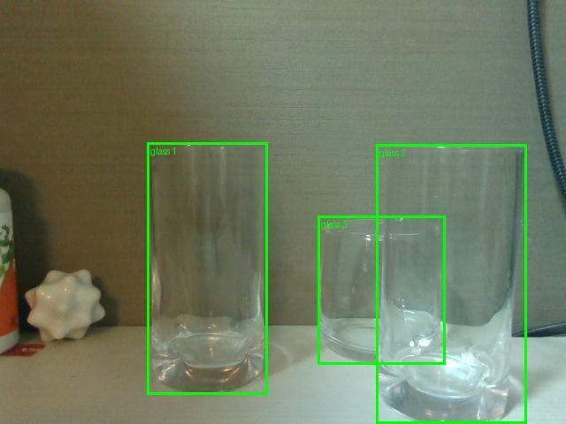
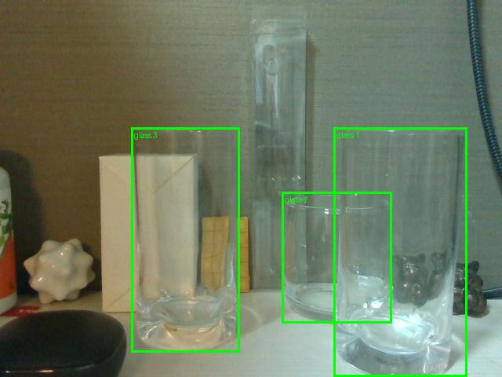
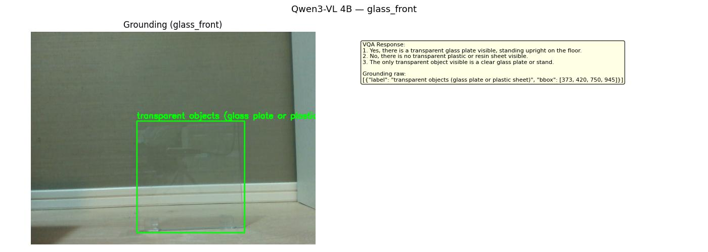
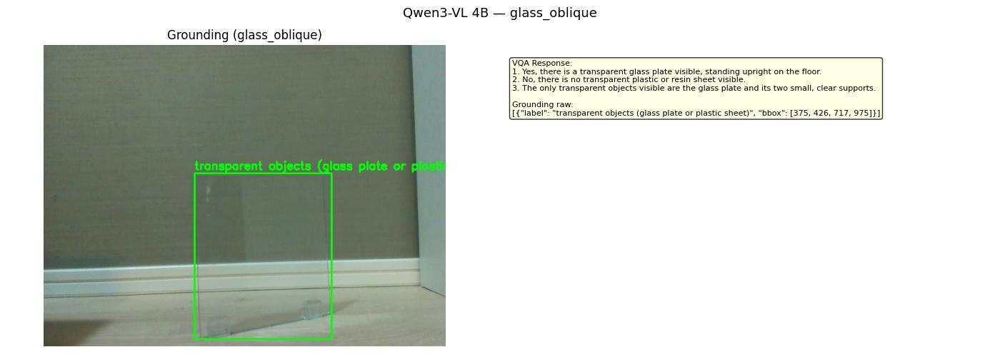
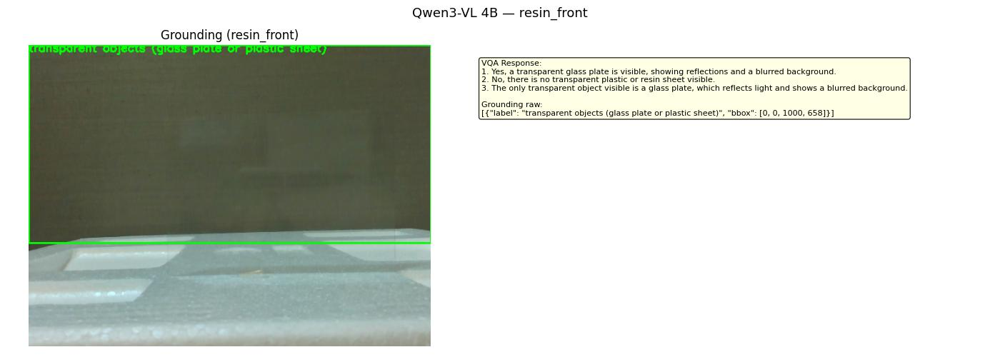
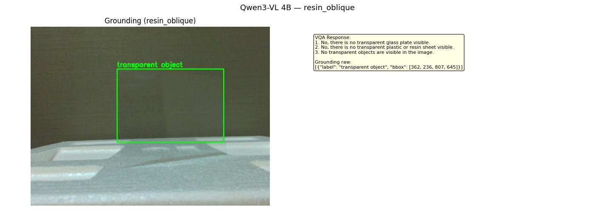

# 視覚言語モデル 技術調査・実験報告
## Qwen3-VL 4B

**文書番号**: PDX-RB20260504-004  
**作成日**: 2026-05-04  
**作成者**: 室屋  
**関連文書**: [概観レポート](00_overview.md) / [前レポート: セグメンテーション](02_segmentation.md)

---

## 1. この技術が解決する課題

これまで評価したモデル（YOLO26・SAM3・DINOv3）はいずれも「画像を見て位置を返す」
純粋な視覚モデルである。これに対し**視覚言語モデル（VLM）**は、
画像と自然言語を組み合わせて「質問に答える」「位置を説明する」ことができる。

```
VLM への問い:
  "Is there a transparent glass plate visible? Where is it?"

VLM の回答:
  "Yes, there is a transparent glass plate standing upright on the floor.
   [bbox: x1=238, y1=201, x2=480, y2=453]"
```

透明物体認識においてVLMは2つの役割を担える。

1. **VQA（Visual Question Answering）**: 「何が写っているか」「ガラスか樹脂か」を言語で判定
2. **Grounding（接地）**: テキストで指定した物体の位置をbboxで返す

---

## 2. 技術の仕組み

### 2.1 Qwen3-VL とは

Alibaba が開発した視覚言語モデルシリーズの最新版（2025年）。
4B（40億パラメータ）の小型モデルながら、多くのベンチマークで
GPT-4V クラスに近い性能を示す。

**アーキテクチャ:**

```
入力: 画像 + テキスト（質問・プロンプト）
         ↓
  ① 視覚エンコーダ: 画像をパッチに分割してベクトル化
  ② 言語モデル: 視覚特徴とテキストを融合して推論
  ③ テキスト生成: 回答・bbox 座標を自然言語で出力
         ↓
出力: 自然言語の回答（+ bbox 座標、JSON形式）
```

**特徴:**
- 4B パラメータ（VRAM ~2.7GB）で運用可能
- VQA・グラウンディング・OCR・動画理解に対応
- 日本語・英語ほか多言語対応
- 追加学習なしでゼロショット動作

### 2.2 VLM の変遷

| 系列 | 代表モデル | 年 | 特徴 |
|---|---|---|---|
| 初期 VLM | CLIP | 2021 | テキスト×画像の対照学習。検索・分類向け |
| 生成VLM | Flamingo | 2022 | 画像を見て文章を生成できる最初期の大型モデル |
| 汎用VLM | GPT-4V | 2023 | 商用で初めて実用水準。高精度だが閉源 |
| 小型高性能 | LLaVA, InternVL | 2023〜 | オープンソース化・軽量化の流れ |
| **Qwen3-VL** | Qwen3-VL 4B | 2025 | 小型ながら GPT-4V クラスに迫る性能 ← 本実験 |

### 2.3 VQA と Grounding の違い

| タスク | 入力 | 出力 | 本実験での使用 |
|---|---|---|---|
| **VQA** | 画像 + 質問文 | 自然言語の回答 | 何が写っているか・ガラスか樹脂かを判定 |
| **Grounding** | 画像 + 物体の説明 | bbox 座標（JSON） | 透明物体の位置を矩形で返す |

---

## 3. 実験A — 透明グラスコップ3個（2026-04-24）

### 3.1 VQA・Grounding 結果

**プロンプト（Grounding）**: `"Locate ALL transparent glass objects in the image. Return as JSON array."`

| シーン | Grounding bbox数 | 評価 |
|---|---|---|
| Simple | **3**（全グラス） | ✅ |
| Complex | **3**（本物グラスのみ。プラケース除外） | ✅ |

**Simple シーン**


*Qwen3-VL grounding — Simple シーン。3個の透明グラスを個別の bbox で正確に囲んでいる。
前後に重なる中央・右のグラスも独立して位置を返している。*

**Complex シーン**


*Qwen3-VL grounding — Complex シーン。手前の本物ガラス3個のみを検出。
奥の透明プラスチックケース（ディストラクタ）は "glass" として拾わず、
意味的な材質理解に基づいて除外している。SAM3 が誤検出したのと対照的。*

**SAM3 との重要な比較:**

| 観点 | SAM3 | Qwen3-VL |
|---|---|---|
| ガラス3個の検出 | ✅（全個） | ✅（全個） |
| プラスチックケースの扱い | ✗ 誤検出（glass と判定） | ✅ 除外（plasticと理解） |
| 判断根拠 | 視覚的透明性 | 言語的意味理解 |

Qwen3-VL は「透明に見えるか」ではなく「概念的にガラスか」で判断するため、
材質の識別においてSAM3 より優れた挙動を示した。

---

## 4. 実験B — ガラス板・樹脂シート（2026-05-03）

### 4.1 VQA 回答

**VQA プロンプト（3問）:**
```
1. Is there a transparent glass plate visible?
2. Is there a transparent plastic or resin sheet visible?
3. What transparent objects can you see, if any?
```

| シーン | Q1: ガラス板? | Q2: 樹脂シート? | 評価 |
|---|---|---|---|
| glass_front | **Yes** ✅ | No ✅ | 正解 |
| glass_oblique | **Yes** ✅ | No ✅ | 正解 |
| resin_front | Yes（誤） ✗ | No（誤） ✗ | **ガラス板と誤認** |
| resin_oblique | No（誤） ✗ | No（誤） ✗ | **不可視と誤判定** |

- **ガラス板**: 正面・斜めともに「ガラス板あり」を正確に回答
- **樹脂シート正面**: 「ガラス板がある」と誤認。実際には樹脂シートだが、VQA では混同
- **樹脂シート斜め**: 「透明物体なし」と誤判定。斜め撮影でも言語判断は困難

### 4.2 Grounding 結果

| シーン | bbox | 評価 |
|---|---|---|
| glass_front | [238,201, 480,453] | ✅ ガラス板を正確に囲む |
| glass_oblique | [240,204, 458,468] | ✅ 傾いた板も正確 |
| resin_front | [0,0, 640,315] | ✗ **画面全体** を bbox として返す（位置不明） |
| resin_oblique | [231,113, 516,309] | △ 何かを指しているが樹脂シートと一致しない |

**glass_front — VQA + Grounding 成功**


*glass_front。左: Grounding bbox がガラス板を正確に囲んでいる。
右: VQA 回答「Yes, ガラス板あり。樹脂シートなし」— 正解。
推論時間 VQA 14.1秒 / Grounding 13.1秒。*


*glass_oblique。斜め配置でも bbox がガラス板をほぼ正確に捉えている。
VQA 回答「Yes, ガラス板あり。スタンドも認識」— 正解。*

**resin_front — VQA・Grounding ともに失敗**


*resin_front。Grounding bbox が画面全体 [0,0,640,315] を返しており、
位置を特定できていない。VQA では「ガラス板がある」と誤認。
実際には樹脂シートが正面にあるが視覚的に不可視のため混乱している。*


*resin_oblique。VQA（右テキスト）は3問すべて「No — 透明物体なし」と回答しているにもかかわらず、
左の Grounding では `transparent object` というラベルと黄緑色の bbox が描画されている。
これは VQA と Grounding が**別プロンプト・別推論呼び出し**で実行されるためで、判断を共有しない。
Grounding タスクは出力形式が bbox 座標のみに固定されており、
「該当物体が存在しない」という回答ができない仕様になっている。
そのため VQA が「見えない」と判断した同じシーンでも、
Grounding は最も近い領域の座標を返すしかなく、この矛盾が生じる。*

---

## 5. 透明ワーク認識への適用可能性

| 評価項目 | 評価 | 補足 |
|---|---|---|
| 透明グラスコップ VQA | ✅ | 材質（ガラス vs プラスチック）を意味的に識別 |
| 透明グラスコップ Grounding | ✅ | 3個同時に個別 bbox を返す |
| ガラス板 VQA（正面・斜め） | ✅ | 存在を正確に確認。「スタンド」も認識 |
| ガラス板 Grounding（正面・斜め） | ✅ | bbox がほぼ正確にガラス板を囲む |
| 樹脂シート VQA（正面） | ✗ | ガラス板と誤認 |
| 樹脂シート VQA（斜め） | ✗ | 不可視と誤判定 |
| 樹脂シート Grounding | ✗ | 画面全体 bbox or 不一致 |
| 材質識別（ガラス vs プラスチック） | ✅ | グラスコップ実験で実証済み |
| 処理速度 | ✗ | VQA ~14秒 / Grounding ~13秒。リアルタイム不可 |

---

## 6. 考察

### 6.1 VLM の強みと弱み

**強み: 意味的理解**
VLM はテキストの概念で物体を理解するため、
SAM3（見た目が透明なら何でも検出）と異なり
「ガラス製かどうか」という意味的判断ができる。
グラスコップ実験でのプラスチックケース除外はその典型例である。

**弱み: 視覚情報が少ない場合の限界**
樹脂シートのように視覚的手がかりがほぼゼロの場合、
言語的推論の根拠となる視覚特徴自体がないため
VLM の強みが活かせない。「見えないものは言えない」。

**弱み: 推論速度**
VQA と Grounding を合わせると約27秒かかる。
リアルタイムのロボット制御への組み込みは現状困難。
小型化・量子化による高速化（4bit量子化等）が今後の課題。

### 6.2 他モデルとの役割分担

| 役割 | 推奨モデル | 理由 |
|---|---|---|
| 「何があるか」の確認 | Qwen3-VL | 言語で回答。材質も識別 |
| 精密な輪郭マスク | SAM3 | ピクセル単位。高速 |
| 位置の粗い特定 | Qwen3-VL Grounding | テキスト指定でbbox返却 |
| 位置の精密な特定（6DoF） | FoundationPose | 3次元位置・姿勢まで |

Qwen3-VL は「まず何が写っているかを確認する」フェーズに向いており、
精密な位置・姿勢推定には別モデルと組み合わせる構成が現実的である。

### 6.3 今後の可能性

- **プロンプトエンジニアリング**: 「樹脂シートか否か」の判定精度はプロンプトの工夫で改善余地あり
- **大型モデルとの比較**: 7B・72B モデルでは樹脂シート識別が改善する可能性
- **Chain-of-Thought**: 推論ステップを明示させることで Grounding 精度の向上が期待できる
- **他の VLM との比較**: InternVL2・LLaVA-Next・GPT-4o 等との精度比較

---

## 7. まとめ

| 項目 | 内容 |
|---|---|
| グラスコップ実験 | VQA・Grounding ともに成功。プラスチックとガラスを意味的に区別できる唯一のモデル |
| ガラス板（exp2） | VQA・Grounding ともに成功（正面・斜め）。bbox 精度も実用的 |
| 樹脂シート（exp2） | VQA・Grounding ともに失敗。視覚的不可視 × 意味的手がかりなしで限界 |
| 処理速度 | ~14秒/回でリアルタイム不可。バッチ処理・事前確認用途に限定 |
| 推奨用途 | ガラス板の存在確認・材質判定・概略位置把握。精密位置はSAM3 + FP と組み合わせ |

---

*次のレポート: [04_depth_mono.md](04_depth_mono.md) — 単眼深度推定 6モデル比較*

---

## 参考文献・リンク

| モデル | 論文 | GitHub |
|---|---|---|
| Qwen3-VL | [arxiv 2511.21631](https://arxiv.org/abs/2511.21631) | [QwenLM/Qwen3-VL](https://github.com/QwenLM/Qwen3-VL) |
| Qwen2.5-VL（参考） | [arxiv 2502.13923](https://arxiv.org/abs/2502.13923) | [QwenLM/Qwen2.5-VL](https://github.com/QwenLM/Qwen2.5-VL) |
