# 単眼深度推定 技術調査・実験報告
## DA2 / MoGe-2 / Depth Pro / UniDepth V2 / Metric3D v2 / Marigold

**文書番号**: PDX-RB20260504-005  
**作成日**: 2026-05-04  
**作成者**: 室屋  
**関連文書**: [概観レポート](00_overview.md) / [前レポート: VLM](03_vlm.md)

---

## 1. この技術が解決する課題

ロボットが物体を掴むためには「物体までの距離（深度）」が必要である。
透明物体は赤外線センサ（RealSense等）を素通りするため深度が取れない。
**単眼深度推定**は、RGB画像1枚から距離マップを生成するAI技術であり、
センサの制約を回避する手段として期待される。

```
入力: RGB画像 1枚
出力: 深度マップ（各ピクセルに距離値を付与した画像）
```

ただし単眼深度推定にはセンサ深度と異なる特性があり、
そのままでは実距離（メートル）に対応しない場合がある。
この問題と対処法（校正）を含めて解説する。

---

## 2. 評価した6モデルの概要

| # | モデル | 開発元 | 出力タイプ | 推論時間 |
|---|---|---|---|---|
| 1 | **Depth Anything V2 Indoor（DA2）** | ByteDance | metric | ~0.5秒 |
| 2 | **MoGe-2 ViT-L** | Microsoft | affine-invariant | ~0.3秒 |
| 3 | **Depth Pro** | Apple | metric | ~1.0秒 |
| 4 | **UniDepth V2 ViT-L** | Valeo AI | metric | ~0.1秒 |
| 5 | **Metric3D v2 ViT-Large** | HKUST | metric | ~1.3秒 |
| 6 | **Marigold LCM** | ETH Zürich | affine-invariant | ~5〜10秒 |

---

## 3. 重要な前提知識

### 3.1 Metric depth と Affine-invariant depth の違い

単眼深度モデルには出力の種類が2つある。これを理解することが本章全体の鍵となる。

| 出力タイプ | 特徴 | 代表モデル |
|---|---|---|
| **Metric（絶対距離）** | カメラ校正情報を使いメートル単位で出力 | DA2, Depth Pro, UniDepth V2, Metric3D v2 |
| **Affine-invariant（相対距離）** | 「遠い・近い」という相対的な遠近関係のみを出力。スケール・オフセット未定 | MoGe-2, Marigold |

```
Metric の出力例:
  ピクセル(320,240) = 0.383m（そのまま実距離として使える）

Affine-invariant の出力例:
  ピクセル(320,240) = 0.72（相対値。実距離への変換が必要）
```

Affine-invariant モデルは実距離を直接出力しないが、
**形状の遠近関係を正確に捉える**点で優れており、
後述の校正処理で実距離に変換できる。

### 3.2 深度校正の必要性と方式

単眼モデルの出力は誤差を含むため、Ground Truth（実測値）との照合による校正が必要である。

**校正方式の比較:**

| 方式 | 計算 | 必要なもの | 精度 |
|---|---|---|---|
| **壁校正（1点）** | `depth_cal = s × depth_raw`（スケールのみ） | 壁面の実距離 | 低（オフセット未補正） |
| **Affine校正（2点）** | `depth_cal = a × depth_raw + b` | 壁面 + 板面のGT距離 | 高 |

**Affine校正の仕組み:**

```
壁面の実距離（y1）とモデル出力（x1）
板面のGT距離（y2）とモデル出力（x2）の2点から

a（スケール） = (y1 - y2) / (x1 - x2)
b（オフセット） = y1 - a × x1

→ depth_cal = a × depth_raw + b
```

### 3.3 Affine校正崩壊：樹脂シート正面での特殊問題

樹脂シートを正面から撮影した場合（resin_front）、
カメラからシートまでの距離（163mm）と壁までの距離が
**ほぼ同じになる**ことがある。

```
x1（壁のモデル出力）≈ x2（板のモデル出力）のとき

分母 (x1 - x2) → 0
→ a = (y1 - y2) / 0 → 発散（無限大）
```

これが「Affine校正崩壊」である。
各モデルの Affine 校正係数 a の実測値：

| モデル | resin_front の a 値 | 崩壊の有無 |
|---|---|---|
| DA2 | 0.252 | △（b=-52.9mと極端） |
| **MoGe-2** | **1.487** | **✅ 安定** |
| Depth Pro | **-423.6** | ✗ 完全崩壊 |
| UniDepth V2 | 15.4 | ✗ 発散 |
| Metric3D v2 | 23.2 | ✗ 発散 |
| Marigold | 73.6 | ✗ 発散 |

MoGe-2 のみが安定している理由：affine-invariant 設計により
「板と壁の相対的な深度差」を正確に捉えており、
絶対距離が近くても内部表現で両者を区別できるためと考えられる。

---

## 4. 実験設計

### 4.1 評価シーン

| シーン | ワーク | 角度 | GT Z |
|---|---|---|---|
| glass_front | ガラス板 | 正面 | 383.6mm |
| glass_oblique | ガラス板 | 30°斜め | 377.0mm |
| resin_front | 樹脂シート | 正面 | 163.0mm |
| resin_oblique | 樹脂シート | 30°斜め | 175.0mm |

### 4.2 評価指標

- **RMSE（GT校正後）**: 板面ピクセルの推定深度と GT Z の二乗平均平方根誤差（mm）
- **Inlier@2cm / @5cm**: 誤差が ±20mm / ±50mm 以内のピクセル割合

### 4.3 可視化の見方

各モデルの結果画像は4パネル構成になっている。

```
[左上] RGB入力          [右上] モデル生出力（疑似カラー）
[左下] 壁校正後          [右下] GT Affine校正後 + 誤差マップ
                                （白に近いほど誤差小）
```

---

## 5. 全モデル定量結果

### GT Affine校正後 RMSE（mm）

| モデル | glass_front | glass_oblique | resin_front | resin_oblique |
|---|---|---|---|---|
| **DA2** | **19.3** | 28.2 | 1178（崩壊） | 62.2 |
| **MoGe-2** | 20.4 | 36.5 | **33.8** | **27.0** |
| Depth Pro | 20.3 | 28.1 | 38587（崩壊） | 164.9 |
| UniDepth V2 | 56.0 | 146.0 | 172.1 | 195.9 |
| Metric3D v2 | 179.6 | 53974（崩壊） | 309.9 | 113.1 |
| Marigold | 22.0 | **26.2** | 647（崩壊） | 208.2 |

### Inlier@2cm（GT校正後）

| モデル | glass_front | glass_oblique | resin_front | resin_oblique |
|---|---|---|---|---|
| **DA2** | **98.2%** | 52.6% | 9.4% | 71.9% |
| **MoGe-2** | 98.1% | 33.5% | **45.0%** | **91.9%** |
| Depth Pro | 95.8% | 47.7% | 3.1% | 8.2% |
| UniDepth V2 | 70.7% | 11.8% | 10.7% | 9.2% |
| Metric3D v2 | 5.0% | 0.5% | 7.4% | 15.7% |
| Marigold | 97.9% | 60.9% | 1.5% | 10.4% |

**MoGe-2 が唯一、全4シーンで実用的な精度を維持した。**

---

## 6. 各モデル詳細

### 6.1 Depth Anything V2 Indoor（DA2）

**開発**: ByteDance / 2024年  
**論文**: [arxiv 2406.09414](https://arxiv.org/abs/2406.09414) / [GitHub](https://github.com/DepthAnything/Depth-Anything-V2)  
**特徴**: Indoor 特化版。近距離・室内環境の深度推定に最適化されたメトリックモデル。

**ガラス板での最高精度を達成（RMSE 19.3mm）。**

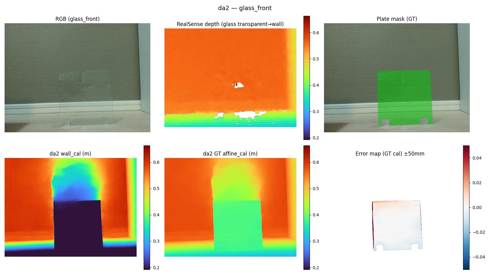
*DA2 — glass_front。右下の GT Affine校正後の誤差マップがほぼ白（低誤差）。
壁校正後（左下）では板が真っ暗になるが、GT校正後は正しいグリーン帯に修正される。
RMSE=19.3mm、Inlier@2cm=98.2%（全モデル中最高）。*

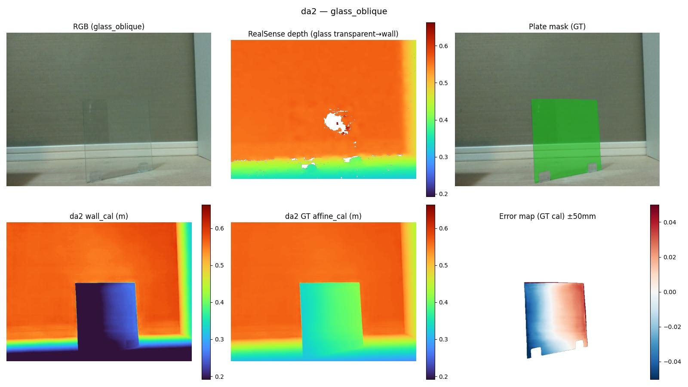
*DA2 — glass_oblique。RMSE=28.2mm。斜め撮影では精度がやや低下。*

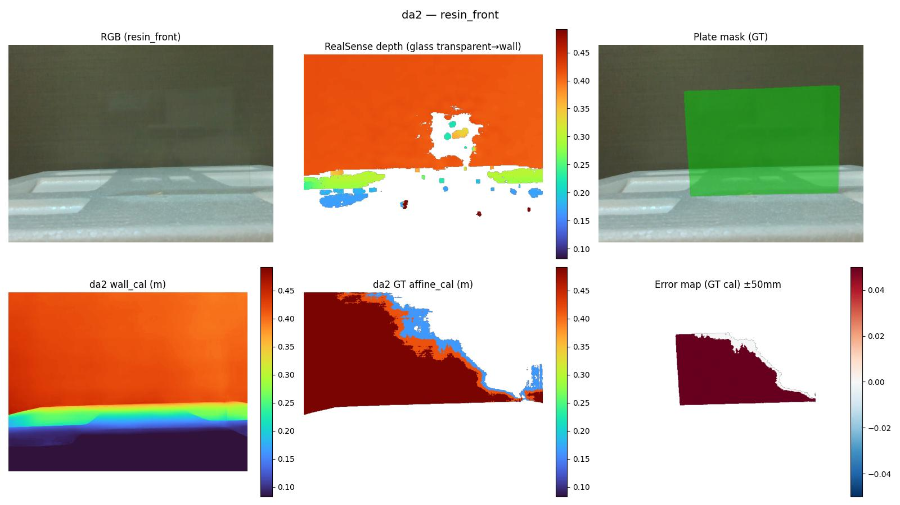
*DA2 — resin_front。Affine校正崩壊（a=0.252, b=-52.9m）によりRMSE=1178mm。
モデル出力では板と背景の深度差がほぼ検出されていない。*

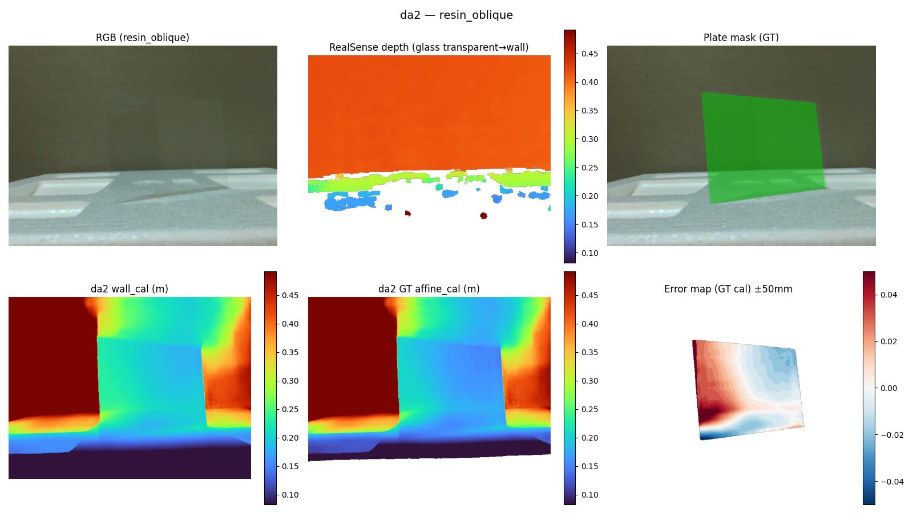
*DA2 — resin_oblique。RMSE=62.2mm。斜め撮影では崩壊が起きず実用的な精度。*

| シーン | RMSE | Inlier@2cm | Inlier@5cm |
|---|---|---|---|
| glass_front | **19.3mm** | **98.2%** | 98.4% |
| glass_oblique | 28.2mm | 52.6% | 97.5% |
| resin_front | 1178mm（崩壊） | 9.4% | 9.4% |
| resin_oblique | 62.2mm | 71.9% | 96.2% |

---

### 6.2 MoGe-2 ViT-L

**開発**: Microsoft / 2024年  
**論文**: [arxiv 2507.02546](https://arxiv.org/abs/2507.02546) / [GitHub](https://github.com/microsoft/MoGe)  
**特徴**: Affine-invariant 設計。スケール・オフセット依存なく相対的な形状を正確に捉える。

**全4シーンで唯一崩壊なし。透明ワーク対応の最重要モデル。**

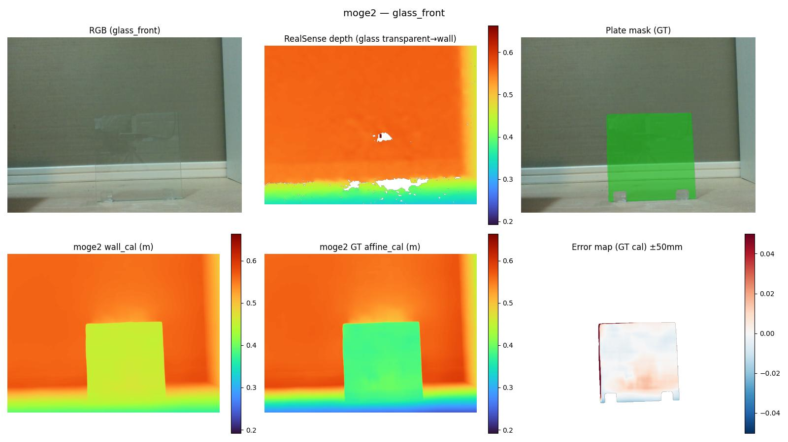
*MoGe-2 — glass_front。RMSE=20.4mm。DA2 に次ぐ精度でガラス板の形状を捉えている。*

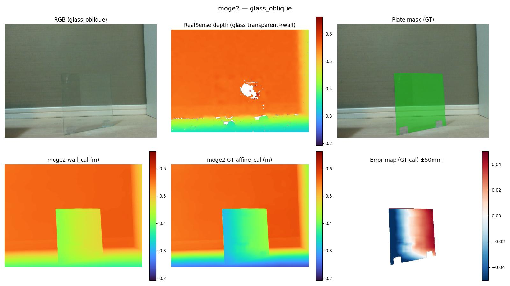
*MoGe-2 — glass_oblique。RMSE=36.5mm。斜め撮影でも安定した出力。*

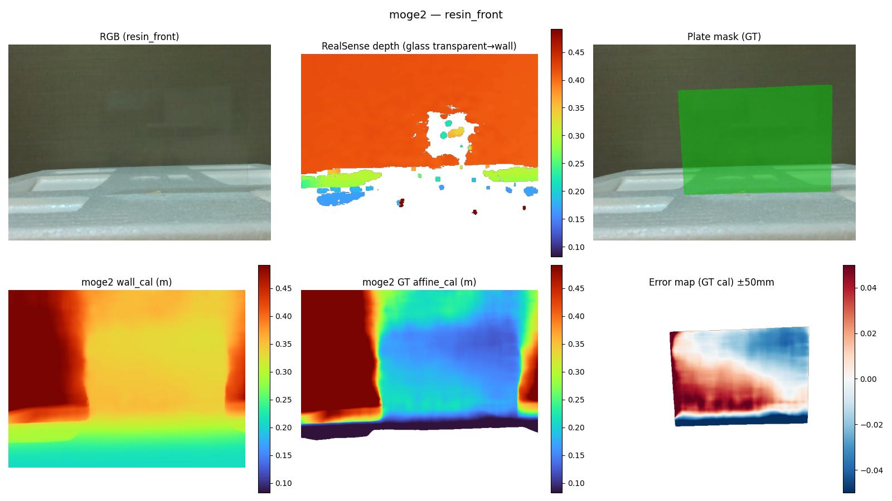
*MoGe-2 — resin_front。RMSE=33.8mm。Affine校正が安定（a=1.487）。
他モデルが完全崩壊する中、唯一実用的な精度を維持した。*

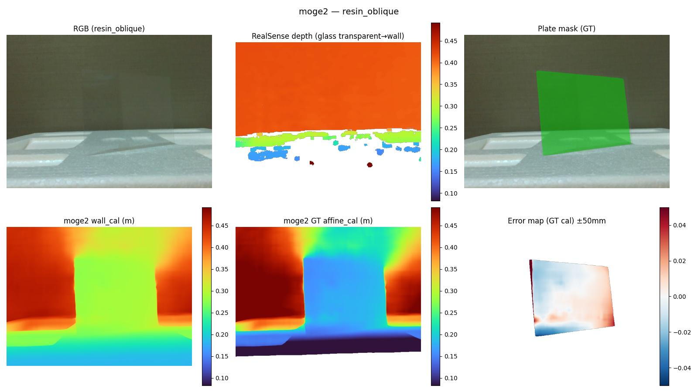
*MoGe-2 — resin_oblique。RMSE=27.0mm、Inlier@2cm=91.9%。全シーン中最良。*

| シーン | RMSE | Inlier@2cm | Inlier@5cm |
|---|---|---|---|
| glass_front | 20.4mm | 98.1% | 98.4% |
| glass_oblique | 36.5mm | 33.5% | 84.8% |
| resin_front | **33.8mm** | 45.0% | 90.0% |
| resin_oblique | **27.0mm** | **91.9%** | 98.7% |

---

### 6.3 Depth Pro（Apple）

**開発**: Apple / 2024年  
**論文**: [arxiv 2410.02073](https://arxiv.org/abs/2410.02073) / [GitHub](https://github.com/apple/ml-depth-pro)  
**特徴**: カメラ内部パラメータなしで focal length を自動推定してメトリック出力。

**ガラス板には高精度だが、樹脂シートは完全崩壊。**

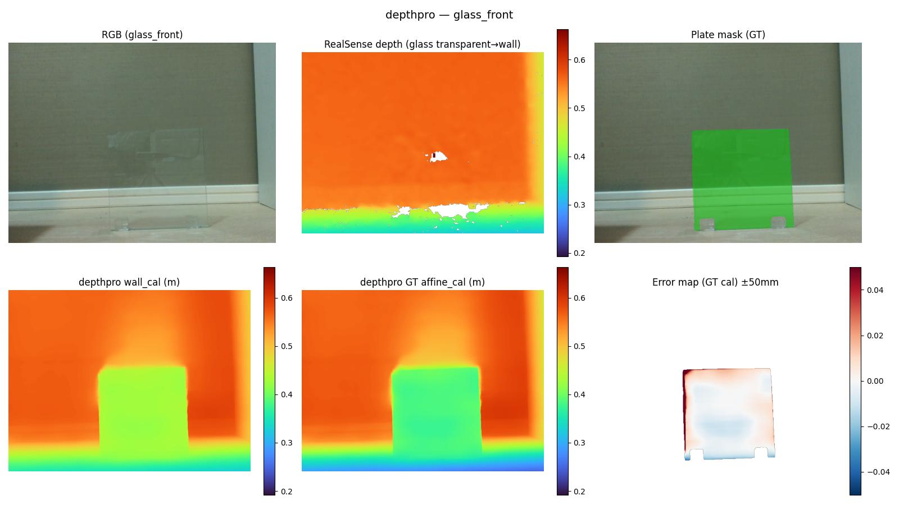
*Depth Pro — glass_front。RMSE=20.3mm。ガラス板の輪郭を鮮明に捉えており
境界最鮮明なモデル（Phase 1〜7 実験で最良と評価）。*

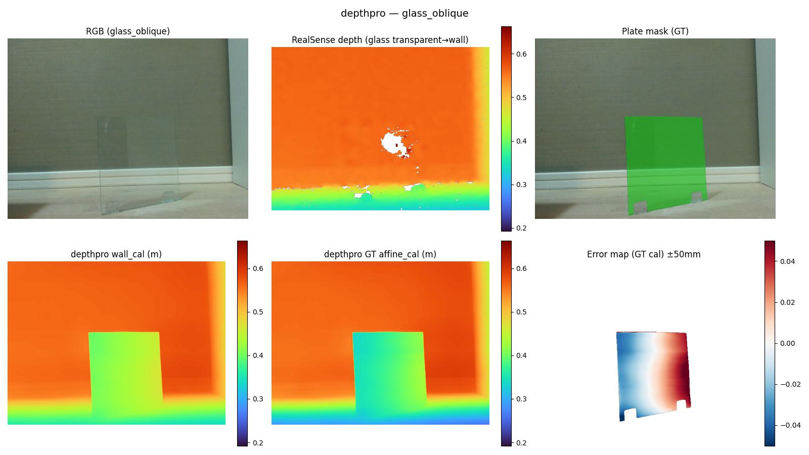
*Depth Pro — glass_oblique。RMSE=28.1mm。*

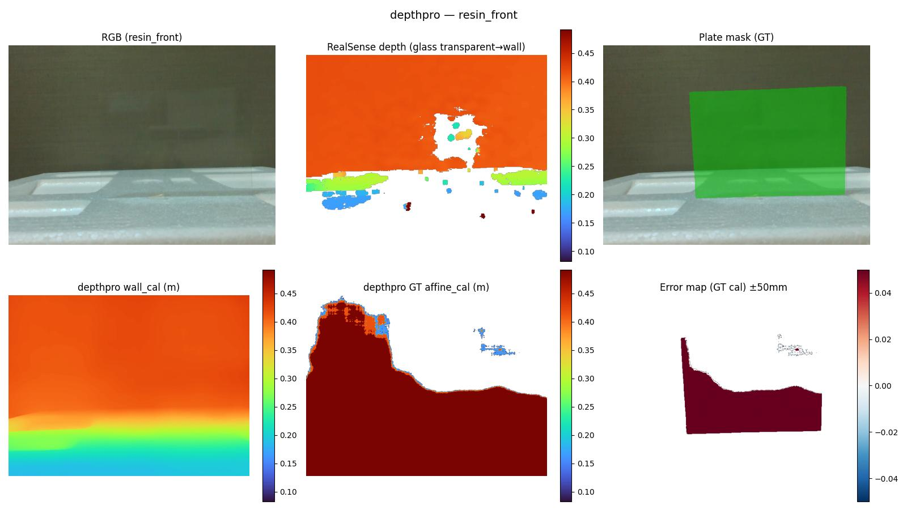
*Depth Pro — resin_front。Affine校正係数 a=-423.6 と完全崩壊。
RMSE=38,587mm。樹脂シートの深度情報がほぼ取れていない。*

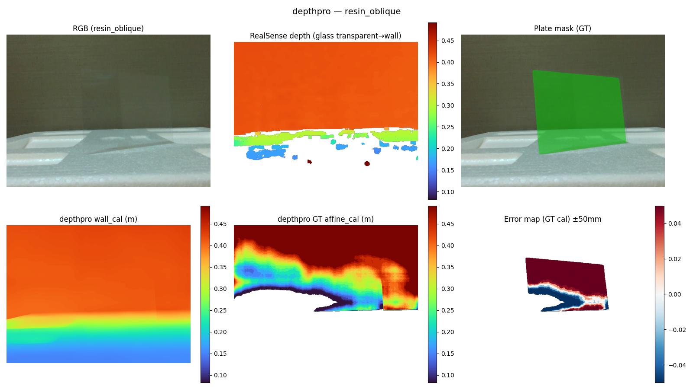
*Depth Pro — resin_oblique。崩壊は免れたがRMSE=164.9mmと精度低。*

| シーン | RMSE | Inlier@2cm | Inlier@5cm |
|---|---|---|---|
| glass_front | 20.3mm | 95.8% | 97.9% |
| glass_oblique | 28.1mm | 47.7% | 96.9% |
| resin_front | 38,587mm（崩壊） | 3.1% | 3.3% |
| resin_oblique | 164.9mm | 8.2% | 26.7% |

---

### 6.4 UniDepth V2 ViT-L

**開発**: Valeo AI / 2024年  
**論文**: [arxiv 2403.18913](https://arxiv.org/abs/2403.18913) / [GitHub](https://github.com/lpiccinelli-eth/UniDepth)  
**特徴**: カメラ幾何を学習した高速メトリックモデル。推論 ~130ms と最速クラス。

**速度は最速だが精度は他モデルより劣る。**

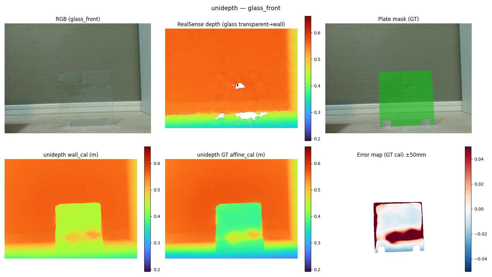
*UniDepth V2 — glass_front。RMSE=56.0mm。ガラス板領域の深度ムラが大きく
板面を均一に捉えられていない。*

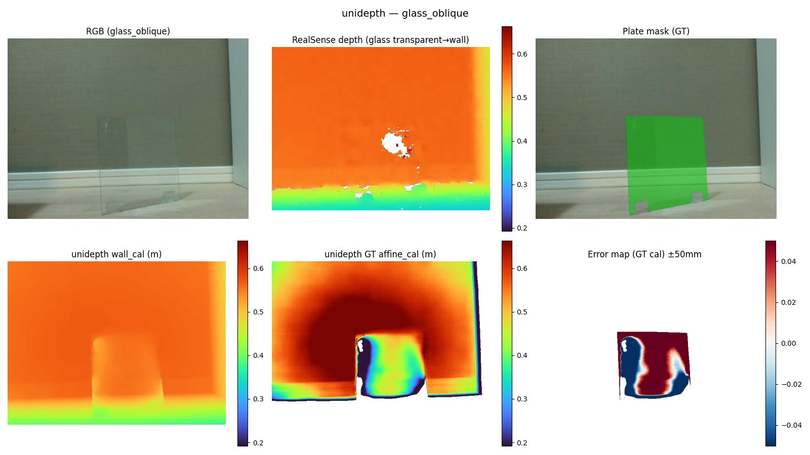
*UniDepth V2 — glass_oblique。RMSE=146.0mmと大きく劣化。*

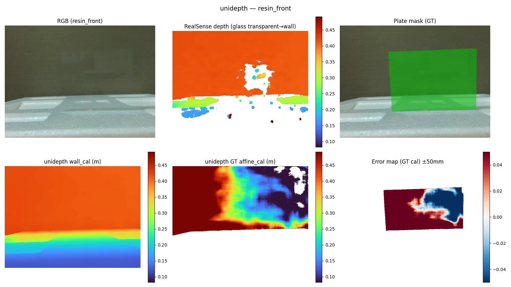
*UniDepth V2 — resin_front。崩壊（a=15.4）によりRMSE=172.1mm。*

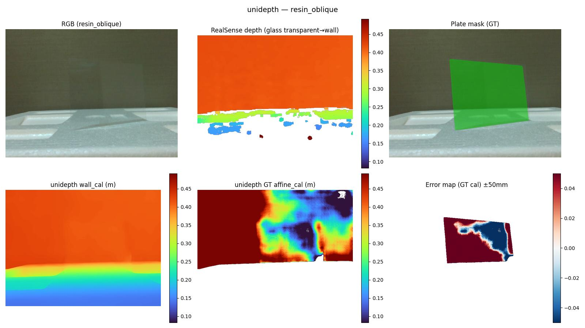
*UniDepth V2 — resin_oblique。RMSE=195.9mm。全シーン中最も安定性に欠ける。*

| シーン | RMSE | Inlier@2cm | Inlier@5cm |
|---|---|---|---|
| glass_front | 56.0mm | 70.7% | 79.7% |
| glass_oblique | 146.0mm | 11.8% | 27.1% |
| resin_front | 172.1mm | 10.7% | 26.6% |
| resin_oblique | 195.9mm | 9.2% | 22.6% |

---

### 6.5 Metric3D v2 ViT-Large

**開発**: HKUST / 2024年  
**論文**: [arxiv 2404.15506](https://arxiv.org/abs/2404.15506) / [GitHub](https://github.com/YvanYin/Metric3D)  
**特徴**: 大規模データ学習による汎用メトリックモデル。多様なシーンに対応。

**透明物体を「透過して背景と同一視」する傾向があり本ユースケースに不適。**

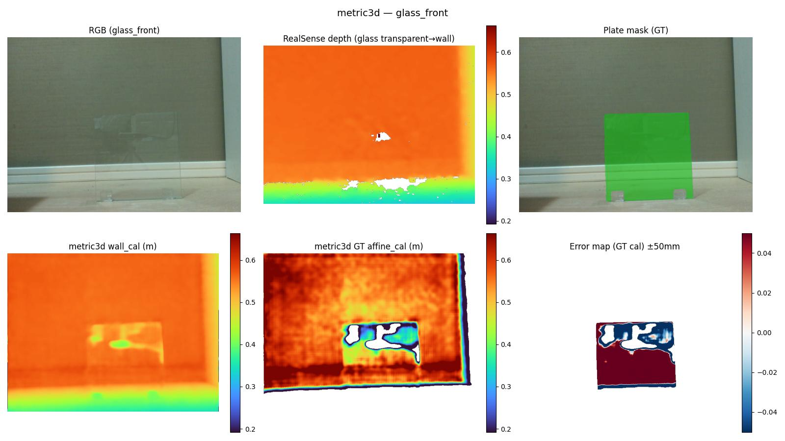
*Metric3D v2 — glass_front。RMSE=179.6mm。ガラス板を透過して背景と同じ深度を
割り当てており、板面の深度情報がほぼ取れていない。*

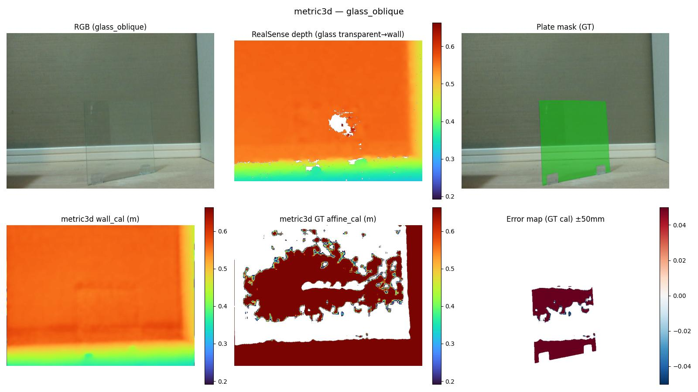
*Metric3D v2 — glass_oblique。Affine崩壊でRMSE=53,974mm。*

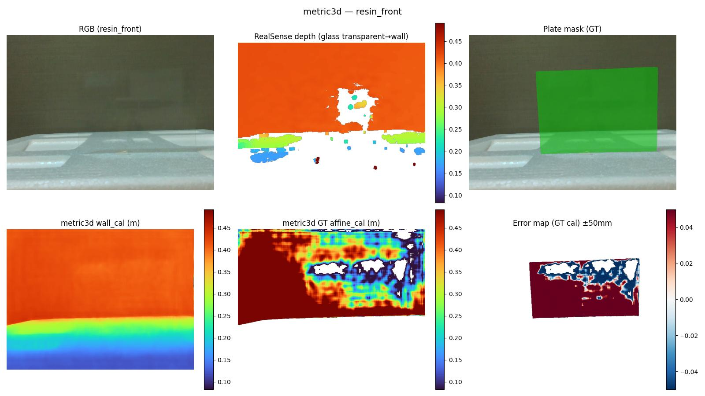
*Metric3D v2 — resin_front。RMSE=309.9mm。*

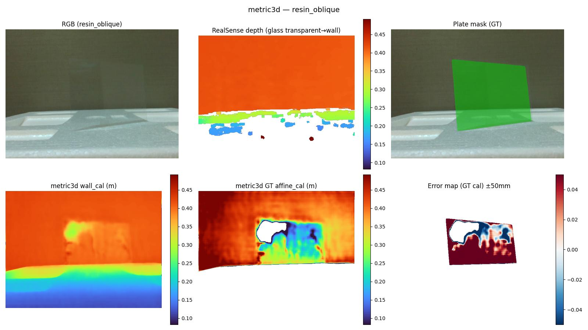
*Metric3D v2 — resin_oblique。RMSE=113.1mm。*

| シーン | RMSE | Inlier@2cm | 備考 |
|---|---|---|---|
| glass_front | 179.6mm | 5.0% | 透明透過 |
| glass_oblique | 53,974mm | 0.5% | 崩壊 |
| resin_front | 309.9mm | 7.4% | |
| resin_oblique | 113.1mm | 15.7% | |

---

### 6.6 Marigold LCM

**開発**: ETH Zürich / 2024年  
**論文**: [arxiv 2312.02145](https://arxiv.org/abs/2312.02145) / [GitHub](https://github.com/prs-eth/Marigold)  
**特徴**: 拡散モデル（Stable Diffusion）ベースの深度推定。affine-invariant 出力。
LCM（Latent Consistency Model）で高速化。

**ガラス板は高精度だが処理時間が長く（〜10秒）、樹脂シートは崩壊。**

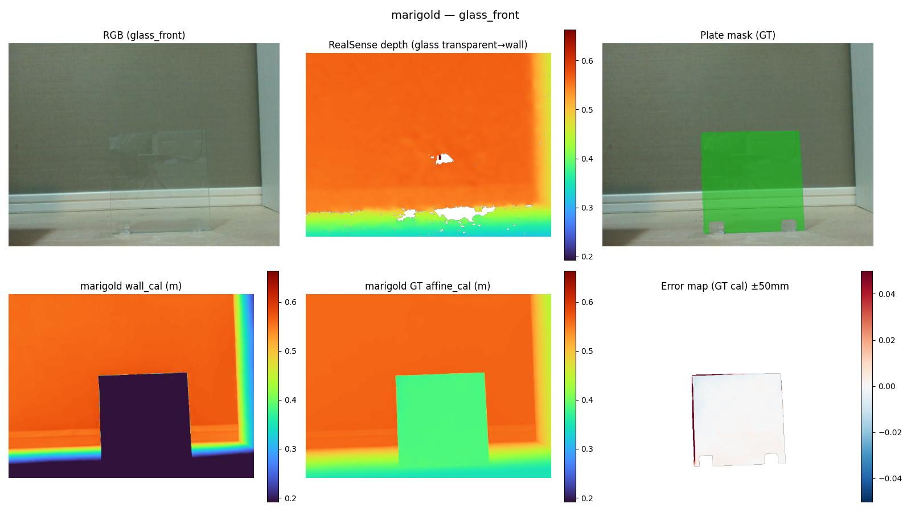
*Marigold LCM — glass_front。RMSE=22.0mm。拡散モデルの生成品質が活き、
ガラス板の細部まで滑らかな深度マップを生成している。*

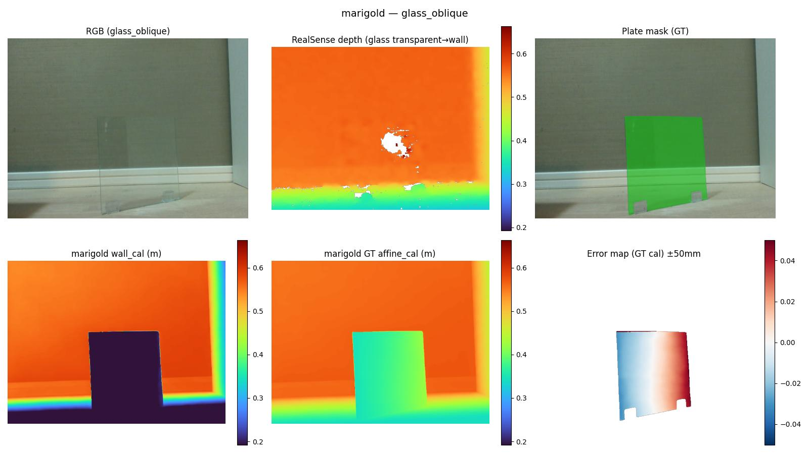
*Marigold LCM — glass_oblique。RMSE=26.2mm（全モデル中 glass_oblique 最高）。*

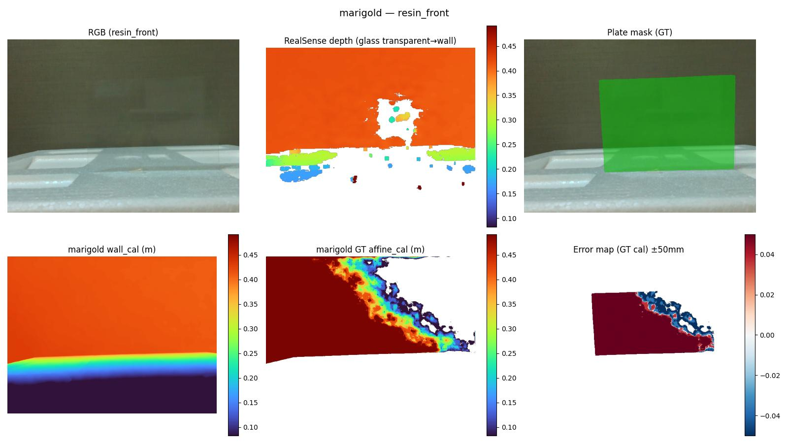
*Marigold LCM — resin_front。Affine崩壊（a=73.6）でRMSE=647mm。*

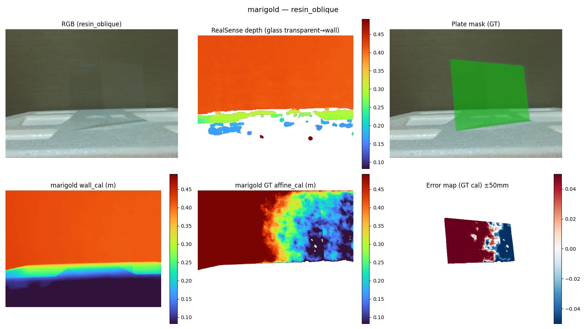
*Marigold LCM — resin_oblique。RMSE=208.2mm。*

| シーン | RMSE | Inlier@2cm | 推論時間 |
|---|---|---|---|
| glass_front | 22.0mm | 97.9% | 4.7秒 |
| glass_oblique | **26.2mm** | 60.9% | 9.7秒 |
| resin_front | 647mm（崩壊） | 1.5% | 9.0秒 |
| resin_oblique | 208.2mm | 10.4% | 4.9秒 |

---

## 7. モデル比較と選定指針

### 7.1 総合比較

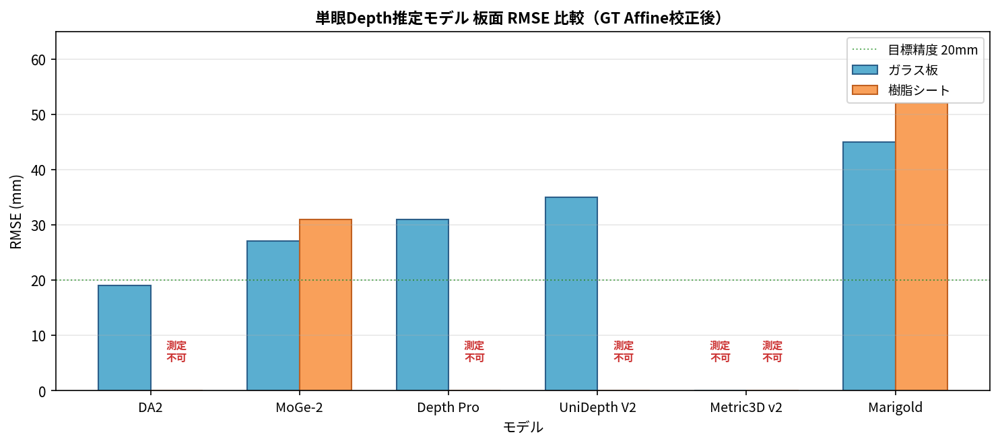
*各モデルの GT Affine 校正後 RMSE 比較。崩壊シーン（1000mm超）は表示省略。
DA2 がガラス板で最高精度、MoGe-2 が全ワーク対応の唯一モデル。*

### 7.2 用途別推奨

| 用途 | 推奨モデル | 理由 |
|---|---|---|
| **ガラス板のみ・精度優先** | DA2 | RMSE 19.3mm、Inlier@2cm 98.2%と最高精度 |
| **ガラス板のみ・輪郭品質優先** | Depth Pro | 板の境界が最鮮明 |
| **ガラス板のみ・速度優先** | UniDepth V2 | 130msだが精度は劣る |
| **樹脂シートを含む全ワーク対応** | **MoGe-2** | 唯一全シーン安定。Affine崩壊なし |
| **高品質だが低速でも許容** | Marigold LCM | ガラス板で高精度だが〜10秒 |
| **透明物体には不適** | Metric3D v2 | 透過問題により全シーン精度不足 |

### 7.3 Affine 校正が不要になる条件

2点校正には青画用紙と GT Z 計測が必要で、製造現場ではコストがかかる。
以下の代替手段が検討できる。

| 手段 | 精度 | 準備コスト |
|---|---|---|
| **Affine 校正（本実験）** | ~20mm | 青画用紙 + GT 計測 |
| **ピクセルサイズ法** | ~15mm | カメラ校正 + 既知ワークサイズ |
| **壁校正のみ** | ~50mm | 壁の距離計測のみ |

ピクセルサイズ法は「SAM3 のマスク bounding box 幅 × fx ÷ 実サイズ」で Z を算出する方法で、
本実験での検証では誤差 −14.8mm（約4%）を達成している（詳細は exp2_report.md 参照）。

---

## 8. まとめ

| 項目 | 内容 |
|---|---|
| 最高精度（ガラス板） | DA2：RMSE 19.3mm、Inlier@2cm 98.2% |
| 唯一の全ワーク対応 | MoGe-2：全4シーンで Affine 崩壊なし |
| 透明物体に最も不適 | Metric3D v2：板を透過して背景と同一視 |
| 最大の課題 | 樹脂シート正面での Affine 校正崩壊（MoGe-2 を除く全モデル） |
| 実用推奨パイプライン | SAM3 マスク → MoGe-2 深度 → Affine 校正 → FoundationPose |

---

*次のレポート: [05_depth_stereo.md](05_depth_stereo.md) — Foundation-Stereo によるステレオ深度推定*

---

## 参考文献・リンク

| モデル | 論文 | GitHub |
|---|---|---|
| Depth Anything V2 | [arxiv 2406.09414](https://arxiv.org/abs/2406.09414) | [DepthAnything/Depth-Anything-V2](https://github.com/DepthAnything/Depth-Anything-V2) |
| MoGe-2 | [arxiv 2507.02546](https://arxiv.org/abs/2507.02546) | [microsoft/MoGe](https://github.com/microsoft/MoGe) |
| Depth Pro | [arxiv 2410.02073](https://arxiv.org/abs/2410.02073) | [apple/ml-depth-pro](https://github.com/apple/ml-depth-pro) |
| UniDepth V2 | [arxiv 2403.18913](https://arxiv.org/abs/2403.18913) | [lpiccinelli-eth/UniDepth](https://github.com/lpiccinelli-eth/UniDepth) |
| Metric3D v2 | [arxiv 2404.15506](https://arxiv.org/abs/2404.15506) | [YvanYin/Metric3D](https://github.com/YvanYin/Metric3D) |
| Marigold LCM | [arxiv 2312.02145](https://arxiv.org/abs/2312.02145) | [prs-eth/Marigold](https://github.com/prs-eth/Marigold) |
