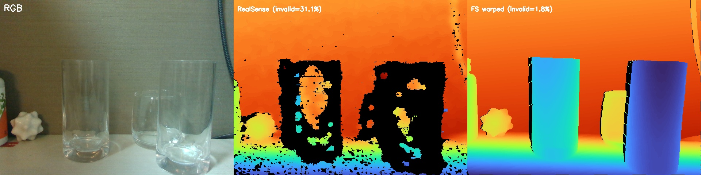
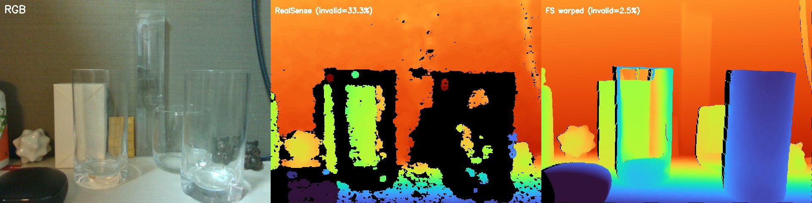
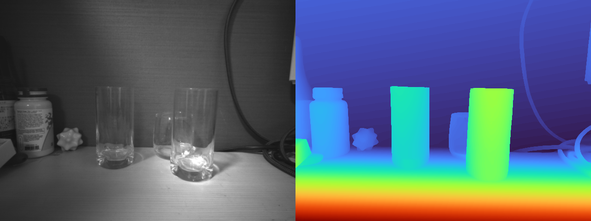
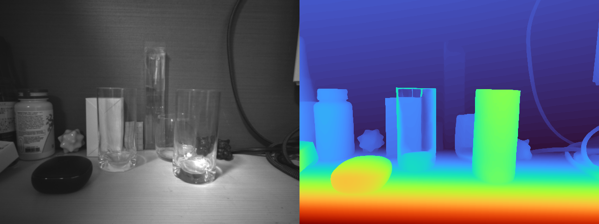
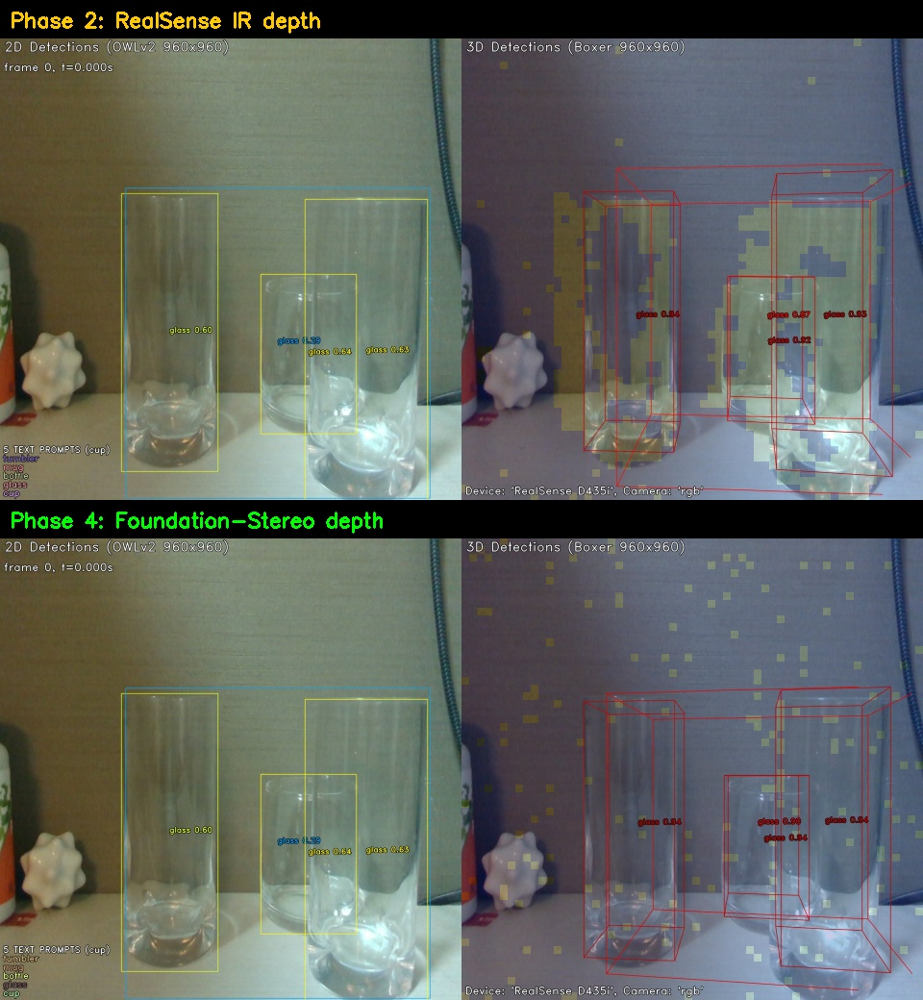
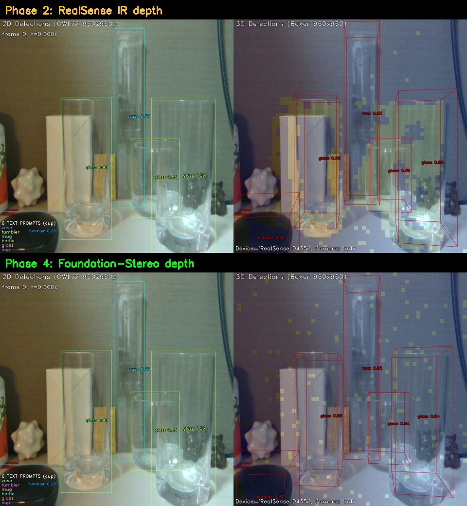
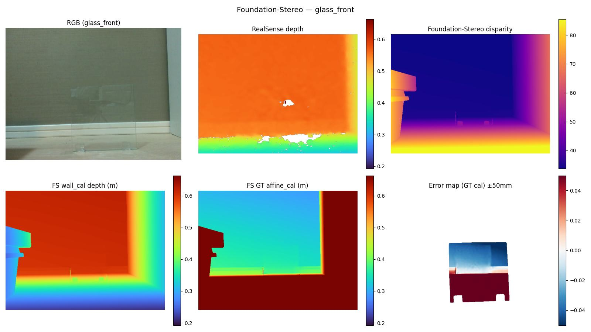
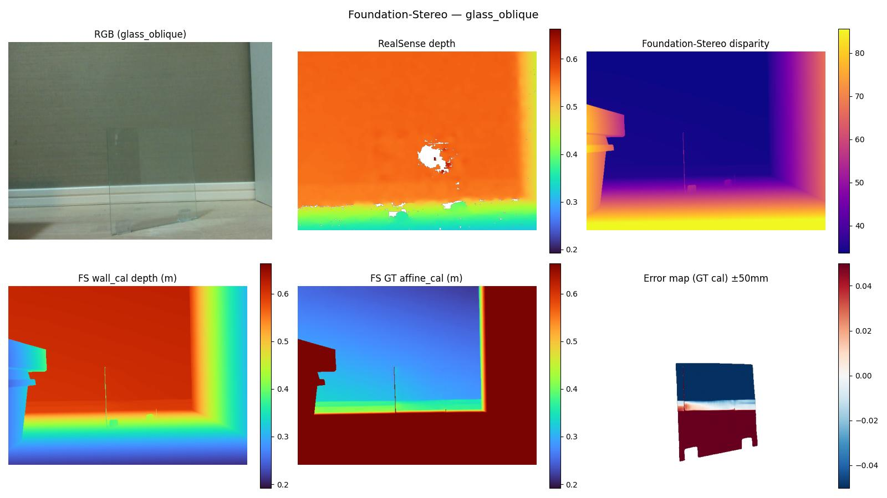
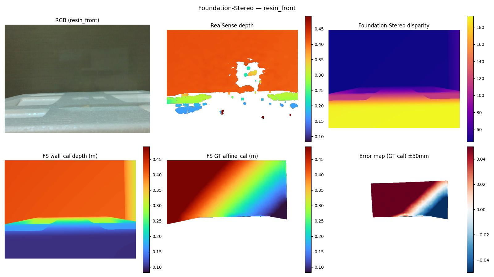

# ステレオ深度推定 技術調査・実験報告
## Foundation-Stereo（NVIDIA）

**文書番号**: RD-2026-006  
**作成日**: 2026-05-04  
**対象読者**: 研究開発部門・技術部門（AI・画像認識の事前知識不要）  
**論文**: [arxiv 2501.09898](https://arxiv.org/abs/2501.09898) / [GitHub](https://github.com/NVlabs/FoundationStereo)  
**関連文書**: [概観レポート](00_overview.md) / [前レポート: 単眼深度推定](04_depth_mono.md)

---

## 1. この技術が解決する課題

前章の単眼深度推定は RGB 1枚で深度を推定するが、
透明物体では視覚手がかりが乏しく精度に限界がある。
**ステレオ深度推定**は左右2台のカメラから視差（disparity）を計算して距離を求める
物理ベースの手法で、原理的に単眼より高精度が期待できる。

```
ステレオ視差の原理:
  同じ物体が左カメラと右カメラで異なる位置に見える
  この「ズレ（視差）」が大きいほど物体は近い

        左カメラ     右カメラ
           ●           ●
            \         /
             \       /
              [物体]
          視差 d = u_left - u_right
          距離 Z = f × B / d  （f:焦点距離, B:基線長）
```

RealSense D435i は赤外線ステレオ方式を内蔵しているが、
透明物体は赤外線を素通りするため深度が取れない（欠損率 27〜33%）。
Foundation-Stereo は AI でステレオマッチングを行い、
RealSense が苦手な領域の深度も復元することを目指す。

---

## 2. Foundation-Stereo とは

**開発**: NVIDIA / 2025年（CVPR 2025 Oral・Best Paper Nomination）  
**論文**: [arxiv 2501.09898](https://arxiv.org/abs/2501.09898)  
**GitHub**: [NVlabs/FoundationStereo](https://github.com/NVlabs/FoundationStereo)

大規模合成データで事前学習した**基盤モデル型**ステレオマッチング手法。
従来のステレオ手法と異なり、テクスチャの乏しい領域・遮蔽領域でも
深度を推定できる汎化性能を持つ。

**アーキテクチャ:**

```
左IR画像 + 右IR画像（emitter OFF: ドットパターンなし）
         ↓
  特徴抽出（Vision Foundation Model ベース）
         ↓
  コスト体積構築（各視差候補のマッチングコスト）
         ↓
  視差推定（disparity map）
         ↓
  スケール変換: Z = f × B / d
         ↓
出力: 深度マップ（左カメラ視点）
```

**ステレオ深度推定の系譜:**

| 手法 | 年 | 特徴 |
|---|---|---|
| SGM（Semi-Global Matching） | 2008 | 古典的手法。テクスチャ必須 |
| PSMNet | 2018 | CNN でコスト体積を学習 |
| RAFT-Stereo | 2021 | 反復更新で高精度。Dense match |
| CREStereo | 2022 | Cascade + Recurrent。実用性高 |
| **Foundation-Stereo** | 2025 | 大規模基盤モデル。ゼロショット汎化 ← 本実験 |

---

## 3. RealSense との撮影上の注意点

RealSense D435i は IR emitter（赤外線投影装置）を持ち、
ON/OFF で取得できる情報が異なる。

| emitter 設定 | RealSense 深度精度 | IR 画像の状態 |
|---|---|---|
| **ON** | ◎（投影ドットで無地面も補助） | ドットパターンが映り込む → FS の精度が落ちる |
| **OFF** | △（パッシブのみ、透明・暗色で欠損大） | クリーンな IR 画像 → **FS に最適** |

本実験では **emitter OFF で IR 画像を取得**し、Foundation-Stereo に入力した。
また FS の出力は左 IR カメラ視点のため、RGB 視点への投影変換（ワープ）が必要である。

---

## 4. 実験A — 透明グラスコップ3個（2026-04-24）

### 4.1 RealSense depth との比較

透明グラスコップでは RealSense の深度欠損が深刻だった。

| シーン | RS depth 欠損率 | FS 欠損率（ワープ後） | 改善 |
|---|---|---|---|
| Simple | 27.1% | ~2.5% | **▲24.6pt** |
| Complex | 33.3% | ~1.8% | **▲31.5pt** |

**Simple シーン — 深度比較**


*左: RGB、中央: RealSense depth（透明グラス3個が**真っ黒・完全欠損**）、
右: Foundation-Stereo warped depth（3つのグラスが青い直方体として明瞭に復元）。
FS は RealSense が捉えられない透明部分の深度を正確に復元している。*

**Complex シーン — 深度比較**


*Complex シーン。RealSense はガラス・箱前面・背景の一部が欠損（33%）。
Foundation-Stereo はほぼ全面カバー。奥の高いガラスも緑色の柱として認識。*

**Foundation-Stereo 深度可視化（Simple）**


*Foundation-Stereo — Simple シーン。透明グラス3個が独立した立体として
明瞭に復元されている。RealSense では完全欠損だった部分が正確な深度値を持つ。*

**Foundation-Stereo 深度可視化（Complex）**


*Foundation-Stereo — Complex シーン。4個のグラス（手前3つ + 奥の高いガラス）が
それぞれ異なる深度段階で分離されている。*

### 4.2 FS depth を使った Boxer の改善

FS depth に切り替えることで Boxer（3D OBB 検出）の精度も向上した。


*Boxer 比較 — Simple シーン。上段: RS depth 使用（Phase 2）、下段: FS depth 使用（Phase 4）。
FS 版では 3D OBB の位置・サイズがシーンの実際の形状により整合的になっている。*


*Boxer 比較 — Complex シーン。FS depth 使用により複数グラスの位置精度が向上。*

---

## 5. 実験B — ガラス板・樹脂シート（2026-05-03）

### 5.1 定量結果

| シーン | RMSE（壁校正） | RMSE（GT校正） | Inlier@2cm | Inlier@5cm | 推論時間 |
|---|---|---|---|---|---|
| glass_front | 175.0mm | 718.6mm | 12.0% | 51.2% | 1.61秒 |
| glass_oblique | 177.8mm | 905.7mm | 8.4% | 11.7% | 1.34秒 |
| resin_front | 208.2mm | 122.3mm | 15.2% | 34.0% | 1.42秒 |
| resin_oblique | 195.7mm | 152.5mm | 10.7% | 25.4% | 1.41秒 |

> GT Affine 校正係数 a が大きく発散している（glass_front: a=-4.9、resin_front: a=47.2）。
> 壁校正後の RMSE も 175〜208mm と単眼モデル（DA2: 198mm）と同程度かそれ以上に悪く、
> 透明平板に対しては根本的に機能していない。

### 5.2 可視化

**glass_front**


*Foundation-Stereo — glass_front。右上の視差マップ（Disparity）を見ると、
ガラス板の領域がほぼ一様な暗色（低視差 = 遠い）になっており、
板面の視差が正しく計算されていない。
壁校正後（左下）・GT校正後（中下）ともに板部分の推定が失敗している。*


*Foundation-Stereo — glass_oblique。斜め撮影でも同様に板面の視差が捉えられていない。*


*Foundation-Stereo — resin_front。樹脂シートも視差ゼロ（不可視）として処理される。*


*Foundation-Stereo — resin_oblique。斜め撮影でも改善なし。*

---

## 6. 単眼モデルとの比較

| モデル | glass_front RMSE | resin_front RMSE | 透明物体対応 |
|---|---|---|---|
| DA2（単眼） | **19.3mm** | 1178mm（崩壊） | ガラス板のみ |
| MoGe-2（単眼） | 20.4mm | **33.8mm** | 全ワーク対応 |
| **Foundation-Stereo** | 718.6mm | 122.3mm | **全シーン不適** |

Foundation-Stereo は透明グラスコップ（3glass実験）では有効だったが、
テクスチャなし・無地の透明**平板**には機能しなかった。

---

## 7. 考察：なぜ透明平板に失敗するのか

### 7.1 グラスコップ vs ガラス板の違い

| 特性 | 透明グラスコップ | ガラス板（平板） |
|---|---|---|
| 形状 | 曲面・脚・底面など複雑 | 完全に平坦 |
| 表面 | 曲率による反射・歪みあり | 均一な反射 |
| 縁 | 複数の方向に縁あり | 4辺のみ |
| ステレオ手がかり | 曲面反射でテクスチャ状の変化 | 手がかりほぼゼロ |

グラスコップの曲面は表面の歪みや縁の多方向性が
ステレオマッチングの手がかりとなる。
ガラス板は完全に平坦で均一なため、左右カメラで見え方がほぼ同一→ 視差ゼロ。

### 7.2 根本的な原因

```
透明平板のステレオマッチング失敗の原因:

① 板面に固有のテクスチャなし
   → 左右カメラで同一の「壁の模様」が見える
   → マッチングで「視差ゼロ（壁と同じ距離）」と判定

② IR emitter OFF でのパッシブステレオ
   → 無地の壁面・透明板には IR 照明なし
   → さらにマッチングが困難

③ 屈折の影響
   → ガラスを通った光が屈折するため
     左右カメラで微妙に異なる背景が見えるが
     これはガラス自体の位置ではなく背景の歪みとして処理される
```

### 7.3 ChArUco 背景による改善可能性

背景に ChArUco マーカー等のテクスチャを配置すると、
ガラス越しに見える背景テクスチャが視差計算の手がかりになり、
Foundation-Stereo の性能が改善する可能性がある。

```
期待効果:
  背景のテクスチャ → ガラス越しに見えて視差が計算できる
  → 透明板の「ある深度」でのテクスチャ変位として深度が推定できる

ただし:
  得られるのは「背景の深度」ではなく「板の深度」かどうかは
  屈折の影響次第であり、実験による検証が必要
```

本プロジェクトでは ChArUco 背景を使った改善実験を予定している。

---

## 8. まとめ

| 項目 | 内容 |
|---|---|
| 透明グラスコップ（3glass実験） | RS depth 欠損率 27〜33% → FS で 2〜3% に改善。Boxer・Any6D の精度向上に貢献 |
| ガラス板・樹脂シート（exp2） | 全4シーンで実用精度に届かず（RMSE 122〜906mm）。テクスチャなし平板に根本的に不適 |
| 失敗の原因 | 透明平板はテクスチャゼロのため左右カメラで視差が計算できない |
| 適用可能なケース | 曲面・縁・複雑形状の透明物体、またはテクスチャのある背景が見える環境 |
| 今後の改善実験 | ChArUco 背景で透明板後方にテクスチャを配置 → FS の視差計算改善を検証予定 |

---

## 参考文献・リンク

| 項目 | リンク |
|---|---|
| Foundation-Stereo 論文（CVPR 2025 Oral） | [arxiv 2501.09898](https://arxiv.org/abs/2501.09898) |
| Foundation-Stereo GitHub | [NVlabs/FoundationStereo](https://github.com/NVlabs/FoundationStereo) |
| RAFT-Stereo（参考・前世代手法） | [arxiv 2109.07547](https://arxiv.org/abs/2109.07547) |

---

*次のレポート: [06_pose_estimation.md](06_pose_estimation.md) — FoundationPose / Any6D による 6DoF ポーズ推定*
