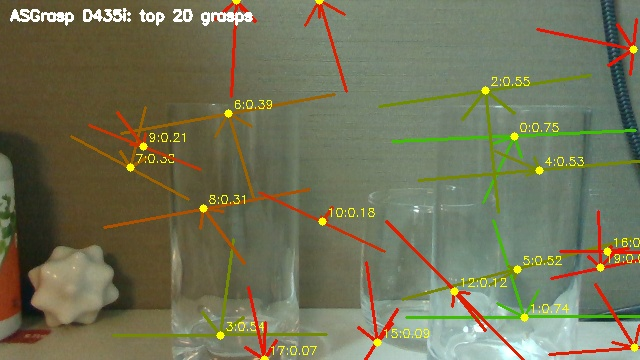
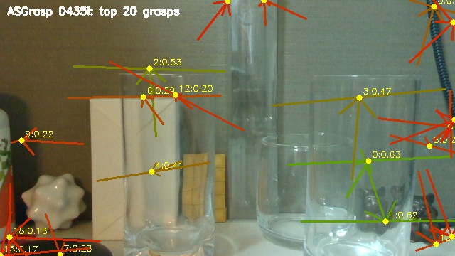
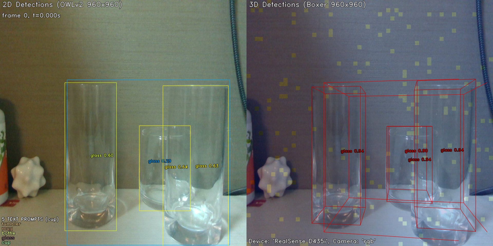
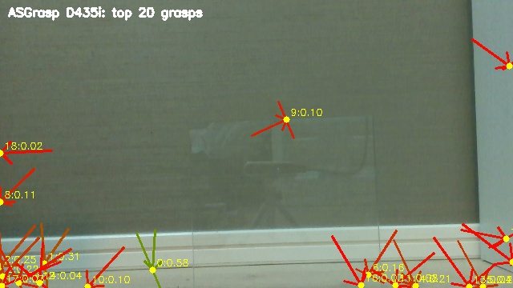
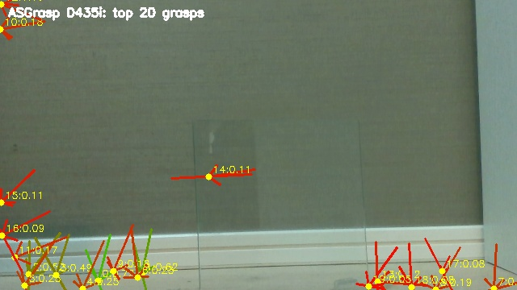
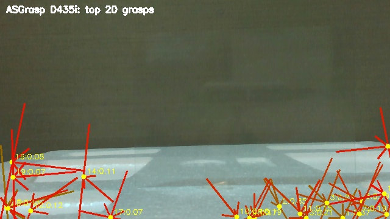
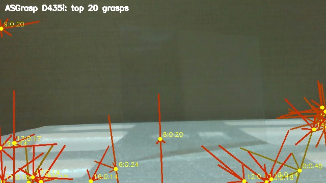

# 把持・3D検出 技術調査・実験報告
## ASGrasp / Boxer（OWLv2 + BoxerNet）

**文書番号**: PDX-RB20260504-008  
**作成日**: 2026-05-05  
**作成者**: 室屋  
**関連文書**: [概観レポート](00_overview.md) / [前レポート: 6DoFポーズ推定](06_pose_estimation.md)

---

## 1. この技術が解決する課題

FoundationPose（前レポート）は「物体の位置と向き」を高精度に推定するが、
CAD メッシュが必要で準備コストがかかる。
本章では「どこを掴むか（把持姿勢）」と「物体の大まかな3D位置」を
RGB-D 画像から直接出力する2つのアプローチを評価する。

| アプローチ | モデル | 出力 | CAD 要否 |
|---|---|---|---|
| **把持姿勢生成** | ASGrasp | 把持候補リスト（位置・向き・スコア） | 不要 |
| **3D OBB 検出** | Boxer（OWLv2 + BoxerNet） | テキスト指定物体の 3D バウンディングボックス | 不要 |

---

## 2. 技術の仕組み

### 2.1 ASGrasp

**論文**: [arxiv 2405.05648](https://arxiv.org/abs/2405.05648) / [GitHub](https://github.com/jun7-shi/ASGrasp)  
**発表**: ICRA 2024

透明物体専用の把持検出システム。透明物体で欠損しがちな RealSense depth を
IR エミッター付きのステレオ画像から補完し、改善した深度から把持候補を生成する。

#### IR エミッターとは

RealSense D435i に内蔵された**赤外線ドットパターン投影装置**。
通常のカメラが光を「受け取る」だけなのに対し、エミッターは光を「出す」。

```
エミッター OFF（受動ステレオ）:
  環境光のみ → 無地・透明面はテクスチャなし → マッチング失敗

エミッター ON（能動ステレオ）:
  ドット●●● を投影 → 無地面にも人工テクスチャが生まれる
                    → 透明物体を通過して背景にもドットが当たる
```

ASGrasp は **emitter ON** で撮影した IR 画像を使う。
透明物体を透過したドットが背景に投影されることで、
「カメラ〜透明物体〜背景」の位置関係を間接的に推定できる。

> **Foundation-Stereo との違い**: Foundation-Stereo は emitter OFF（ドットなし）の
> クリーンな IR 画像を使う。ドットが映り込むと AI マッチングの精度が落ちるため。

#### ASN-Net（Active Stereo Network）とは

ASGrasp の第1段として depth 欠損を補完するニューラルネットワーク。

```
入力: 左IR（emitter ON）+ 右IR（emitter ON）+ RS 生 depth（欠損あり）
         ↓
  背景に投影されたドットの位置・視差・周辺 depth を手がかりに
  「透明物体部分に来るべき depth 値」を深層学習で推定
         ↓
出力: 補完済み depth マップ（透明部分も埋まった状態）
```

**パイプライン:**

```
入力: RGB + 左IR + 右IR（RealSense D435i、emitter ON）
         ↓
  ① ASN-Net（Depth Completion）:
     透明物体部分の depth 欠損を補完
         ↓
  ② 点群生成（補完後 depth から）
         ↓
  ③ AnyGrasp:
     点群から把持候補を生成（6DoF 把持姿勢 × N件）
         ↓
出力: 把持候補リスト（rank, score, width, depth, height, XYZ位置, 回転）
```

**出力フォーマット:**
```
rank, score, width, depth, height, tx, ty, tz, R(3×3 row-major)
0, 0.582, 0.085, 0.020, 0.020, -0.086, 0.103, 0.409, ...
```

### 2.2 Boxer（OWLv2 + BoxerNet）

**論文**: [arxiv 2604.05212](https://arxiv.org/abs/2604.05212) / [GitHub](https://github.com/facebookresearch/boxer)  
**開発**: Meta Reality Labs Research / 2025年

テキストプロンプトで指定した物体の 3D OBB（向き付き直方体）を推定する。
2D 検出（OWLv2）→ 3D リフトアップ（BoxerNet）の2段構成。

**パイプライン:**

```
入力: RGB + depth + テキストプロンプト（"glass", "cup" 等）
         ↓
  ① OWLv2（オープンボキャブラリー検出）:
     テキストに合う物体の 2D bbox + クラス
         ↓
  ② BoxerNet（~100M params）:
     DINOv3 特徴 + 重力方向 + depth の部分情報
     → 3D OBB（pos / rotation / scale）を推定
         ↓
出力: 3D OBB リスト（位置・向き・サイズ）
```

**Boxer の depth に対する頑健性:**  
BoxerNet は DINOv3 特徴と重力プライアを主な手がかりとして使い、
depth は補助情報として扱う設計である。このため depth が欠損していても
完全に破綻せず、部分的な depth 情報と物体の形状プライアで妥当な 3D OBB を出力できる。

### 2.3 2手法の比較

| 観点 | ASGrasp | Boxer |
|---|---|---|
| 出力 | 把持姿勢候補（ロボットが直接使える） | 3D OBB（物体の大まかな位置・サイズ） |
| テキスト指定 | 不可（汎用把持） | 可（任意のクラス名） |
| depth 依存度 | **高い**（depth 補完が核心） | **低い**（DINOv3 + 重力が主） |
| 透明物体対応 | 専用設計（depth 補完あり） | 間接的（OWLv2 が見えれば） |

---

## 3. 実験A — 透明グラスコップ3個（2026-04-24）

### 3.1 ASGrasp — グラスコップ

| シーン | 把持候補数 | top1 スコア | top1 Z |
|---|---|---|---|
| Simple | 50件 | 0.747 | 211.5mm |
| Complex | 50件 | 0.632 | 209.6mm |

**Simple シーン**


*ASGrasp — Simple シーン。透明グラス3個の周囲に多数の把持候補が生成されている
（黄点=把持中心、矢印=把持方向、色=スコア 緑高〜赤低）。
高スコア（0.74〜0.75）の候補が右のグラス付近に集中しており、
グラスを実際に掴める位置を推定できている。*

**Complex シーン**


*ASGrasp — Complex シーン。背景物体が多い中でも透明グラス付近に
高スコア候補が生成されている。奥の透明プラスチックケースにも
把持候補が分散しているが、スコアはグラスより低い。*

### 3.2 Boxer — グラスコップ

**RS depth 使用**


*Boxer（RS depth） — Simple シーン。左: OWLv2 2D 検出（glass 0.60〜0.63）。
右: BoxerNet 3D OBB。3個の透明グラスそれぞれに 3D OBB が生成されており、
前後に重なるグラスも個別に捉えている。RS depth の欠損（27%）があっても
妥当な 3D OBB が出力されている。*


*Boxer（RS depth） — Complex シーン。ガラス製グラスを "glass" クラスとして検出し、
奥の透明プラスチックケースを "vase" として別クラスに分類。
材質の違いをラベルレベルで区別できている。*

**FS depth 使用（改善版）**


*Boxer（Foundation-Stereo depth） — Simple シーン。RS depth 版と比較して
3D OBB の位置・サイズがシーン形状により整合的になっている。ただし改善幅は限定的で、
Boxer が depth に強く依存しない設計であることを示している。*

---

## 4. 実験B — ガラス板・樹脂シート（2026-05-03）

### 4.1 ASGrasp — ガラス板・樹脂シート

| シーン | 把持候補数 | top1 score | top1 Z | GT Z | Z誤差 |
|---|---|---|---|---|---|
| glass_front | 50件 | 0.582 | 409.3mm | 383.6mm | **+25.7mm** |
| glass_oblique | 50件 | 0.724 | 422.9mm | 377.0mm | **+45.9mm** |
| resin_front | 50件 | 0.411 | 251.2mm | 163.0mm | **+88.2mm** |
| resin_oblique | 50件 | 0.447 | 226.0mm | 175.0mm | **+51.0mm** |

> 全シーンで把持候補は50件生成された（検出自体は成功）。
> ただし Z 誤差は +25〜88mm と大きく、実用的な精度には届かない。

**glass_front**


*ASGrasp — glass_front。ガラス板付近に把持候補が生成されているが、
スコアが低い（top1=0.10〜0.58 が混在）。板面の depth 欠損により
depth 補完後も正確な板面位置の取得が困難。Z 誤差 +25.7mm。*


*ASGrasp — glass_oblique。Z 誤差 +45.9mm。斜め撮影では板の縁が
より多く depth に現れるが、精度改善は限定的。*


*ASGrasp — resin_front。樹脂シートの depth がほぼ取れていないため
候補が周囲の発泡スチロールスタンドに分散。Z 誤差 +88.2mm と最大。*


*ASGrasp — resin_oblique。Z 誤差 +51.0mm。斜め撮影でも樹脂シートの
depth 情報が不十分で把持位置精度が低い。*

### 4.2 Boxer — ガラス板・樹脂シート

| シーン | 2D 検出 | 3D OBB | 評価 |
|---|---|---|---|
| glass_front | ✅ transparent 0.55 | ✅ 生成（スケール過大） | △ |
| glass_oblique | ✅ transparent 0.41 | ✅ 生成（スケール過大） | △ |
| resin_front | ✗ 未検出 | ✗ なし | ✗ |
| resin_oblique | ✗ 未検出 | ✗ なし | ✗ |

**glass_front**


*Boxer — glass_front。左: OWLv2 が "transparent object" スコア 0.55 で検出。
右: 3D OBB が生成されているが、ガラス板（厚み 2.5mm）に対して
奥行き方向のボックスが過大（壁面まで包んでいる）。
深度が取れないため奥行き推定が壁面の距離に引っ張られている。*


*Boxer — glass_oblique。同様に 3D OBB を生成。スコアは 0.41 と正面より低い。*


*Boxer — resin_front。OWLv2 が樹脂シートを検出できず、3D OBB も生成されない。
正面から見た樹脂シートは視覚特徴がゼロのため OWLv2 の限界。*


*Boxer — resin_oblique。斜め撮影でも未検出。*

---

## 5. 透明ワーク認識への適用可能性

### ASGrasp

| 評価項目 | 評価 | 補足 |
|---|---|---|
| 透明グラスコップ把持候補生成 | ✅ | スコア 0.63〜0.75、上位候補がグラス付近に集中 |
| ガラス板把持候補生成 | △ | 候補は生成されるが Z 誤差 +25〜46mm |
| 樹脂シート把持候補生成 | △ | 候補は生成されるが Z 誤差 +51〜88mm |
| depth 補完の効果 | △ | グラスコップには有効。平板透明物体は限定的 |
| 出力形式 | ✅ | ロボットアームが直接使える 6DoF 把持姿勢 |
| CAD 不要 | ✅ | 汎用把持のため物体モデル不要 |

### Boxer

| 評価項目 | 評価 | 補足 |
|---|---|---|
| 透明グラスコップ 3D OBB | ✅ | RS / FS depth ともに妥当な OBB |
| ガラス板 3D OBB | △ | OBB 生成されるが奥行きが過大 |
| 樹脂シート 3D OBB | ✗ | OWLv2 が未検出のため生成不可 |
| depth 品質への頑健性 | ✅ | DINOv3 + 重力で depth 欠損に強い |
| テキスト指定 | ✅ | 任意のクラス名で物体を指定可 |
| 材質識別 | ✅ | ガラス / プラスチックを別クラスに分類 |

---

## 6. 考察

### 6.1 ASGrasp の正確な評価

ASGrasp はグラスコップに対しては有効な把持候補を生成できる。
これは透明グラスが**曲面・縁・底面**といった複雑な形状を持ち、
depth 補完後の点群にも形状情報が残るためである。

ガラス板・樹脂シートのような**完全に平坦な透明物体**では、
depth 補完後も板面の点群が不十分で、把持候補の Z 精度が低い。
これは depth 補完自体の限界ではなく、**平板に対する depth 欠損の規模**が
補完で回復しきれない問題である。

### 6.2 Boxer の depth 頑健性の意味

Boxer は depth 欠損が 27〜33% あっても機能する。
これは製造現場で重要な特性であり、
「RealSense が苦手なシーンでも OBB だけは出せる」
という用途に向く。ただし OBB の奥行き精度は depth 品質に依存するため、
「物体の大まかな位置と姿勢を把握したい」という用途には有用でも、
「正確な距離でピッキングしたい」という要求には追加の距離推定が必要。

### 6.3 パイプライン統合の可能性

ASGrasp と Boxer は単体では精度に課題があるが、他モデルと組み合わせることで補完できる。

```
提案統合パイプライン（透明ガラス板向け）:

Step 1: Boxer
  → 物体の存在確認 + 大まかな 3D 位置（OBB）

Step 2: SAM3
  → 精密なマスク取得

Step 3: MoGe-2 + Affine 校正
  → 正確な depth 取得

Step 4: FoundationPose × CAD
  → 精密な 6DoF ポーズ推定

Step 5: ASGrasp（オプション）
  → FP ポーズ周辺の把持候補生成
```

Boxer は「どこに何があるか」の粗い確認として最初に使い、
高精度な位置は FoundationPose で取得するという役割分担が現実的である。

---

## 7. まとめ

| 項目 | 内容 |
|---|---|
| ASGrasp（グラスコップ） | 有効な把持候補を生成（スコア 0.63〜0.75）。ロボット把持に直接利用可能な形式 |
| ASGrasp（ガラス板・樹脂） | 候補は生成されるが Z 誤差 +25〜88mm。平板透明物体には精度不十分 |
| Boxer（グラスコップ） | RS / FS depth ともに妥当な 3D OBB。材質識別も可能 |
| Boxer（ガラス板） | OBB 生成されるが奥行きが過大。粗い位置把握には使用可 |
| Boxer（樹脂シート） | 全シーン未検出。OWLv2 が視覚的に認識できないため |
| 推奨用途 | ASGrasp → 透明容器の把持候補生成。Boxer → 存在確認・大まかな位置把握 |

---

## 参考文献・リンク

| 項目 | リンク |
|---|---|
| ASGrasp 論文（ICRA 2024） | [arxiv 2405.05648](https://arxiv.org/abs/2405.05648) |
| ASGrasp GitHub | [jun7-shi/ASGrasp](https://github.com/jun7-shi/ASGrasp) |
| Boxer 論文 | [arxiv 2604.05212](https://arxiv.org/abs/2604.05212) |
| Boxer GitHub | [facebookresearch/boxer](https://github.com/facebookresearch/boxer) |
| OWLv2 論文 | [arxiv 2306.09683](https://arxiv.org/abs/2306.09683) |
| AnyGrasp（ASGrasp 内部の把持生成器） | [arxiv 2212.08333](https://arxiv.org/abs/2212.08333) |

---

*シリーズ完了。全レポートの一覧は [00_overview.md](00_overview.md) を参照。*
