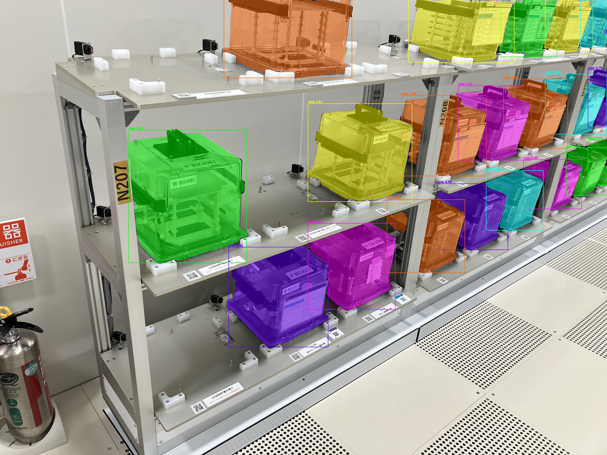
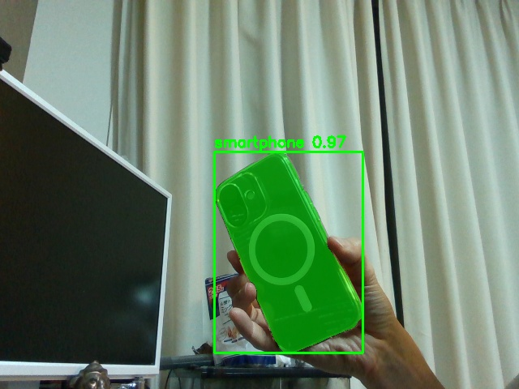
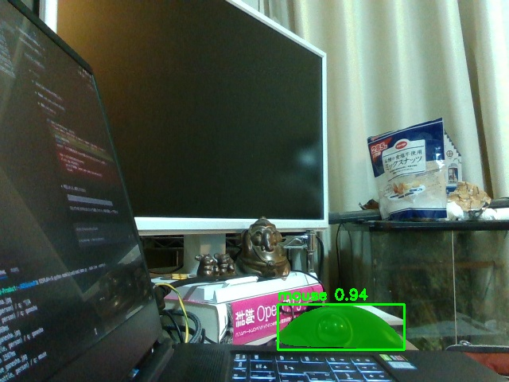
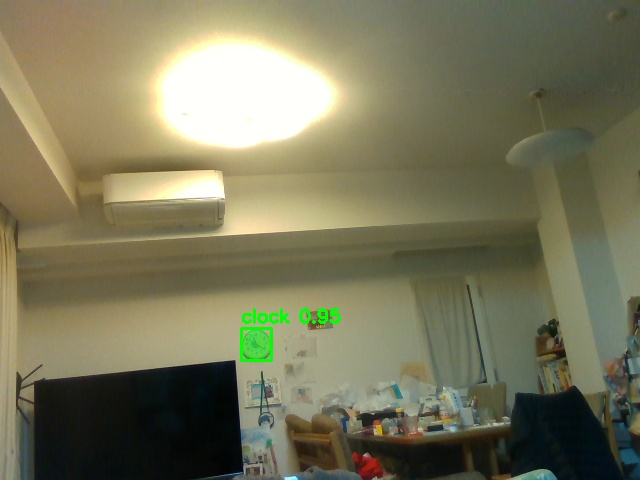
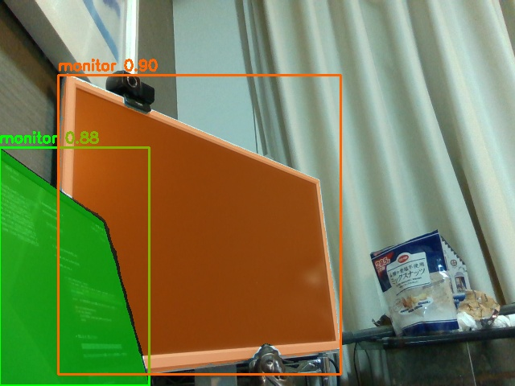
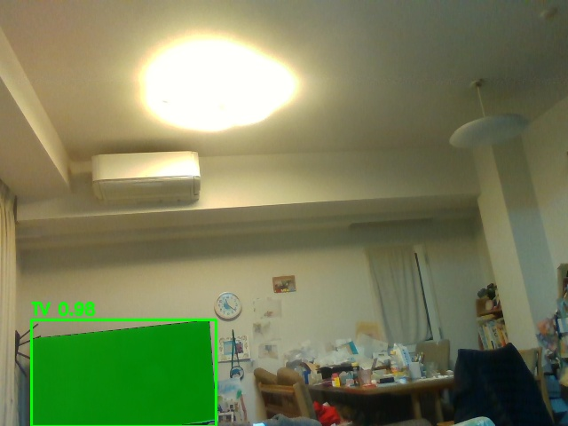
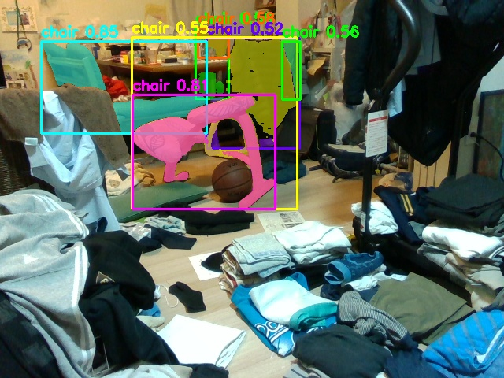

# SAM3 実験報告書

**実験日**: 2026-03-06  
**実施者**: vr01  
**実験環境**: Ubuntu 22.04 / Quadro RTX 5000 Max-Q (16GB VRAM) / Python 3.12

---

## 1. SAM3 とは何か

**SAM3 (Segment Anything with Concepts)** は Meta AI が 2025 年に発表したテキストプロンプトベースのセグメンテーションモデルである。

| 項目 | 内容 |
|------|------|
| 開発元 | Meta AI |
| 発表年 | 2025 年 |
| ベースモデル | SAM 2 アーキテクチャ拡張 |
| 入力 | RGB 画像 + 自然言語テキストプロンプト |
| 出力 | バイナリマスク + バウンディングボックス + 信頼スコア |
| モデルサイズ | 3.45GB (sam3.pt) |
| HF リポジトリ | `facebook/sam3` (Meta 審査承認制) |

**SAM3 が解決しようとしている課題:**

- SAM 2 はクリックやボックスによるプロンプトのみで、テキストによる物体指定ができなかった
- 「カップを検出して」のような自然言語での物体指定を可能にする
- ゼロショット: 学習データに含まれていない物体にも対応

**期待される活用シーン:**

- ロボットの物体認識マスク生成（「赤いカップを掴め」→ マスク生成 → FoundationPose / Any6D 入力）
- 工業用棚の物品セグメンテーション
- ROS2 パイプラインの中間モジュール（YOLO26 → SAM3 → FoundationPose）

---

## 2. 技術変遷

| 年 | モデル | 特徴 |
|----|--------|------|
| 2023 | **SAM** (Meta AI) | クリック / ボックス / グリッドプロンプト。テキスト非対応 |
| 2024 | **SAM 2** (Meta AI) | 動画対応、マスク精度向上。テキスト非対応 |
| 2024 | **Grounding DINO** (IDEA Research) | テキストでバウンディングボックス検出。マスクは SAM と組み合わせ |
| 2025 | **SAM3** (Meta AI) | SAM 2 にコンセプト理解を統合。テキストプロンプトで直接マスク生成 |

SAM3 は Grounding DINO + SAM の組み合わせを単一モデルに統合した位置づけである。エンドツーエンドでテキスト → マスクが完結する。

---

## 3. 技術バックグラウンド

### アーキテクチャ

```
テキストプロンプト
      ↓
  テキストエンコーダ (CLIP 系)
      ↓
  コンセプトアライメント
      ↓
  SAM 2 デコーダ
      ↓
  マスク + BBox + スコア
```

### 推論パイプライン（`sam3_demo.py` 実装）

```python
model = build_sam3_image_model(load_from_HF=True, device="cuda")
processor = Sam3Processor(model)

state = processor.set_image(pil_img)          # 画像特徴抽出
output = processor.set_text_prompt(state, prompt)  # テキスト照合・マスク生成

masks  = output["masks"]   # (N, H, W) bool tensor
boxes  = output["boxes"]   # (N, 4) xyxy
scores = output["scores"]  # (N,)
```

### 性能（本環境での実測）

| 項目 | 値 |
|------|-----|
| モデルサイズ | 3.45 GB |
| ロード時間（初回 / キャッシュ） | ~67秒 / ~10秒 |
| 推論時間 | ~1600〜1800 ms / フレーム |
| VRAM 使用量 | 未計測（モデル占有 ~3.5GB 相当） |
| リアルタイム性 | 非対応（~0.6 FPS） |

---

## 4. 活用可能性の検討

| 応用領域 | 実現性 | 備考 |
|---------|--------|------|
| Any6D マスク入力 | **高** | `generate_sam3_mask.py` として統合済み。"cup" 0.982, "stuffed animal" 0.965 で動作確認 |
| 工業用棚の物品セグメンテーション | **高** | 本実験で多数のケースを同時検出確認（後述） |
| ROS2 パイプライン中間モジュール | **中** | ~1.7秒/フレームのため低レートに限定 |
| リアルタイム物体認識 | **低** | 推論速度がボトルネック。YOLO26（13.6ms）と比較して100倍以上遅い |
| 複数物体の同時セグメント | **高** | 1プロンプトで複数インスタンスを同時検出 |

---

## 5. 実験

### 実験目的

1. SAM3 が本環境（Quadro RTX 5000 Max-Q）で動作するか確認する
2. テキストプロンプトによるゼロショットセグメンテーションの精度を検証する
3. **工業用棚画像（IMG_1501.jpg）**での実用性を評価する
4. ライブカメラモードでの汎用物体認識性能を評価する

### 実験環境

| 項目 | 仕様 |
|------|------|
| GPU | Quadro RTX 5000 Max-Q (VRAM 16GB, SM 7.5 Turing) |
| OS | Ubuntu 22.04 |
| Python | 3.12 (`.venv_sam3`) |
| SAM3 バージョン | sam3==0.1.0 |
| モデルファイル | sam3.pt (3.45GB, HuggingFace キャッシュ) |
| カメラ | USB カメラ (ライブモード) / 静止画ファイル |

### 環境制約と工夫した点

#### 制約 1: Meta HuggingFace 審査制

SAM3 モデルは Meta AI による手動審査承認が必要な Gated Repository である。承認後に `huggingface-cli login` でアクセス可能となる。

#### 制約 2: cv2.imshow クラッシュ（セグメンテーションフォルト）

CUDA 推論後に `cv2.imshow` を呼び出すと Qt/CUDA メモリ競合でクラッシュする問題が発生した。

**対処**: `cv2.imshow` を廃止し、`subprocess.Popen(["xdg-open", out_path])` でシステムビューアを起動する方式に変更した。

```python
# 修正前（クラッシュ）
cv2.imshow(f"SAM3: '{prompt}'", display)

# 修正後（安定動作）
cv2.imwrite(out_path, display)
subprocess.Popen(["xdg-open", out_path])
```

#### 制約 3: マスク shape の不一致

SAM3 の出力マスクが `(1, H, W)` で来るが `(H, W)` を期待していた。`squeeze()` を追加して解決した。

```python
mask_np = mask.cpu().numpy().squeeze().astype(bool)
```

---

### 実験結果

#### Step 1: サンプル画像テスト（truck.jpg）

SAM3 付属のサンプル画像でまず動作確認した。

**コマンド:**
```bash
DISPLAY=:0 .venv_sam3/bin/python models/sam3/sam3_demo.py \
  --task image \
  --image models/sam3/assets/images/truck.jpg \
  --prompt "truck"
```

| 指標 | 値 |
|------|-----|
| プロンプト | "truck" |
| 検出セグメント数 | 1 |
| 推論時間 | 1780 ms |

---

#### Step 2: 工業用棚画像（IMG_1501.jpg）での検証

工業用棚に並んだ複数の搬送ケースを対象に、"case" プロンプトでセグメンテーションを実施した。

**コマンド:**
```bash
DISPLAY=:0 .venv_sam3/bin/python models/sam3/sam3_demo.py \
  --task image \
  --image data/IMG_1501.jpg \
  --prompt "case"
```

**SAM3 セグメンテーション結果（工業用棚）:**


*棚に並ぶ搬送ケースを "case" プロンプトで一括セグメント。各ケースが異なる色のマスクで識別されている。*

| 指標 | 値 |
|------|-----|
| プロンプト | "case" |
| 検出セグメント数 | 複数（全段にわたって検出） |
| 推論時間 | ~1700 ms |
| 特記事項 | 1〜3 段すべてのケースを同時検出 |

**注目点:**

- 1 つのプロンプトで棚の全段にわたる複数ケースを同時セグメント
- 各インスタンスを独立したマスク（緑・橙・黄・紫・水色 etc.）で識別
- 透明ケース・黒ケースなど外観の異なる物体も区別なく検出
- バウンディングボックスと信頼スコアも同時出力

この結果は **Any6D のアンカーマスク生成**（`generate_sam3_mask.py`）の基礎として直接活用されている。

---

#### Step 3: ライブカメラモードでの多様な物体テスト

USB カメラを接続し、ライブモードで様々な物体に対してテキストプロンプトを試した。

**コマンド:**
```bash
DISPLAY=:0 .venv_sam3/bin/python models/sam3/sam3_demo.py \
  --task live --source 4
```

ライブモードの動作フロー:
```
[プロンプト入力] → [カメラ撮影] → [SAM3 推論] → [結果を xdg-open で表示]
```

以下に代表的な結果を示す。

---

**スマートフォン検出 (smartphone, score: 0.97)**


*手に持ったスマートフォンを高精度（0.97）で検出・セグメント。背景（カーテン、TV）は除外されている。*

---

**マウス検出 (mouse, score: 0.94)**


*デスク上の光学マウスを "mouse" プロンプトで検出。暗い室内でも認識可能。*

---

**時計検出 (clock, score: 0.95)**


*壁掛け時計を遠距離から正確に検出。画面内の小さな物体でも機能する。*

---

**モニター検出 (monitor, 2インスタンス)**


*2台のモニターを "monitor" プロンプトで同時検出（score: 0.90, 0.88）。*

---

**TV 検出 (TV)**


*TV を部分的に捉えて検出。フレームに一部しか映っていない物体にも反応。*

---

**椅子検出 (chair) — 課題例**


*"chair" プロンプトに対して椅子以外の物体（バスケットボール等）を誤検出。散乱した物体が多い環境では精度が低下する。最高スコアは 0.80（誤検出）。*

---

#### Step 4: Any6D マスク生成への統合

SAM3 を `generate_sam3_mask.py` として独立スクリプト化し、Any6D パイプラインに組み込んだ。

```bash
# スヌーピーカップのマスク生成
DISPLAY=:0 .venv_sam3/bin/python scripts/generate_sam3_mask.py \
  --image data/realsense/rgb.png \
  --prompt "cup" \
  --output data/realsense/mask.png
```

| 物体 | プロンプト | スコア | マスクカバレッジ |
|------|-----------|--------|----------------|
| スヌーピーマグカップ | "cup" | **0.982** | 14.8% |
| くまのぬいぐるみ | "stuffed animal" | **0.965** | 18.5% |

> "bear" プロンプトではぬいぐるみが未検出。"stuffed animal" に変更して成功した。これは SAM3 のコンセプト理解が語彙依存であることを示している。

---

## 6. 考察

### 6-1. 成功点

- **ゼロショット汎用性**: 事前学習なしに truck, case, smartphone, mouse, clock, monitor, TV など多様な物体を検出できた
- **複数インスタンス同時検出**: 工業用棚の実験で、1 プロンプトで全段のケースを同時にセグメント可能であることが実証された
- **Any6D 統合**: `generate_sam3_mask.py` として実用的に組み込み、スコア 0.96〜0.98 の高品質マスクを生成できた

### 6-2. 限界・課題

| 課題 | 詳細 |
|------|------|
| 推論速度 | ~1700ms/フレーム ≈ 0.6 FPS。リアルタイム用途には不向き |
| 語彙依存性 | "bear" では不検出 → "stuffed animal" が必要。英語語彙の選択が精度に直結 |
| 雑然シーンでの誤検出 | 椅子実験のように散乱物が多い環境では関係ない物体も検出される |
| VRAM 未計測 | モデル占有量の詳細を本実験では計測できていない |
| cv2.imshow 非対応 | CUDA 推論後の Qt/CUDA 競合を回避するため xdg-open に変更が必要 |

### 6-3. 今後の展開

| 優先度 | タスク | 説明 |
|--------|--------|------|
| 高 | YOLO26 → SAM3 → Any6D パイプライン統合 | YOLO26 で粗検出 → SAM3 でマスク精製 → Any6D でポーズ推定 |
| 高 | ROS2 ノード化 | SAM3 を ROS2 サービスとして公開 |
| 中 | VRAM 使用量の計測 | `torch.cuda.max_memory_allocated()` で定量化 |
| 中 | 推論速度の最適化 | INT8 量子化 / TensorRT 変換の検討 |
| 低 | 日本語プロンプト対応検証 | 英語語彙への依存度を確認 |

---

## 7. まとめ

SAM3 は「テキストプロンプト → セグメントマスク」を単一モデルで実現するゼロショットセグメンテーションモデルである。本実験では以下を確認した。

1. **Quadro RTX 5000 Max-Q（SM 7.5）で安定動作**する（~1700ms/フレーム）
2. **工業用棚の複数ケースを 1 プロンプトで同時検出**でき、ロボット物体認識への適用可能性が高い
3. **Any6D マスク生成への統合に成功**し、スコア 0.96〜0.98 の高品質マスクを生成できた
4. リアルタイム性は低いが、**アンカー取得時の 1 回限り処理**として活用するのが現実的である

---

## 付録: ファイル構成

```
AIVisionPJ/
├── .venv_sam3/                          # SAM3専用仮想環境 (Python 3.12)
├── models/
│   └── sam3/
│       ├── sam3_demo.py                 # image/camera/live/stream モード
│       └── assets/images/              # サンプル画像 (truck.jpg 等)
├── scripts/
│   └── generate_sam3_mask.py           # Any6D 用マスク生成スクリプト
├── results/
│   ├── sam3_result.jpg                 # 工業用棚 (IMG_1501.jpg) セグメント結果
│   ├── sam3_live_smartphone.jpg        # ライブモード: スマートフォン
│   ├── sam3_live_mouse.jpg             # ライブモード: マウス
│   ├── sam3_live_clock.jpg             # ライブモード: 時計
│   ├── sam3_live_monitor.jpg           # ライブモード: モニター
│   ├── sam3_live_TV.jpg                # ライブモード: TV
│   ├── sam3_live_chair.jpg             # ライブモード: 椅子（課題例）
│   └── sam3_live_*.jpg                 # その他ライブモード結果
└── log/
    └── session_2026-03-06.md           # セッションログ

```

---

*レポート生成: 2026-04-06*
